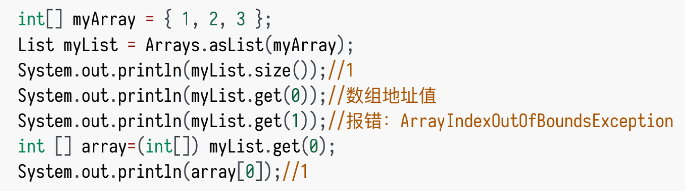

---

title: Arrays.asList()避坑
author: John Doe
tags:
  - Java
  - 集合
categories:
  - Java
  - 集合
date: 2022-04-01 21:53:00
---

Arrays.asList() 我们可以使⽤它将⼀个数组转换为⼀个List集合。

jdk对这个方法的说明：返回由指定数组⽀持的固定⼤⼩的列表。此⽅法作为基于数组和基于集合的API之间的桥梁，与 Collection.toArray()结合使⽤。返回的List是可序列化并实现RandomAccess接⼝。

《阿⾥巴巴 Java 开发⼿册》对其的描述：Arrays.asList() 将数组转换为集合后,底层其实还是数组。强制使用add/remove/clear等方法会抛出异常。asList返回的对象是一个Arrays内部类，并没有实现集合的修改方法。Arrays.asList（）体现的是适配器模式，只是接口转换，后台的数据仍是数组。

传递的数组必须是对象数组，⽽不是基本类型。Arrays.asList() 是泛型⽅法，传⼊的对象必须是对象数组。

 

当传⼊⼀个原⽣数据类型数组时， Arrays.asList() 的真正得到的参数就不是数组中的元素，⽽是
数组对象本身！此时 List 的唯⼀元素就是这个数组，这也就解释了上⾯的代码。我们使用包装类可以解决该问题，但调用add/remove/clear等方法仍是会报错。

Arrays.asList() ⽅法返回的并不是 java.util.ArrayList ，⽽是 java.util.Arrays 的⼀个内部类,这个内部类并没有实现集合的修改⽅法或者说并没有重写这些⽅法。

