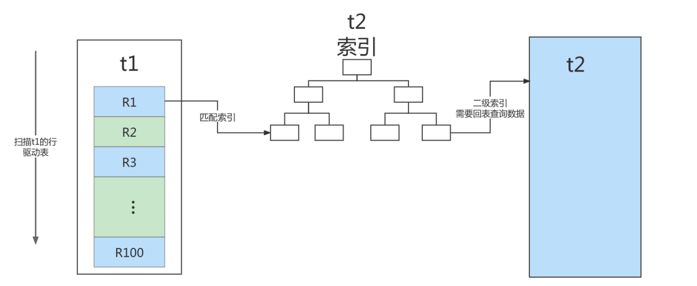

---

title: 关联查询优化
author: John Doe
tags:
  - 关联查询
  - MySQL
categories:
  - MySQL
date: 2022-03-23 10:24:00
---

采用左外连接
- 被驱动的表简历索引，可以避免全表扫描（LEFT JOIN条件用于确定如何从右表搜索行，左边一定都有，所以 右边是我们的关键点,一定需要建立索引 。）

采用内连接
- MySQL自动选择驱动表（小结果集），保证被驱动的表的JOIN字段已经建立了索引。

小结：

- 保证被驱动表的JOIN字段已经创建了索引
- 需要JOIN 的字段，数据类型保持绝对一致。
- LEFT JOIN 时，选择小表作为驱动表， 大表作为被驱动表 。减少外层循环的次数。
- INNER JOIN 时，MySQL会自动将 小结果集的表选为驱动表 。选择相信MySQL优化策略。
- 能够直接多表关联的尽量直接关联，不用子查询。(减少查询的趟数)
- 不建议使用子查询，建议将子查询SQL拆开结合程序多次查询，或使用 JOIN 来代替子查询。
- 衍生表建不了索引

补充：
- 什么叫作“小表”？在决定哪个表做驱动表的时候，应该是两个表按照各自的条件过滤，过滤完成之后，计算参与join的各个字段的总数据量，数据量小的那个表，就是“小表”，应该作为驱动表。

 
 
在这个流程里：
1. 对驱动表t1做了全表扫描，这个过程需要扫描100行；
2. 而对于每一行R，根据a字段去表t2查找，走的是树搜索过程。由于我们构造的数据都是一一对应的，因此每次的搜索过程都只扫描一行，也是总共扫描100行；
3. 所以，整个执行流程，总扫描行数是200。