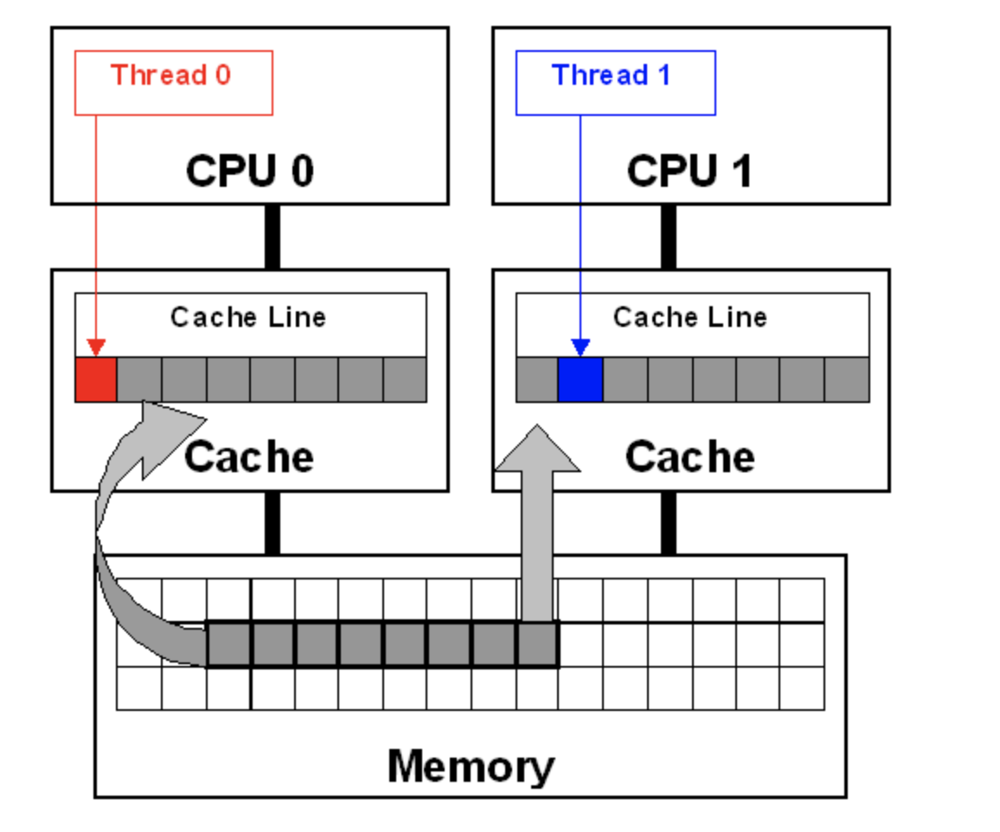

---

title: 内存模型之伪共享(False Sharing)
author: John Doe
tags:
  - Java
  - JMM
categories:
  - Java
  - JMM
date: 2022-03-23 21:09:00
---
在对称多处理器(SMP)系统中，每个处理器均有一个本地高速缓存。内存系统必须保证高速缓存的一致性。当不同处理器上的线程修改驻留在同一高速缓存行中的变量时就会发生假共享，结果导致高速缓存行无效，并强制执行更新，进而影响系统性能。

 
线程0和线程1会用到不同变量，它们在内存中彼此相邻，并驻留在同一高速缓存行。高速缓存行被加载到CPU0和CPU1的高速缓存中（灰色箭头）。
尽管这些线程修改的是不同变量（红色和蓝色箭头），高速缓存行仍会无效，并强制内存更新以维持高速缓存的一致性。

缓存系统中是以缓存行（cacheline）为单位存储的。缓存行是2的整数幂个连续字节，一般为32-256个字节。最常见的缓存行大小是64个字节。一个Java的long类型是8字节，因此在一个缓存行中可以存8个long类型的变量。所以，如果你访问一个long数组，当数组中的一个值被加载到缓存中，它会额外加载另外7个，这会带来一些优势。但是也有伪共享问题，比如两个线程，修改long数组的第一个与第七个，会频发发生缓存失效，影响性能。解决办法就是填充，在JDK8中提供了@sun.misc.Contended注解来避免伪共享，即通过padding填充，让数据占据不同的缓存行。