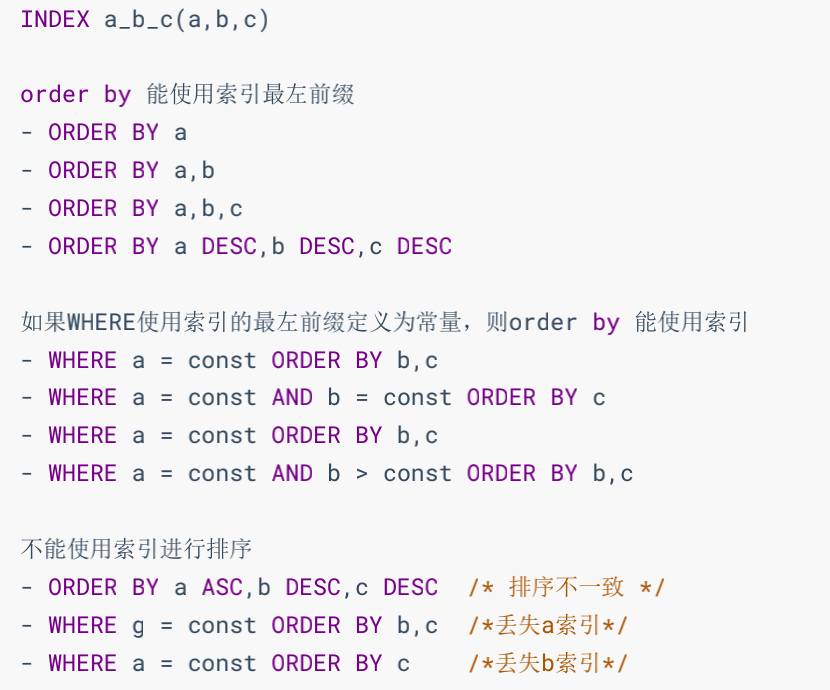

---

title: 排序优化
author: John Doe
tags:
  - 排序优化
  - MySQL
categories:
  - MySQL
date: 2022-03-23 10:47:00
---

在 WHERE 条件字段上加索引，但是为什么在 ORDER BY 字段上还要加索引呢？

优化建议：
1. SQL 中，可以在 WHERE 子句和 ORDER BY 子句中使用索引，目的是在 WHERE 子句中 避免全表扫 描 ，在 ORDER BY 子句 避免使用 FileSort 排序 。当然，某些情况下全表扫描，或者 FileSort 排序不一定比索引慢。但总的来说，我们还是要避免，以提高查询效率。
2. 尽量使用 Index 完成 ORDER BY 排序。如果 WHERE 和 ORDER BY 后面是相同的列就使用单索引列；如果不同就使用联合索引。
3. 无法使用 Index 时，需要对 FileSort 方式进行调优。

 
 
 
 
 
 1. 两个索引同时存在，mysql自动选择最优的方案。（对于这个例子，mysql选idx_age_stuno_name）。但是， 随着数据量的变化，选择的索引也会随之变化的 。 
 2. 当【范围条件】和【group by 或者 order by】的字段出现二选一时，优先观察条件字段的过滤数量，如果过滤的数据足够多，而需要排序的数据并不多时，优先把索引放在范围字段上。反之，亦然。
 
filesort：双路排序和单路排序

双路排序 （慢）
MySQL 4.1之前是使用双路排序 ，字面意思就是两次扫描磁盘，最终得到数据， 读取行指针和
order by列 ，对他们进行排序，然后扫描已经排序好的列表，按照列表中的值重新从列表中读取
对应的数据输出
从磁盘取排序字段，在buffer进行排序，再从 磁盘取其他字段 。
取一批数据，要对磁盘进行两次扫描，众所周知，IO是很耗时的，所以在mysql4.1之后，出现了第二种
改进的算法，就是单路排序。

单路排序 （快）
从磁盘读取查询需要的 所有列 ，按照order by列在buffer对它们进行排序，然后扫描排序后的列表进行输
出， 它的效率更快一些，避免了第二次读取数据。并且把随机IO变成了顺序IO，但是它会使用更多的空
间， 因为它把每一行都保存在内存中了。

优化策略
1. 尝试提高 sort_buffer_size 2. 尝试提高 max_length_for_sort_data 
3. Order by 时select * 是一个大忌。最好只Query需要的字段。
