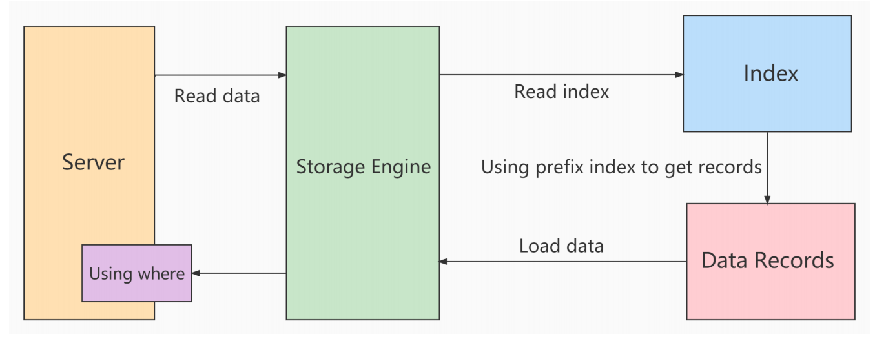

---

title: 索引下推
author: John Doe
tags:
  - MySQL
  - 索引下推
categories:
  - MySQL
date: 2022-03-23 11:50:00
---

Index Condition Pushdown(ICP)是MySQL 5.6中新特性，是一种在存储引擎层使用索引过滤数据的一种优化方式。ICP可以减少存储引擎访问基表的次数以及MySQL服务器访问存储引擎的次数。

在不使用ICP索引扫描的过程：

- storage层：只将满足index key条件的索引记录对应的整行记录取出，返回给server层 
- server 层：对返回的数据，使用后面的where条件过滤，直至返回最后一行。

 
 
 使用ICP扫描的过程：
 - storage层：首先将index key条件满足的索引记录区间确定，然后在索引上使用index filter进行过滤。将满足的index filter条件的索引记录才去回表取出整行记录返回server层。不满足index filter条件的索引记录丢弃，不回表、也不会返回server层。
 - server 层：对返回的数据，使用table filter条件做最后的过滤。
 
使用前后的成本差别：使用前，存储层多返回了需要被index filter过滤掉的整行记录使用ICP后，直接就去掉了不满足index filter条件的记录，省去了他们回表和传递到server层的成本。ICP的 加速效果 取决于在存储引擎内通过 ICP筛选 掉的数据的比例。

ICP的使用条件：

① 只能用于二级索引(secondary index) 

②explain显示的执行计划中type值（join 类型）为 range 、 ref 、 eq_ref 或者 ref_or_null 。 

③ 并非全部where条件都可以用ICP筛选，如果where条件的字段不在索引列中，还是要读取整表的记录
到server端做where过滤。

④ ICP可以用于MyISAM和InnnoDB存储引擎

⑤ MySQL 5.6版本的不支持分区表的ICP功能，5.7版本的开始支持。

⑥ 当SQL使用覆盖索引时，不支持ICP优化方法。

