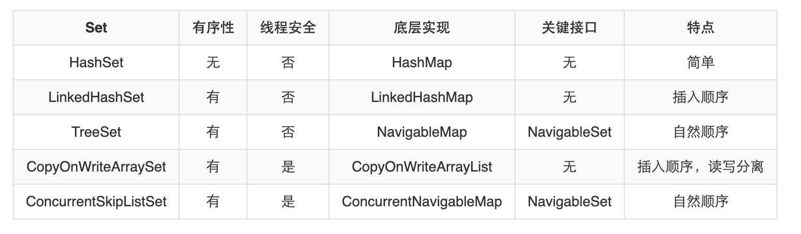

---

title: Java中的Set那些事
author: John Doe
tags:
  - Java
  - 集合
categories:
  - Java
  - 集合
date: 2022-04-03 15:31:00
---
## HashSet
（1）HashSet内部使用HashMap的key存储元素，以此来保证元素不重复；

（2）HashSet是无序的，因为HashMap的key是无序的；

（3）HashSet中允许有一个null元素，因为HashMap允许key为null；

（4）HashSet是非线程安全的；

（5）HashSet是没有get()方法的；

	 public class HashSet<E>
            extends AbstractSet<E>
            implements Set<E>, Cloneable, java.io.Serializable
        {
            static final long serialVersionUID = -5024744406713321676L;
        
            // 内部元素存储在HashMap中
            private transient HashMap<E,Object> map;
        
            // 虚拟元素，用来存到map元素的value中的，没有实际意义
            private static final Object PRESENT = new Object();
        
            // 空构造方法
            public HashSet() {
                map = new HashMap<>();
            }
        
            // 把另一个集合的元素全都添加到当前Set中
            // 注意，这里初始化map的时候是计算了它的初始容量的
            public HashSet(Collection<? extends E> c) {
                map = new HashMap<>(Math.max((int) (c.size()/.75f) + 1, 16));
                addAll(c);
            }
        
            // 指定初始容量和装载因子
            public HashSet(int initialCapacity, float loadFactor) {
                map = new HashMap<>(initialCapacity, loadFactor);
            }
        
            // 只指定初始容量
            public HashSet(int initialCapacity) {
                map = new HashMap<>(initialCapacity);
            }
        
            // LinkedHashSet专用的方法
            // dummy是没有实际意义的, 只是为了跟上上面那个操持方法签名不同而已
            HashSet(int initialCapacity, float loadFactor, boolean dummy) {
                map = new LinkedHashMap<>(initialCapacity, loadFactor);
            }
        
            // 迭代器
            public Iterator<E> iterator() {
                return map.keySet().iterator();
            }
        
            // 元素个数
            public int size() {
                return map.size();
            }
        
            // 检查是否为空
            public boolean isEmpty() {
                return map.isEmpty();
            }
        
            // 检查是否包含某个元素
            public boolean contains(Object o) {
                return map.containsKey(o);
            }
        
            // 添加元素
            public boolean add(E e) {
                return map.put(e, PRESENT)==null;
            }
        
            // 删除元素
            public boolean remove(Object o) {
                return map.remove(o)==PRESENT;
            }
        
            // 清空所有元素
            public void clear() {
                map.clear();
            }
        
            // 克隆方法
            @SuppressWarnings("unchecked")
            public Object clone() {
                try {
                    HashSet<E> newSet = (HashSet<E>) super.clone();
                    newSet.map = (HashMap<E, Object>) map.clone();
                    return newSet;
                } catch (CloneNotSupportedException e) {
                    throw new InternalError(e);
                }
            }
        
            // 序列化写出方法
            private void writeObject(java.io.ObjectOutputStream s)
                throws java.io.IOException {
                // 写出非static非transient属性
                s.defaultWriteObject();
        
                // 写出map的容量和装载因子
                s.writeInt(map.capacity());
                s.writeFloat(map.loadFactor());
        
                // 写出元素个数
                s.writeInt(map.size());
        
                // 遍历写出所有元素
                for (E e : map.keySet())
                    s.writeObject(e);
            }
        
            // 序列化读入方法
            private void readObject(java.io.ObjectInputStream s)
                throws java.io.IOException, ClassNotFoundException {
                // 读入非static非transient属性
                s.defaultReadObject();
        
                // 读入容量, 并检查不能小于0
                int capacity = s.readInt();
                if (capacity < 0) {
                    throw new InvalidObjectException("Illegal capacity: " +
                                                     capacity);
                }
        
                // 读入装载因子, 并检查不能小于等于0或者是NaN(Not a Number)
                // java.lang.Float.NaN = 0.0f / 0.0f;
                float loadFactor = s.readFloat();
                if (loadFactor <= 0 || Float.isNaN(loadFactor)) {
                    throw new InvalidObjectException("Illegal load factor: " +
                                                     loadFactor);
                }
        
                // 读入元素个数并检查不能小于0
                int size = s.readInt();
                if (size < 0) {
                    throw new InvalidObjectException("Illegal size: " +
                                                     size);
                }
                // 根据元素个数重新设置容量
                // 这是为了保证map有足够的容量容纳所有元素, 防止无意义的扩容
                capacity = (int) Math.min(size * Math.min(1 / loadFactor, 4.0f),
                        HashMap.MAXIMUM_CAPACITY);
        
                // 再次检查某些东西, 不重要的代码忽视掉
                SharedSecrets.getJavaOISAccess()
                             .checkArray(s, Map.Entry[].class, HashMap.tableSizeFor(capacity));
        
                // 创建map, 检查是不是LinkedHashSet类型
                map = (((HashSet<?>)this) instanceof LinkedHashSet ?
                       new LinkedHashMap<E,Object>(capacity, loadFactor) :
                       new HashMap<E,Object>(capacity, loadFactor));
        
                // 读入所有元素, 并放入map中
                for (int i=0; i<size; i++) {
                    @SuppressWarnings("unchecked")
                        E e = (E) s.readObject();
                    map.put(e, PRESENT);
                }
            }
        
            // 可分割的迭代器, 主要用于多线程并行迭代处理时使用
            public Spliterator<E> spliterator() {
                return new HashMap.KeySpliterator<E,Object>(map, 0, -1, 0, 0);
            }
        }

## LinkedHashSet
（1）LinkedHashSet的底层使用LinkedHashMap存储元素。

（2）LinkedHashSet是有序的，它是按照插入的顺序排序的。

- 注意：LinkedHashSet是不支持按访问顺序对元素排序的，只能按插入顺序排序。
        package java.util;
        
        // LinkedHashSet继承自HashSet
        public class LinkedHashSet<E>
            extends HashSet<E>
            implements Set<E>, Cloneable, java.io.Serializable {
        
            private static final long serialVersionUID = -2851667679971038690L;
        
            // 传入容量和装载因子
            public LinkedHashSet(int initialCapacity, float loadFactor) {
                super(initialCapacity, loadFactor, true);
            }
        
            // 只传入容量, 装载因子默认为0.75
            public LinkedHashSet(int initialCapacity) {
                super(initialCapacity, .75f, true);
            }
        
            // 使用默认容量16, 默认装载因子0.75
            public LinkedHashSet() {
                super(16, .75f, true);
            }
        
            // 将集合c中的所有元素添加到LinkedHashSet中
            // 好奇怪, 这里计算容量的方式又变了
            // HashSet中使用的是Math.max((int) (c.size()/.75f) + 1, 16)
            // 这一点有点不得其解, 是作者偷懒？
            public LinkedHashSet(Collection<? extends E> c) {
                super(Math.max(2*c.size(), 11), .75f, true);
                addAll(c);
            }
        
            // 可分割的迭代器, 主要用于多线程并行迭代处理时使用
            @Override
            public Spliterator<E> spliterator() {
                return Spliterators.spliterator(this, Spliterator.DISTINCT | Spliterator.ORDERED);
            }
        }

## TreeSet
（1）TreeSet底层使用NavigableMap存储元素；

（2）TreeSet是有序的；

（3）TreeSet是非线程安全的；

（4）TreeSet实现了NavigableSet接口，而NavigableSet继承自SortedSet接口；

（5）TreeSet实现了SortedSet接口；

    package java.util;
        
        // TreeSet实现了NavigableSet接口，所以它是有序的
        public class TreeSet<E> extends AbstractSet<E>
            implements NavigableSet<E>, Cloneable, java.io.Serializable
        {
            // 元素存储在NavigableMap中
            // 注意它不一定就是TreeMap
            private transient NavigableMap<E,Object> m;
        
            // 虚拟元素, 用来作为value存储在map中
            private static final Object PRESENT = new Object();
        
            // 直接使用传进来的NavigableMap存储元素
            // 这里不是深拷贝,如果外面的map有增删元素也会反映到这里
            // 而且, 这个方法不是public的, 说明只能给同包使用
            TreeSet(NavigableMap<E,Object> m) {
                this.m = m;
            }
        
            // 使用TreeMap初始化
            public TreeSet() {
                this(new TreeMap<E,Object>());
            }
        
            // 使用带comparator的TreeMap初始化
            public TreeSet(Comparator<? super E> comparator) {
                this(new TreeMap<>(comparator));
            }
        
            // 将集合c中的所有元素添加的TreeSet中
            public TreeSet(Collection<? extends E> c) {
                this();
                addAll(c);
            }
        
            // 将SortedSet中的所有元素添加到TreeSet中
            public TreeSet(SortedSet<E> s) {
                this(s.comparator());
                addAll(s);
            }
        
            // 迭代器
            public Iterator<E> iterator() {
                return m.navigableKeySet().iterator();
            }
        
            // 逆序迭代器
            public Iterator<E> descendingIterator() {
                return m.descendingKeySet().iterator();
            }
        
            // 以逆序返回一个新的TreeSet
            public NavigableSet<E> descendingSet() {
                return new TreeSet<>(m.descendingMap());
            }
        
            // 元素个数
            public int size() {
                return m.size();
            }
        
            // 判断是否为空
            public boolean isEmpty() {
                return m.isEmpty();
            }
        
            // 判断是否包含某元素
            public boolean contains(Object o) {
                return m.containsKey(o);
            }
        
            // 添加元素, 调用map的put()方法, value为PRESENT
            public boolean add(E e) {
                return m.put(e, PRESENT)==null;
            }
        
            // 删除元素
            public boolean remove(Object o) {
                return m.remove(o)==PRESENT;
            }
        
            // 清空所有元素
            public void clear() {
                m.clear();
            }
        
            // 添加集合c中的所有元素
            public  boolean addAll(Collection<? extends E> c) {
                // 满足一定条件时直接调用TreeMap的addAllForTreeSet()方法添加元素
                if (m.size()==0 && c.size() > 0 &&
                    c instanceof SortedSet &&
                    m instanceof TreeMap) {
                    SortedSet<? extends E> set = (SortedSet<? extends E>) c;
                    TreeMap<E,Object> map = (TreeMap<E, Object>) m;
                    Comparator<?> cc = set.comparator();
                    Comparator<? super E> mc = map.comparator();
                    if (cc==mc || (cc != null && cc.equals(mc))) {
                        map.addAllForTreeSet(set, PRESENT);
                        return true;
                    }
                }
                // 不满足上述条件, 调用父类的addAll()通过遍历的方式一个一个地添加元素
                return super.addAll(c);
            }
        
            // 子set（NavigableSet中的方法）
            public NavigableSet<E> subSet(E fromElement, boolean fromInclusive,
                                          E toElement,   boolean toInclusive) {
                return new TreeSet<>(m.subMap(fromElement, fromInclusive,
                                               toElement,   toInclusive));
            }
        
            // 头set（NavigableSet中的方法）
            public NavigableSet<E> headSet(E toElement, boolean inclusive) {
                return new TreeSet<>(m.headMap(toElement, inclusive));
            }
        
            // 尾set（NavigableSet中的方法）
            public NavigableSet<E> tailSet(E fromElement, boolean inclusive) {
                return new TreeSet<>(m.tailMap(fromElement, inclusive));
            }
        
            // 子set（SortedSet接口中的方法）
            public SortedSet<E> subSet(E fromElement, E toElement) {
                return subSet(fromElement, true, toElement, false);
            }
        
            // 头set（SortedSet接口中的方法）
            public SortedSet<E> headSet(E toElement) {
                return headSet(toElement, false);
            }
        
            // 尾set（SortedSet接口中的方法）
            public SortedSet<E> tailSet(E fromElement) {
                return tailSet(fromElement, true);
            }
        
            // 比较器
            public Comparator<? super E> comparator() {
                return m.comparator();
            }
        
            // 返回最小的元素
            public E first() {
                return m.firstKey();
            }
        
            // 返回最大的元素
            public E last() {
                return m.lastKey();
            }
        
            // 返回小于e的最大的元素
            public E lower(E e) {
                return m.lowerKey(e);
            }
        
            // 返回小于等于e的最大的元素
            public E floor(E e) {
                return m.floorKey(e);
            }
        
            // 返回大于等于e的最小的元素
            public E ceiling(E e) {
                return m.ceilingKey(e);
            }
        
            // 返回大于e的最小的元素
            public E higher(E e) {
                return m.higherKey(e);
            }
        
            // 弹出最小的元素
            public E pollFirst() {
                Map.Entry<E,?> e = m.pollFirstEntry();
                return (e == null) ? null : e.getKey();
            }
        
            public E pollLast() {
                Map.Entry<E,?> e = m.pollLastEntry();
                return (e == null) ? null : e.getKey();
            }
        
            // 克隆方法
            @SuppressWarnings("unchecked")
            public Object clone() {
                TreeSet<E> clone;
                try {
                    clone = (TreeSet<E>) super.clone();
                } catch (CloneNotSupportedException e) {
                    throw new InternalError(e);
                }
        
                clone.m = new TreeMap<>(m);
                return clone;
            }
        
            // 序列化写出方法
            private void writeObject(java.io.ObjectOutputStream s)
                throws java.io.IOException {
                // Write out any hidden stuff
                s.defaultWriteObject();
        
                // Write out Comparator
                s.writeObject(m.comparator());
        
                // Write out size
                s.writeInt(m.size());
        
                // Write out all elements in the proper order.
                for (E e : m.keySet())
                    s.writeObject(e);
            }
        
            // 序列化写入方法
            private void readObject(java.io.ObjectInputStream s)
                throws java.io.IOException, ClassNotFoundException {
                // Read in any hidden stuff
                s.defaultReadObject();
        
                // Read in Comparator
                @SuppressWarnings("unchecked")
                    Comparator<? super E> c = (Comparator<? super E>) s.readObject();
        
                // Create backing TreeMap
                TreeMap<E,Object> tm = new TreeMap<>(c);
                m = tm;
        
                // Read in size
                int size = s.readInt();
        
                tm.readTreeSet(size, s, PRESENT);
            }
        
            // 可分割的迭代器
            public Spliterator<E> spliterator() {
                return TreeMap.keySpliteratorFor(m);
            }
        
            // 序列化id
            private static final long serialVersionUID = -2479143000061671589L;
        }
        
    
（1）我们知道TreeSet和LinkedHashSet都是有序的，那它们有何不同？

- LinkedHashSet并没有实现SortedSet接口，它的有序性主要依赖于LinkedHashMap的有序性，所以它的有序性是指按照插入顺序保证的有序性；而TreeSet实现了SortedSet接口，它的有序性主要依赖于NavigableMap的有序性，而NavigableMap又继承自SortedMap，这个接口的有序性是指按照key的自然排序保证的有序性，而key的自然排序又有两种实现方式，一种是key实现Comparable接口，一种是构造方法传入Comparator比较器。

（2）TreeSet里面真的是使用TreeMap来存储元素的吗？

- 我们知道TreeSet里面实际上是使用的NavigableMap来存储元素，虽然大部分时候这个map确实是TreeMap，但不是所有时候都是TreeMap。所以，TreeSet的底层不完全是使用TreeMap来实现的，更准确地说，应该是NavigableMap。

## CopyOnWriteArraySet

（1）CopyOnWriteArraySet是用Map实现的吗？
- CopyOnWriteArraySet底层是使用CopyOnWriteArrayList存储元素的，所以它并不是使用Map来存储元素的。

（2）CopyOnWriteArraySet是有序的吗？
- 是有序的

（3）CopyOnWriteArraySet是并发安全的吗？
- 因为底层是使用了CopyOnWriteArrayList，因此CopyOnWriteArraySet是并发安全的，而且是读写分离的。

（4）CopyOnWriteArraySet以何种方式保证元素不重复？
- CopyOnWriteArrayList底层其实是一个数组，它是允许元素重复的。而CopyOnWriteArraySet通过调用其addIfAbsent来保证元素的不重复

        public class CopyOnWriteArraySet<E> extends AbstractSet<E>
                implements java.io.Serializable {
            private static final long serialVersionUID = 5457747651344034263L;
        
            // 内部使用CopyOnWriteArrayList存储元素
            private final CopyOnWriteArrayList<E> al;
        
            // 构造方法
            public CopyOnWriteArraySet() {
                al = new CopyOnWriteArrayList<E>();
            }
        
            // 将集合c中的元素初始化到CopyOnWriteArraySet中
            public CopyOnWriteArraySet(Collection<? extends E> c) {
                if (c.getClass() == CopyOnWriteArraySet.class) {
                    // 如果c是CopyOnWriteArraySet类型，说明没有重复元素，
                    // 直接调用CopyOnWriteArrayList的构造方法初始化
                    @SuppressWarnings("unchecked") CopyOnWriteArraySet<E> cc =
                        (CopyOnWriteArraySet<E>)c;
                    al = new CopyOnWriteArrayList<E>(cc.al);
                }
                else {
                    // 如果c不是CopyOnWriteArraySet类型，说明有重复元素
                    // 调用CopyOnWriteArrayList的addAllAbsent()方法初始化
                    // 它会把重复元素排除掉
                    al = new CopyOnWriteArrayList<E>();
                    al.addAllAbsent(c);
                }
            }
        
            // 获取元素个数
            public int size() {
                return al.size();
            }
        
            // 检查集合是否为空
            public boolean isEmpty() {
                return al.isEmpty();
            }
        
            // 检查是否包含某个元素
            public boolean contains(Object o) {
                return al.contains(o);
            }
        
            // 集合转数组
            public Object[] toArray() {
                return al.toArray();
            }
        
            // 集合转数组，这里是可能有bug的，详情见ArrayList中分析
            public <T> T[] toArray(T[] a) {
                return al.toArray(a);
            }
        
            // 清空所有元素
            public void clear() {
                al.clear();
            }
        
            // 删除元素
            public boolean remove(Object o) {
                return al.remove(o);
            }
        
            // 添加元素
            // 这里是调用CopyOnWriteArrayList的addIfAbsent()方法
            // 它会检测元素不存在的时候才添加
            // 还记得这个方法吗？当时有分析过的，建议把CopyOnWriteArrayList拿出来再看看
            public boolean add(E e) {
                return al.addIfAbsent(e);
            }
        
            // 是否包含c中的所有元素
            public boolean containsAll(Collection<?> c) {
                return al.containsAll(c);
            }
        
            // 并集
            public boolean addAll(Collection<? extends E> c) {
                return al.addAllAbsent(c) > 0;
            }
        
            // 单方向差集
            public boolean removeAll(Collection<?> c) {
                return al.removeAll(c);
            }
        
            // 交集
            public boolean retainAll(Collection<?> c) {
                return al.retainAll(c);
            }
        
            // 迭代器
            public Iterator<E> iterator() {
                return al.iterator();
            }
        
            // equals()方法
            public boolean equals(Object o) {
                // 如果两者是同一个对象，返回true
                if (o == this)
                    return true;
                // 如果o不是Set对象，返回false
                if (!(o instanceof Set))
                    return false;
                Set<?> set = (Set<?>)(o);
                Iterator<?> it = set.iterator();
        
                // 集合元素数组的快照
                Object[] elements = al.getArray();
                int len = elements.length;
        
                // 我觉得这里的设计不太好
                // 首先，Set中的元素本来就是不重复的，所以不需要再用个matched[]数组记录有没有出现过
                // 其次，两个集合的元素个数如果不相等，那肯定不相等了，这个是不是应该作为第一要素先检查
                boolean[] matched = new boolean[len];
                int k = 0;
                // 从o这个集合开始遍历
                outer: while (it.hasNext()) {
                    // 如果k>len了，说明o中元素多了
                    if (++k > len)
                        return false;
                    // 取值
                    Object x = it.next();
                    // 遍历检查是否在当前集合中
                    for (int i = 0; i < len; ++i) {
                        if (!matched[i] && eq(x, elements[i])) {
                            matched[i] = true;
                            continue outer;
                        }
                    }
                    // 如果不在当前集合中，返回false
                    return false;
                }
                return k == len;
            }
        
            // 移除满足过滤条件的元素
            public boolean removeIf(Predicate<? super E> filter) {
                return al.removeIf(filter);
            }
        
            // 遍历元素
            public void forEach(Consumer<? super E> action) {
                al.forEach(action);
            }
        
            // 分割的迭代器
            public Spliterator<E> spliterator() {
                return Spliterators.spliterator
                    (al.getArray(), Spliterator.IMMUTABLE | Spliterator.DISTINCT);
            }
        
            // 比较两个元素是否相等
            private static boolean eq(Object o1, Object o2) {
                return (o1 == null) ? o2 == null : o1.equals(o2);
            }
        }
        
## ConcurrentSkipListSet
（1）ConcurrentSkipListSet的底层是ConcurrentSkipListMap吗？
- ConcurrentSkipListSet底层是通过ConcurrentNavigableMap来实现的，

（2）ConcurrentSkipListSet是线程安全的吗？
- 它是一个有序的线程安全的集合。

（3）ConcurrentSkipListSet是有序的吗？
- 有序的

（4）ConcurrentSkipListSet和之前讲的Set有何不同？
- ConcurrentSkipListSet基本上都是使用ConcurrentSkipListMap实现的，虽然取子set部分是使用ConcurrentSkipListMap中的内部类，但是这些内部类其实也是和ConcurrentSkipListMap相关的，它们返回ConcurrentSkipListMap的一部分数据。

       // 实现了NavigableSet接口，并没有所谓的ConcurrentNavigableSet接口
        public class ConcurrentSkipListSet<E>
            extends AbstractSet<E>
            implements NavigableSet<E>, Cloneable, java.io.Serializable {
        
            private static final long serialVersionUID = -2479143111061671589L;
        
            // 存储使用的map
            private final ConcurrentNavigableMap<E,Object> m;
        
            // 初始化
            public ConcurrentSkipListSet() {
                m = new ConcurrentSkipListMap<E,Object>();
            }
        
            // 传入比较器
            public ConcurrentSkipListSet(Comparator<? super E> comparator) {
                m = new ConcurrentSkipListMap<E,Object>(comparator);
            }
        
            // 使用ConcurrentSkipListMap初始化map
            // 并将集合c中所有元素放入到map中
            public ConcurrentSkipListSet(Collection<? extends E> c) {
                m = new ConcurrentSkipListMap<E,Object>();
                addAll(c);
            }
        
            // 使用ConcurrentSkipListMap初始化map
            // 并将有序Set中所有元素放入到map中
            public ConcurrentSkipListSet(SortedSet<E> s) {
                m = new ConcurrentSkipListMap<E,Object>(s.comparator());
                addAll(s);
            }
        
            // ConcurrentSkipListSet类内部返回子set时使用的
            ConcurrentSkipListSet(ConcurrentNavigableMap<E,Object> m) {
                this.m = m;
            }
        
            // 克隆方法
            public ConcurrentSkipListSet<E> clone() {
                try {
                    @SuppressWarnings("unchecked")
                    ConcurrentSkipListSet<E> clone =
                        (ConcurrentSkipListSet<E>) super.clone();
                    clone.setMap(new ConcurrentSkipListMap<E,Object>(m));
                    return clone;
                } catch (CloneNotSupportedException e) {
                    throw new InternalError();
                }
            }
        
            /* ---------------- Set operations -------------- */
            // 返回元素个数
            public int size() {
                return m.size();
            }
        
            // 检查是否为空
            public boolean isEmpty() {
                return m.isEmpty();
            }
        
            // 检查是否包含某个元素
            public boolean contains(Object o) {
                return m.containsKey(o);
            }
        
            // 添加一个元素
            // 调用map的putIfAbsent()方法
            public boolean add(E e) {
                return m.putIfAbsent(e, Boolean.TRUE) == null;
            }
        
            // 移除一个元素
            public boolean remove(Object o) {
                return m.remove(o, Boolean.TRUE);
            }
        
            // 清空所有元素
            public void clear() {
                m.clear();
            }
        
            // 迭代器
            public Iterator<E> iterator() {
                return m.navigableKeySet().iterator();
            }
        
            // 降序迭代器
            public Iterator<E> descendingIterator() {
                return m.descendingKeySet().iterator();
            }
        
        
            /* ---------------- AbstractSet Overrides -------------- */
            // 比较相等方法
            public boolean equals(Object o) {
                // Override AbstractSet version to avoid calling size()
                if (o == this)
                    return true;
                if (!(o instanceof Set))
                    return false;
                Collection<?> c = (Collection<?>) o;
                try {
                    // 这里是通过两次两层for循环来比较
                    // 这里是有很大优化空间的，参考上篇文章CopyOnWriteArraySet中的彩蛋
                    return containsAll(c) && c.containsAll(this);
                } catch (ClassCastException unused) {
                    return false;
                } catch (NullPointerException unused) {
                    return false;
                }
            }
        
            // 移除集合c中所有元素
            public boolean removeAll(Collection<?> c) {
                // Override AbstractSet version to avoid unnecessary call to size()
                boolean modified = false;
                for (Object e : c)
                    if (remove(e))
                        modified = true;
                return modified;
            }
        
            /* ---------------- Relational operations -------------- */
        
            // 小于e的最大元素
            public E lower(E e) {
                return m.lowerKey(e);
            }
        
            // 小于等于e的最大元素
            public E floor(E e) {
                return m.floorKey(e);
            }
        
            // 大于等于e的最小元素
            public E ceiling(E e) {
                return m.ceilingKey(e);
            }
        
            // 大于e的最小元素
            public E higher(E e) {
                return m.higherKey(e);
            }
        
            // 弹出最小的元素
            public E pollFirst() {
                Map.Entry<E,Object> e = m.pollFirstEntry();
                return (e == null) ? null : e.getKey();
            }
        
            // 弹出最大的元素
            public E pollLast() {
                Map.Entry<E,Object> e = m.pollLastEntry();
                return (e == null) ? null : e.getKey();
            }
        
        
            /* ---------------- SortedSet operations -------------- */
        
            // 取比较器
            public Comparator<? super E> comparator() {
                return m.comparator();
            }
        
            // 最小的元素
            public E first() {
                return m.firstKey();
            }
        
            // 最大的元素
            public E last() {
                return m.lastKey();
            }
        
            // 取两个元素之间的子set
            public NavigableSet<E> subSet(E fromElement,
                                          boolean fromInclusive,
                                          E toElement,
                                          boolean toInclusive) {
                return new ConcurrentSkipListSet<E>
                    (m.subMap(fromElement, fromInclusive,
                              toElement,   toInclusive));
            }
        
            // 取头子set
            public NavigableSet<E> headSet(E toElement, boolean inclusive) {
                return new ConcurrentSkipListSet<E>(m.headMap(toElement, inclusive));
            }
        
            // 取尾子set
            public NavigableSet<E> tailSet(E fromElement, boolean inclusive) {
                return new ConcurrentSkipListSet<E>(m.tailMap(fromElement, inclusive));
            }
        
            // 取子set，包含from，不包含to
            public NavigableSet<E> subSet(E fromElement, E toElement) {
                return subSet(fromElement, true, toElement, false);
            }
        
            // 取头子set，不包含to
            public NavigableSet<E> headSet(E toElement) {
                return headSet(toElement, false);
            }
        
            // 取尾子set，包含from
            public NavigableSet<E> tailSet(E fromElement) {
                return tailSet(fromElement, true);
            }
        
            // 降序set
            public NavigableSet<E> descendingSet() {
                return new ConcurrentSkipListSet<E>(m.descendingMap());
            }
        
            // 可分割的迭代器
            @SuppressWarnings("unchecked")
            public Spliterator<E> spliterator() {
                if (m instanceof ConcurrentSkipListMap)
                    return ((ConcurrentSkipListMap<E,?>)m).keySpliterator();
                else
                    return (Spliterator<E>)((ConcurrentSkipListMap.SubMap<E,?>)m).keyIterator();
            }
        
            // 原子更新map，给clone方法使用
            private void setMap(ConcurrentNavigableMap<E,Object> map) {
                UNSAFE.putObjectVolatile(this, mapOffset, map);
            }
        
            // 原子操作相关内容
            private static final sun.misc.Unsafe UNSAFE;
            private static final long mapOffset;
            static {
                try {
                    UNSAFE = sun.misc.Unsafe.getUnsafe();
                    Class<?> k = ConcurrentSkipListSet.class;
                    mapOffset = UNSAFE.objectFieldOffset
                        (k.getDeclaredField("m"));
                } catch (Exception e) {
                    throw new Error(e);
                }
            }
        }
        
        
  # 总结：
  
    
 
 
（1）除了HashSet其它Set都是有序的；

（2）实现了NavigableSet或者SortedSet接口的都是自然顺序的；

（3）使用并发安全的集合实现的Set也是并发安全的；

（4）TreeSet虽然不是全部都是使用的TreeMap实现的，但其实都是跟TreeMap相关的（TreeMap的子Map中组合了TreeMap）；

（5）ConcurrentSkipListSet虽然不是全部都是使用的ConcurrentSkipListMap实现的，但其实都是跟ConcurrentSkipListMap相关的（ConcurrentSkipListeMap的子Map中组合了ConcurrentSkipListMap）；
 