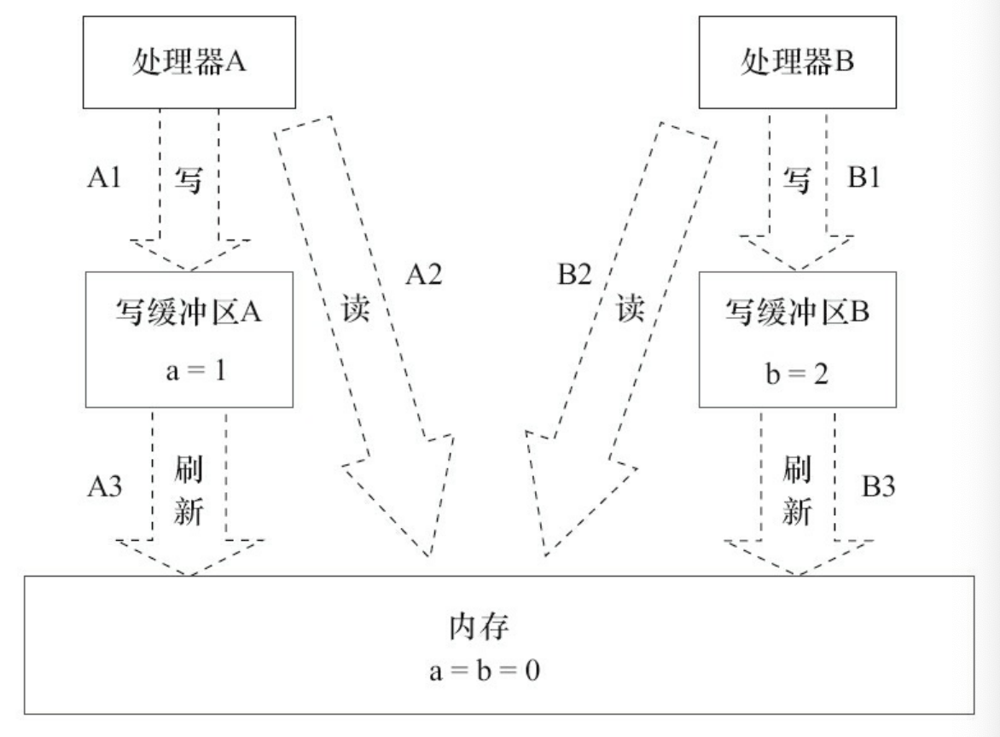
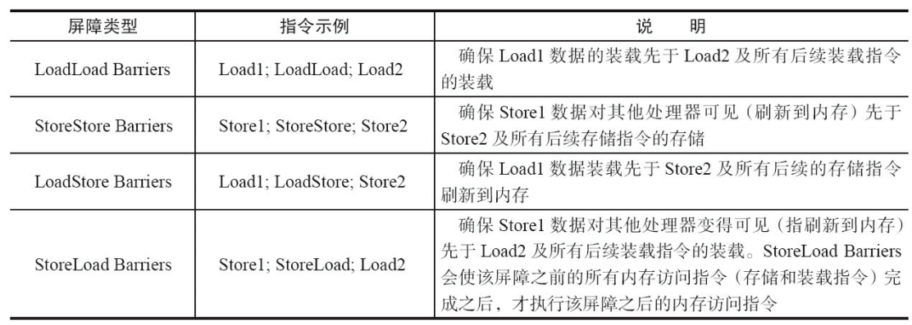
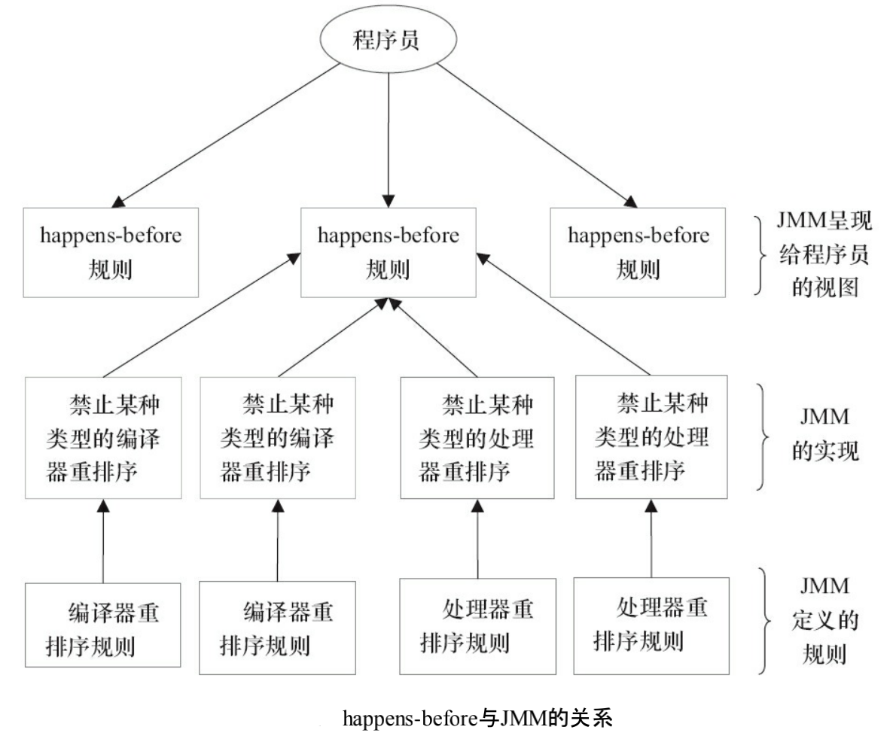

---

title: Java内存模式的基础
author: John Doe
tags:
  - JMM
  - 并发编程
categories:
  - JMM
  - 并发编程
date: 2022-04-17 09:11:00
---

### 并发编程模型的两个关键问题

在并发编程中，需要处理两个关键问题：线程之间如何通信及线程之间如何同步（这里的线程是指并发执行的活动实体）。

通信是指线程之间以何种机制来交换信息。在命令式编程中，线程之间的通信机制有两种：共享内存和消息传递。
- 在共享内存的并发模型里，线程之间共享程序的公共状态，通过写-读内存中的公共状态 进行隐式通信。
- 在消息传递的并发模型里，线程之间没有公共状态，线程之间必须通过发送消 息来显式进行通信。

同步是指程序中用于控制不同线程间操作发生相对顺序的机制。

- 在共享内存并发模型里，同步是显式进行的。程序员必须显式指定某个方法或某段代码需要在线程之间互斥执行。 
- 在消息传递的并发模型里，由于消息的发送必须在消息的接收之前，因此同步是隐式进行的。

Java的并发采用的是共享内存模型，Java线程之间的通信总是隐式进行，整个通信过程对 程序员完全透明。如果编写多线程程序的Java程序员不理解隐式进行的线程之间通信的工作 机制，很可能会遇到各种奇怪的内存可见性问题。

### Java内存模型的抽象结构

在Java中，所有实例域、静态域和数组元素都存储在堆内存中，堆内存在线程之间共享 （本章用“共享变量”这个术语代指实例域，静态域和数组元素）。局部变量（Local Variables），方 法定义参数（Java语言规范称之为Formal Method Parameters）和异常处理器参数（Exception Handler Parameters）不会在线程之间共享，它们不会有内存可见性问题，也不受内存模型的影 响。

Java线程之间的通信由Java内存模型（本文简称为JMM）控制，JMM决定一个线程对共享 变量的写入何时对另一个线程可见。从抽象的角度来看，JMM定义了线程和主内存之间的抽 象关系：线程之间的共享变量存储在主内存（Main Memory）中，每个线程都有一个私有的本地 内存（Local Memory），本地内存中存储了该线程以读/写共享变量的副本。本地内存是JMM的 一个抽象概念，并不真实存在。它涵盖了缓存、写缓冲区、寄存器以及其他的硬件和编译器优化。

### 从源代码到指令序列的重排序

在执行程序时，为了提高性能，编译器和处理器常常会对指令做重排序。重排序分3种类型。

 1. 编译器优化的重排序。编译器在不改变单线程程序语义的前提下，可以重新安排语句 的执行顺序。 
 
 2. 指令级并行的重排序。现代处理器采用了指令级并行技术（Instruction-Level Parallelism，ILP）来将多条指令重叠执行。如果不存在数据依赖性，处理器可以改变语句对应 机器指令的执行顺序。 
 
 3. 内存系统的重排序。由于处理器使用缓存和读/写缓冲区，这使得加载和存储操作看上 去可能是在乱序执行。

这些重排序可能会导致多线程程序 出现内存可见性问题。对于编译器，JMM的编译器重排序规则会禁止特定类型的编译器重排 序（不是所有的编译器重排序都要禁止）。对于处理器重排序，JMM的处理器重排序规则会要 求Java编译器在生成指令序列时，插入特定类型的内存屏障（Memory Barriers，Intel称之为 Memory Fence）指令，通过内存屏障指令来禁止特定类型的处理器重排序。

JMM属于语言级的内存模型，它确保在不同的编译器和不同的处理器平台之上，通过禁止特定类型的编译器重排序和处理器重排序，为程序员提供一致的内存可见性保证。

### 并发编程模型的分类
现代的处理器使用写缓冲区临时保存向内存写入的数据。写缓冲区可以保证指令流水线 持续运行，它可以避免由于处理器停顿下来等待向内存写入数据而产生的延迟。同时，通过以 批处理的方式刷新写缓冲区，以及合并写缓冲区中对同一内存地址的多次写，减少对内存总 线的占用。虽然写缓冲区有这么多好处，但每个处理器上的写缓冲区，仅仅对它所在的处理器 可见。这个特性会对内存操作的执行顺序产生重要的影响：处理器对内存的读/写操作的执行 顺序，不一定与内存实际发生的读/写操作顺序一致！

 
 这里处理器A和处理器B可以同时把共享变量写入自己的写缓冲区（A1，B1），然后从内存 中读取另一个共享变量（A2，B2），最后才把自己写缓存区中保存的脏数据刷新到内存中（A3， B3）。当以这种时序执行时，程序就可以得到x=y=0的结果。 从内存操作实际发生的顺序来看，直到处理器A执行A3来刷新自己的写缓存区，写操作 A1才算真正执行了。虽然处理器A执行内存操作的顺序为：A1→A2，但内存操作实际发生的顺 序却是A2→A1。此时，处理器A的内存操作顺序被重排序了（处理器B的情况和处理器A一样， 这里就不赘述了）。
 
这里的关键是，由于写缓冲区仅对自己的处理器可见，它会导致处理器执行内存操作的 顺序可能会与内存实际的操作执行顺序不一致。由于现代的处理器都会使用写缓冲区，因此现代的处理器都会允许对写-读操作进行重排序。

	常见的处理器都允许Store-Load重排序；常见的处理器都不允许对 存在数据依赖的操作做重排序。sparc-TSO和X86拥有相对较强的处理器内存模型，它们仅允 许对写-读操作做重排序（因为它们都使用了写缓冲区）。
    
为了保证内存可见性，Java编译器在生成指令序列的适当位置会插入内存屏障指令来禁 止特定类型的处理器重排序。JMM把内存屏障指令分为4类

 
 StoreLoad Barriers是一个“全能型”的屏障，它同时具有其他3个屏障的效果。现代的多处 理器大多支持该屏障（其他类型的屏障不一定被所有处理器支持）。执行该屏障开销会很昂 贵，因为当前处理器通常要把写缓冲区中的数据全部刷新到内存中（Buffer Fully Flush）。
 
 ### happens-before简介
 
 从JDK 5开始，Java使用新的JSR-133内存模型（除非特别说明，本文针对的都是JSR-133内 存模型）。JSR-133使用happens-before的概念来阐述操作之间的内存可见性。在JMM中，如果一 个操作执行的结果需要对另一个操作可见，那么这两个操作之间必须要存在happens-before关 系。这里提到的两个操作既可以是在一个线程之内，也可以是在不同线程之间。
 
与程序员密切相关的happens-before规则如下。 
- 程序顺序规则：一个线程中的每个操作，happens-before于该线程中的任意后续操作。  
- 监视器锁规则：对一个锁的解锁，happens-before于随后对这个锁的加锁。 
- volatile变量规则：对一个volatile域的写，happens-before于任意后续对这个volatile域的读。 
- 传递性：如果A happens-before B，且B happens-before C，那么A happens-before C。

		注意：两个操作之间具有happens-before关系，并不意味着前一个操作必须要在后一个 操作之前执行！happens-before仅仅要求前一个操作（执行的结果）对后一个操作可见，且前一 个操作按顺序排在第二个操作之前

 

一个happens-before规则对应于一个或多个编译器和处理器重排序规则。对 于Java程序员来说，happens-before规则简单易懂，它避免Java程序员为了理解JMM提供的内存 可见性保证而去学习复杂的重排序规则以及这些规则的具体实现方法。

 