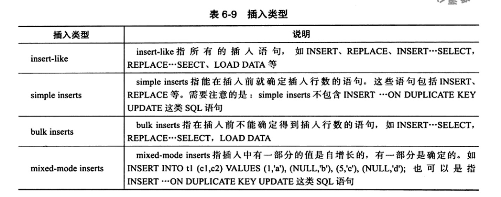
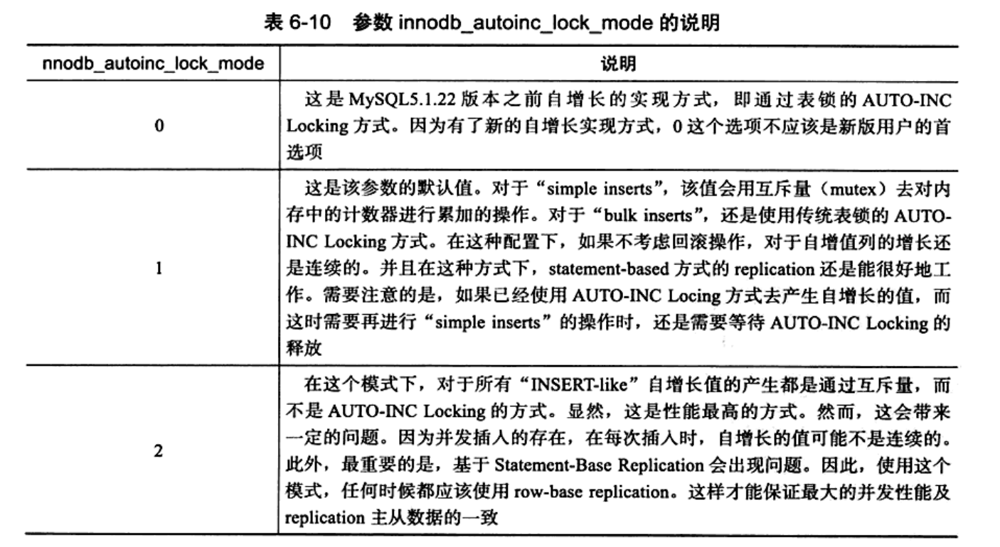

---

title: MySQL中的自增长锁需要注意的点
author: John Doe
tags:
  - MySQL
  - 自增主键
  - 锁
categories:
  - MySQL
date: 2022-04-05 10:13:00
---

在表设计的时候，int类型自增长的主键一直是我们的最爱，但是如果你不了解自增长主键，那么在某些情况下可能会给你带来一些意想不到的错误。

在innoDB存储引擎中，对每个含有自增长值的表都有一个自增长计数器，当对该表插入记录时，这个计数器会+n，插入方式会根据这个计数器的值确定自增id。而这种插入，为了避免在多线程下的冲突问题，采用了表锁来处理。同时为了提高插入性能，该锁并不是在一个事务提交之后才释放，而是完成对自增长值插入SQL语句后立即释放。尽管如此，这种方式的插入性能还是很差。事务必须等前一个插入完成，其次对于大批量的数据插入影响性能。

因此从MySQL5.1.22开始，innoDB提供了一种轻量级互斥遍历的自增长实现机制，通过innoDB_autoinc_lock_mode来控制自增长的模式。如下图所示

 

 
 
 此外，还需要特别注意的是innoDB存储引擎的自增长和MyISAM不同，MyISAM是表级锁，自增长无需考虑并发插入。
