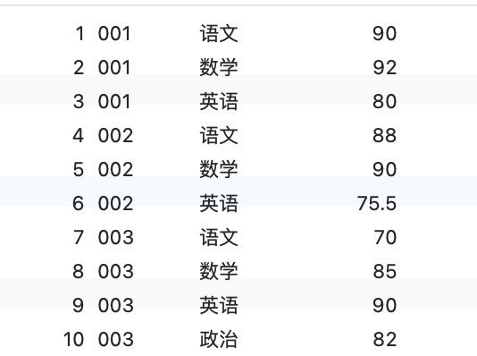
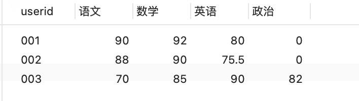
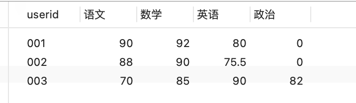
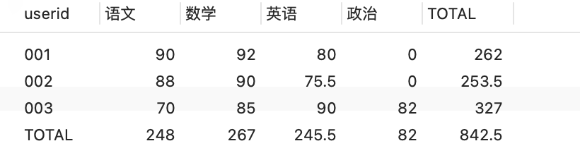
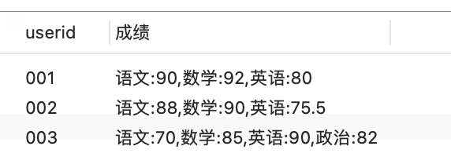

---

title: MySQL行转列，列转行
author: John Doe
tags:
  - MySQL
  - 查询
  - 行列转换
categories:
  - MySQL
date: 2022-04-26 20:09:00
---

## 行转列

- 建表
      CREATE TABLE tb_score(
          id INT(11) NOT NULL auto_increment,
          userid VARCHAR(20) NOT NULL COMMENT '用户id',
          subject VARCHAR(20) COMMENT '科目',
          score DOUBLE COMMENT '成绩',
          PRIMARY KEY(id)
      )ENGINE = INNODB DEFAULT CHARSET = utf8;

- 插入数据
      INSERT INTO tb_score(userid,subject,score) VALUES ('001','语文',90);
      INSERT INTO tb_score(userid,subject,score) VALUES ('001','数学',92);
      INSERT INTO tb_score(userid,subject,score) VALUES ('001','英语',80);
      INSERT INTO tb_score(userid,subject,score) VALUES ('002','语文',88);
      INSERT INTO tb_score(userid,subject,score) VALUES ('002','数学',90);
      INSERT INTO tb_score(userid,subject,score) VALUES ('002','英语',75.5);
      INSERT INTO tb_score(userid,subject,score) VALUES ('003','语文',70);
      INSERT INTO tb_score(userid,subject,score) VALUES ('003','数学',85);
      INSERT INTO tb_score(userid,subject,score) VALUES ('003','英语',90);
      INSERT INTO tb_score(userid,subject,score) VALUES ('003','政治',82);
      
 
 查询数据表中的内容（即转换前的结果）

		select * from tb_score;
 
 
 
 1. 使用case...when....then 进行行转列
 
         SELECT userid,
        SUM(CASE `subject` WHEN '语文' THEN score ELSE 0 END) AS '语文',
        SUM(CASE `subject` WHEN '数学' THEN score ELSE 0 END) AS '数学',
        SUM(CASE `subject` WHEN '英语' THEN score ELSE 0 END) AS '英语',
        SUM(CASE `subject` WHEN '政治' THEN score ELSE 0 END) AS '政治'
        FROM tb_score
        GROUP BY userid
  
 
 
 
 2. 使用IF() 进行行转列：
        SELECT userid,
        SUM(IF(`subject`='语文',score,0)) AS '语文',
        SUM(IF(`subject`='数学',score,0)) AS '数学',
        SUM(IF(`subject`='英语',score,0)) AS '英语',
        SUM(IF(`subject`='政治',score,0)) AS '政治'
        FROM tb_score
        GROUP BY userid

 
 > 注意点：

>>（1）SUM() 是为了能够使用GROUP BY根据userid进行分组，因为每一个userid对应的subject="语文"的记录只有一条，所以SUM() 的值就等于对应那一条记录的score的值。假如userid ='001' and subject='语文' 的记录有两条，则此时SUM() 的值将会是这两条记录的和，同理，使用Max()的值将会是这两条记录里面值最大的一个。但是正常情况下，一个user对应一个subject只有一个分数，因此可以使用SUM()、MAX()、MIN()、AVG()等聚合函数都可以达到行转列的效果。

>>（2）IF(`subject`='语文',score,0) 作为条件，即对所有subject='语文'的记录的score字段进行SUM()、MAX()、MIN()、AVG()操作，如果score没有值则默认为0。

3. 计算行列和
        SELECT IFNULL(userid,'TOTAL') AS userid,
        SUM(IF(`subject`='语文',score,0)) AS 语文,
        SUM(IF(`subject`='数学',score,0)) AS 数学,
        SUM(IF(`subject`='英语',score,0)) AS 英语,
        SUM(IF(`subject`='政治',score,0)) AS 政治,
        SUM(score) AS TOTAL 
        FROM tb_score
        GROUP BY userid WITH ROLLUP;
   
 
 
 4. 合并字段显示：利用group_concat()

          SELECT userid,GROUP_CONCAT(`subject`,":",score)AS 成绩 FROM tb_score
          GROUP BY userid
    
 
 
### 列转行
将每个userid对应的多个科目的成绩查出来，通过UNION ALL将结果集加起来

    附：UNION与UNION ALL的区别（摘）：

    1.对重复结果的处理：UNION会去掉重复记录，UNION ALL不会；

    2.对排序的处理：UNION会排序，UNION ALL只是简单地将两个结果集合并；

    3.效率方面的区别：因为UNION 会做去重和排序处理，因此效率比UNION ALL慢很多；
