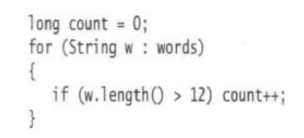
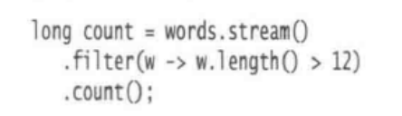
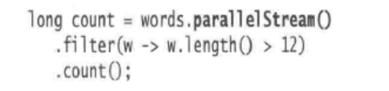
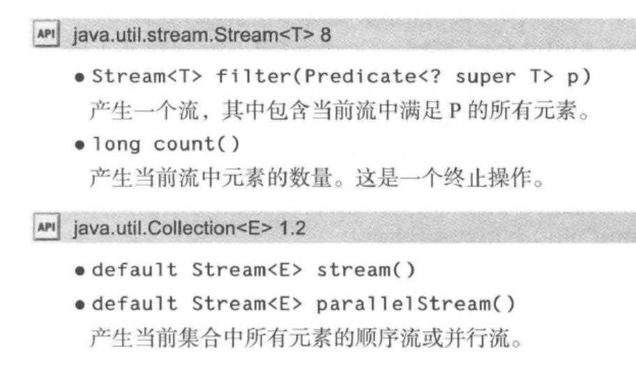
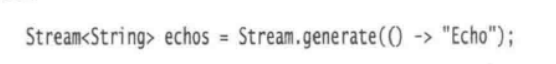
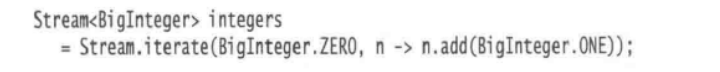
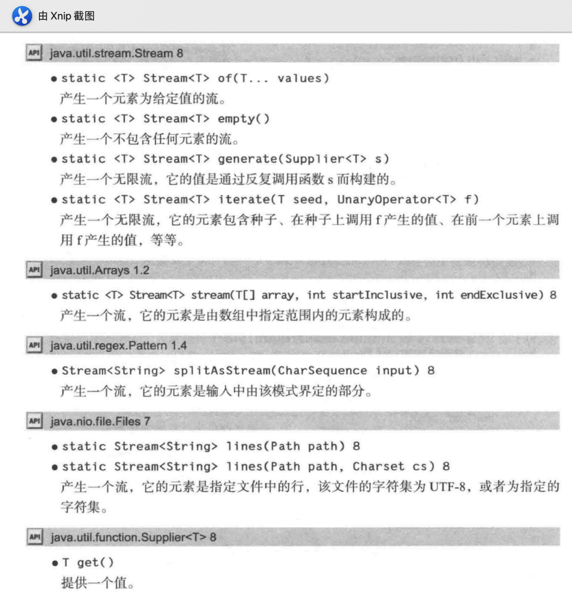
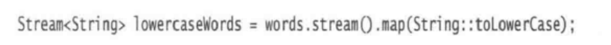
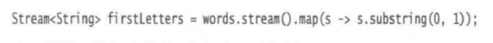
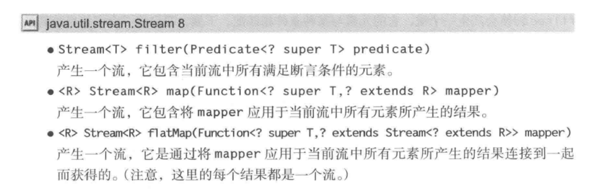

---

title: 关于Java SE 8 的流库
author: John Doe
tags:
  - Java
  - 流
categories:
  - Java
date: 2022-04-09 14:58:00
---

流提供了一种让我们可以在比集合更高的概念级别上去指定计算的数据视图。通过使用流，我们可以说明想要完成什么任务，而不是说明如何去实现它。我们将操作的调度留给具体实现去解决。

### 1.1 从迭代到流的操作
在处理集合时，我们通常会迭代遍历它的元素，并在每个元素上执行某项操作。

 
 
 而在使用流时，相同的操作是这样的
 
 
 
流的版本比循环版本更易于阅读。将stream修改为parallelstream就可以让流库以并行方式来执行过滤和计数。

 
 流遵循了“做什么,而非怎么做”的原则。在上述例子中，我们描述了需要做什么：获取单词长度，对其计数。我们没有指定该操作应该以什么顺序或者在哪个线程中执行。
 
 流表面上看起来和集合类似，但实际上期存在较大差异：
 1. 流并不存储其元素。这些元素可能存储在底层的集合中，或者是按需生成的。
 
 2. 流的操作不会修改器数据源。
 
 3. 流的操作是尽可能的惰性执行。即直至需要结果时，操作才会执行。
 
 还是以上述例子：stream会产生一个用于words的stream，filter会返回另一个流，其中只包含长度大于12的单词，count方法会将这个流简化为一个结果。即：
 1. 创建一个流
 2. 指定将初始化流转化为其他流的中间操作，可能包含多个步骤
 3. 应用终止，产生结果
 
 
 
 ### 1.2 流的创建
 可以用collection接口的stream方法将任何集合转换为一个流。如果你有一个数组，可以使用静态方法Stream.of方法进行流化。除此之外，也可以使用Array.stream(array,from,to)从数组from到to元素创建一个流。
 也可以使用stream.empty创建一个不包含任何元素的流。
 
 stream接口有两个用于创建无限流的静态方法。
 1. generate方法会接收一个不包含任何引元的函数。无论何时，只需要一个流类型的值，该函数会被调用产生一个这样的值。我们可以像下面这样获得一个常量值的流：
 
 
 
 2. iterate方法会接收一个“种子”值，以及一个函数，并且反复的将函数应用到之前的结果上，例如：
 
 
 
 java API中有大量方法可以产生流。
  
 
 
 ### 1.3filter、map和flatMap方法
 流的转换会产生一个新的流，它的元素派生自另一个流的元素。
 
 filter的引元是Predicate< T>，即从T到boolean的函数。
  
  通常我们想要按照某种方法来转换流中的值，此时，可以使用map方法并传递执行该转换的函数。例如，我们可以用下面的方式，将单词转化为小写：
  
 
 这里，我们使用的是带有方法引用的map，但是，通常我们可以使用lambda表达式来代替：
 
 

在使用map时，会有一个函数应用到每个元素上，并且其结果是包含了应用函数后所产生的所有结果的流。

 
 
 ### 1.4 抽取子流和连接流
 stream.limit（n）会返回一个新的流，它在n个元素之后结束（如果原来的流更短，那么就会在流结束时结束）。这个方法对于剪裁无限流的尺寸会显得特别有用。

 会产生包含100个随机数的流。
 
 调用strea.skip(n)则相反，会对其前n个元素。
 
 ### 1.5 其他的流转换
 
 distinct方法会返回一个流，他的元素时从原有流产生的，即剔除掉重复元素的流。
 
 对于流的排序，有多种sorted方法的变体可用。其中一种用于操作comparable元素的流，而另一种则支持comparator。
 
 与所有流转换一样，sorted方法会产生一个新的流（按照规则已经排序）。
 
 最后，peek方法会产生另一个流，在每次获取元素时，都会调用一个函数，对于调式很有用。
 
 ### 1.6 简单约简
 
简单约简是一种终结操作，他们会将流约简为可以在程序中使用的非流值。

count就是其中一种（返回流中的元素）

其他的简单约简还有max和min之类。他们会返回最大值和最小值。而这里返回的值是一个类型Optional< T>的值，它要么在其中包装了答案，要么表示没有任何值（流碰巧为空）。所有Optional的引入是为了避免空指针异常这类问题的出现。
  
  如果只想知道是否匹配，那么可以使用angMatch、allMatch、nonMatch方法。
  
  
### 1.7 收集结果

当流处理完后，可以使用iterator方法查看结果，也可以使用forEach（在并行流中，调用forEach会以任意顺序遍历，可以使用forEachOrdered方法，当然该方法会丧失并行处理的优势）

如果想将结果收集到数据结构中，可以使用toArray函数。

如果是收集到另一个目标中，可以使用collect方法。

### 1.8 收集到映射表中
Collectors.toMap方法有两个函数引元，他们用来产生映射表的键和值

如果有多个元素具体相同的键，则会存在冲突，收集器将会抛出一个Illeagel-StateException对象。可以通过第三个函数引元来覆盖这种行为。

未完，待续...

