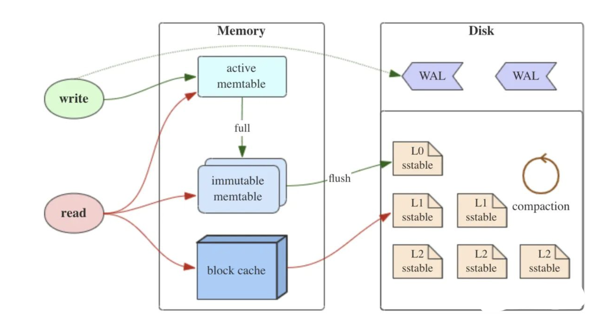
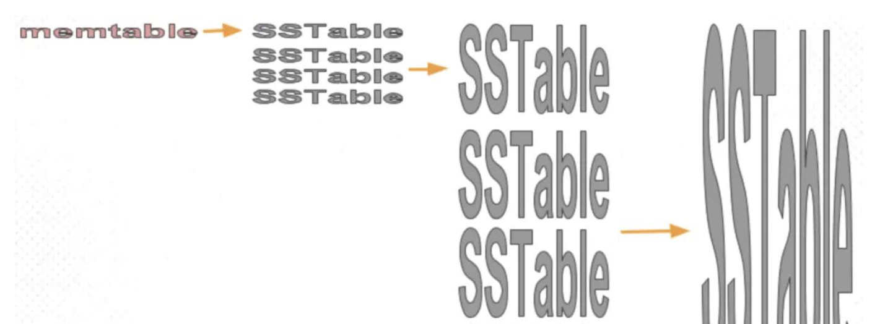
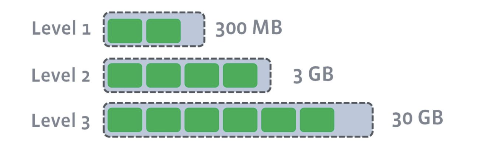
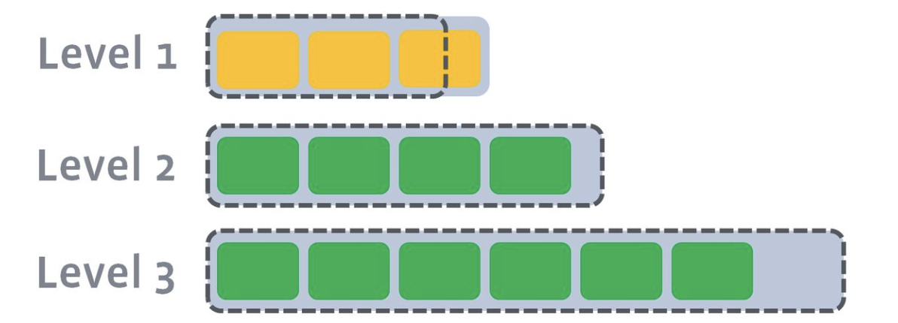
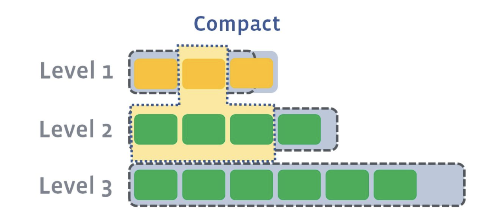
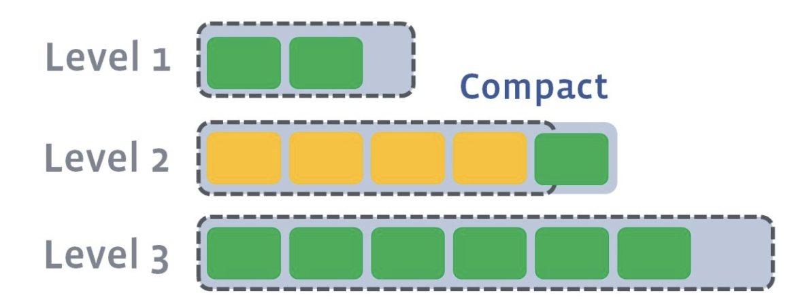

---

title: 初识LSM树
author: John Doe
tags:
  - LSM
categories:
  - LSM
date: 2022-04-14 09:09:00
---
今天在看MYSQL45讲的时候，看见一个新词LSM树，抱着好奇和求学的心态，上网查询了一下。对LMS树有了一个简单的认识。特以此篇来记录一下。摘抄自：https://zhuanlan.zhihu.com/p/181498475

### 简介

LSM树并不像B+树、红黑树一样是一颗严格的树状数据结构，它其实是一种存储结构，目前HBase,LevelDB,RocksDB这些NoSQL存储都是采用的LSM树。

对于传统关系型数据库使用btree或一些变体作为存储结构，其能高效进行查找。但保存在磁盘中时它也有一个明显的缺陷，那就是逻辑上相离很近但物理却可能相隔很远，这就可能造成大量的磁盘随机读写。随机读写比顺序读写慢很多，为了提升IO性能，我们需要一种能将随机操作变为顺序操作的机制，于是便有了LSM树。LSM树能让我们进行顺序写磁盘，从而大幅提升写操作，作为代价的是牺牲了一些读性能。

### LMS树的核心思想

 
由上图可知，LMS主要由三个部分组成：

1. MemTable
MemTable是在内存中的数据结构，用于保存最近更新的数据，会按照Key有序地组织这些数据，LSM树对于具体如何组织有序地组织数据并没有明确的数据结构定义，例如Hbase使跳跃表来保证内存中key的有序。

因为数据暂时保存在内存中，内存并不是可靠存储，如果断电会丢失数据，因此通常会通过WAL(Write-ahead logging，预写式日志)的方式来保证数据的可靠性。

2. Immutable MemTable

当 MemTable达到一定大小后，会转化成Immutable MemTable。Immutable MemTable是将转MemTable变为SSTable的一种中间状态。写操作由新的MemTable处理，在转存过程中不阻塞数据更新操作。

3. SSTable(Sorted String Table)

有序键值对集合，是LSM树组在磁盘中的数据结构。为了加快SSTable的读取，可以通过建立key的索引以及布隆过滤器来加快key的查找。

- 这里需要关注一个重点，LSM树(Log-Structured-Merge-Tree)正如它的名字一样，LSM树会将所有的数据插入、修改、删除等操作记录(注意是操作记录)保存在内存之中，当此类操作达到一定的数据量后，再批量地顺序写入到磁盘当中。这与B+树不同，B+树数据的更新会直接在原数据所在处修改对应的值，但是LSM数的数据更新是日志式的，当一条数据更新是直接append一条更新记录完成的。这样设计的目的就是为了顺序写，不断地将Immutable MemTable flush到持久化存储即可，而不用去修改之前的SSTable中的key，保证了顺序写。

- 因此当MemTable达到一定大小flush到持久化存储变成SSTable后，在不同的SSTable中，可能存在相同Key的记录，当然最新的那条记录才是准确的。这样设计的虽然大大提高了写性能，但同时也会带来一些问题：

      1）冗余存储，对于某个key，实际上除了最新的那条记录外，其他的记录都是冗余无用的，但是仍然占用了存储空间。因此需要进行Compact操作(合并多个SSTable)来清除冗余的记录。
      2）读取时需要从最新的倒着查询，直到找到某个key的记录。最坏情况需要查询完所有的SSTable，这里可以通过前面提到的索引/布隆过滤器来优化查找速度。
      
### LSM树的Compact策略

从上面可以看出，Compact操作是十分关键的操作，否则SSTable数量会不断膨胀。在Compact策略上，主要介绍两种基本策略：size-tiered和leveled。

不过在介绍这两种策略之前，先介绍三个比较重要的概念，事实上不同的策略就是围绕这三个概念之间做出权衡和取舍。

1. 读放大:读取数据时实际读取的数据量大于真正的数据量。例如在LSM树中需要先在MemTable查看当前key是否存在，不存在继续从SSTable中寻找。
2. 写放大:写入数据时实际写入的数据量大于真正的数据量。例如在LSM树中写入时可能触发Compact操作，导致实际写入的数据量远大于该key的数据量。
3. 空间放大:数据实际占用的磁盘空间比数据的真正大小更多。上面提到的冗余存储，对于一个key来说，只有最新的那条记录是有效的，而之前的记录都是可以被清理回收的。

1) size-tiered 策略

 

size-tiered策略保证每层SSTable的大小相近，同时限制每一层SSTable的数量。如上图，每层限制SSTable为N，当每层SSTable达到N后，则触发Compact操作合并这些SSTable，并将合并后的结果写入到下一层成为一个更大的sstable。

由此可以看出，当层数达到一定数量时，最底层的单个SSTable的大小会变得非常大。并且size-tiered策略会导致空间放大比较严重。即使对于同一层的SSTable，每个key的记录是可能存在多份的，只有当该层的SSTable执行compact操作才会消除这些key的冗余记录。

2) leveled策略

 

leveled策略也是采用分层的思想，每一层限制总文件的大小。

但是跟size-tiered策略不同的是，leveled会将每一层切分成多个大小相近的SSTable。这些SSTable是这一层是全局有序的，意味着一个key在每一层至多只有1条记录，不存在冗余记录。之所以可以保证全局有序，是因为合并策略和size-tiered不同，接下来会详细提到。

假设存在以下这样的场景:

1) L1的总大小超过L1本身大小限制：

 
 
2) 此时会从L1中选择至少一个文件，然后把它跟L2有交集的部分(非常关键)进行合并。生成的文件会放在L2:

 
 
 如上图所示，此时L1第二SSTable的key的范围覆盖了L2中前三个SSTable，那么就需要将L1中第二个SSTable与L2中前三个SSTable执行Compact操作。

3) 如果L2合并后的结果仍旧超出L5的阈值大小，需要重复之前的操作 —— 选至少一个文件然后把它合并到下一层:

 
 
 	需要注意的是，多个不相干的合并是可以并发进行的

leveled策略相较于size-tiered策略来说，每层内key是不会重复的，即使是最坏的情况，除开最底层外，其余层都是重复key，按照相邻层大小比例为10来算，冗余占比也很小。因此空间放大问题得到缓解。但是写放大问题会更加突出。举一个最坏场景，如果LevelN层某个SSTable的key的范围跨度非常大，覆盖了LevelN+1层所有key的范围，那么进行Compact时将涉及LevelN+1层的全部数据。

### 小结

从Btree到LSM，其设计思想都和底层息息相关，了解学习不同的思想和底层。有助于我们对不同的框架的学习和思考。

