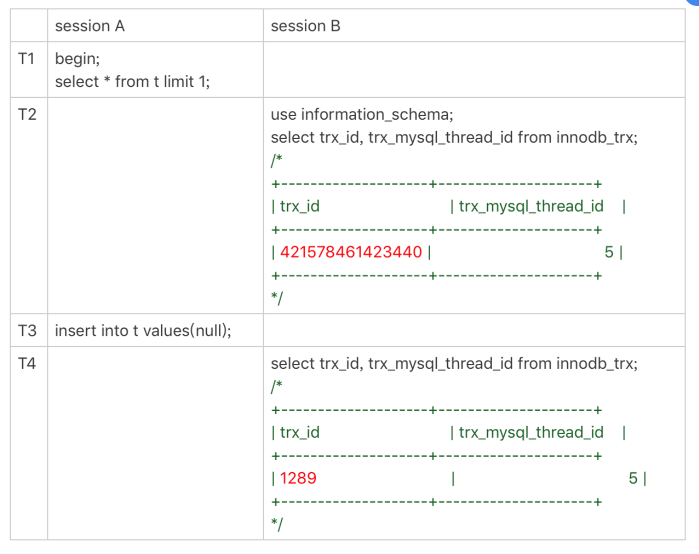
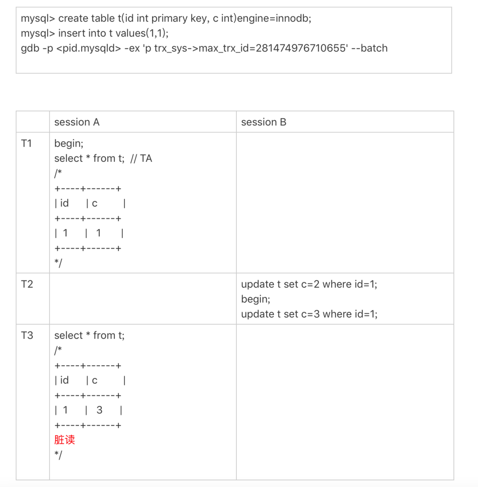
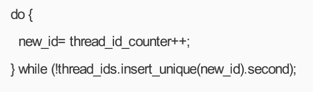

---

title: 自增id用完了怎么办？
author: John Doe
tags:
  - MySQL
  - 自增id
categories:
  - MySQL
date: 2022-04-10 13:40:00
---

MySQL里有很多自增的id，每个自增id都是定义了初始值，然后不停地往上加步长。虽然自然数 是没有上限的，但是在计算机里，只要定义了表示这个数的字节长度，那它就有上限。比如，无 符号整型(unsigned int)是4个字节，上限就是2 -1。既然自增id有上限，就有可能被用完。但是，自增id用完了会怎么样呢？

### 表定义自增id

表定义的自增值达到上限后的逻辑是：再申请下一个id时，得到的值保持不变。即当自增id用完，在插入新数据会报错（主键冲突）

2^32 -1（4294967295）不是一个特别大的数，对于一个频繁插入删除数据的表来说，是可能会被 用完的。因此在建表的时候你需要考察你的表是否有可能达到这个上限，如果有可能，就应该创 建成8个字节的bigint unsigned。

### InnoDB系统自自增row__id

如果你创建的InnoDB表没有指定主键，那么InnoDB会给你创建一个不可见的，长度为6个字节 的row_id。InnoDB维护了一个全局的dict_sys.row_id值，所有无主键的InnoDB表，每插入一行 数据，都将当前的dict_sys.row_id值作为要插入数据的row_id，然后把dict_sys.row_id的值加1。

实际上，在代码实现时row_id是一个长度为8字节的无符号长整型(bigint unsigned)。但 是，InnoDB在设计时，给row_id留的只是6个字节的长度，这样写到数据表中时只放了最后6个 字节，所以row_id能写到数据表中的值，就有两个特征：
1.  row_id写入表中的值范围，是从0到2^48 -1；
2. 当dict_sys.row_id=2 时，如果再有插入数据的行为要来申请row_id，拿到以后再取最后6个 字节的话就是0。

也就是说，写入表的row_id是从0开始到2^48 -1。达到上限后，下一个值就是0，然后继续循环。 当然，2^48 -1这个值本身已经很大了，但是如果一个MySQL实例跑得足够久的话，还是可能达到这个上限的。在InnoDB逻辑里，申请到row_id=N后，就将这行数据写入表中；如果表中已经存在row_id=N的行，新写入的行就会覆盖原有的行。

    从这个角度看，我们还是应该在InnoDB表中主动创建自增主键。因为，表自增id到达上限后， 再插入数据时报主键冲突错误，是更能被接受的。 毕竟覆盖数据，就意味着数据丢失，影响的是数据可靠性；报主键冲突，是插入失败，影响的是 可用性。而一般情况下，可靠性优先于可用性。

### Xid
MySQL内部维护了一个全局变量global_query_id，每次执行语句的时候将它赋值给Query_id， 然后给这个变量加1。如果当前语句是这个事务执行的第一条语句，那么MySQL还会同时把 Query_id赋值给这个事务的Xid。

而global_query_id是一个纯内存变量，重启之后就清零了。所以你就知道了，在同一个数据库实 例中，不同事务的Xid也是有可能相同的。

但是MySQL重启之后会重新生成新的binlog文件，这就保证了，同一个binlog文件里，Xid一定是 惟一的。

虽然MySQL重启不会导致同一个binlog里面出现两个相同的Xid，但是如果global_query_id达到 上限后，就会继续从0开始计数。从理论上讲，还是就会出现同一个binlog里面出现相同Xid的场景。

因为global_query_id定义的长度是8个字节，这个自增值的上限是2^64 -1。要出现这种情况，必须是下面这样的过程：
1. 执行一个事务，假设Xid是A；
2. 接下来执行2 次查询语句，让global_query_id回到A； 
3. 再启动一个事务，这个事务的Xid也是A。
不过，2 这个值太大了，大到你可以认为这个可能性只会存在于理论上。

### Innodb trx__id
Xid和InnoDB的trx_id是两个容易混淆的概念。

Xid是由server层维护的。InnoDB内部使用Xid，就是为了能够在InnoDB事务和server之间做关 联。但是，InnoDB自己的trx_id，是另外维护的。

InnoDB内部维护了一个max_trx_id全局变量，每次需要申请一个新的trx_id时，就获得 max_trx_id的当前值，然后并将max_trx_id加1。

InnoDB数据可见性的核心思想是：每一行数据都记录了更新它的trx_id，当一个事务读到一行数据的时候，判断这个数据是否可见的方法，就是通过事务的一致性视图与这行数据的trx_id做对 比。

对于正在执行的事务，你可以从information_schema.innodb_trx表中看到事务的trx_id。

看下面这个例子：

 
 session B里，我从innodb_trx表里查出的这两个字段，第二个字段trx_mysql_thread_id就是线程 id。显示线程id，是为了说明这两次查询看到的事务对应的线程id都是5，也就是session A所在的线程。
 
 可以看到，T2时刻显示的trx_id是一个很大的数；T4时刻显示的trx_id是1289，看上去是一个比 较正常的数字。这是什么原因呢？
 
 实际上，在T1时刻，session A还没有涉及到更新，是一个只读事务。而对于只读事务，InnoDB 并不会分配trx_id。也就是说：
1. 在T1时刻，trx_id的值其实就是0。而这个很大的数，只是显示用的。一会儿我会再和你说说这个数据的生成逻辑。 
2. 直到session A 在T3时刻执行insert语句的时候，InnoDB才真正分配了trx_id。所以，T4时刻，session B查到的这个trx_id的值就是1289。

需要注意的是，除了显而易见的修改类语句外，如果在select 语句后面加上for update，这个事 务也不是只读事务。

	另外注意：
    1. update 和 delete语句除了事务本身，还涉及到标记删除旧数据，也就是要把数据放到purge 队列里等待后续物理删除，这个操作也会把max_trx_id+1， 因此在一个事务中至少加2； 
    2. InnoDB的后台操作，比如表的索引信息统计这类操作，也是会启动内部事务的，因此你可能看到，trx_id值并不是按照加1递增的。
 
那么，T2时刻查到的这个很大的数字是怎么来的呢？

其实，这个数字是每次查询的时候由系统临时计算出来的。它的算法是：把当前事务的trx变量的 指针地址转成整数，再加上2 。使用这个算法，就可以保证以下两点：
1. 因为同一个只读事务在执行期间，它的指针地址是不会变的，所以不论是在 innodb_trx还是 在innodb_locks表里，同一个只读事务查出来的trx_id就会是一样的。
2. 如果有并行的多个只读事务，每个事务的trx变量的指针地址肯定不同。这样，不同的并发只读事务，查出来的trx_id就是不同的。
那么，为什么还要再加上2^48呢？
在显示值里面加上2 ，目的是要保证只读事务显示的trx_id值比较大，正常情况下就会区别于读 写事务的id。但是，trx_id跟row_id的逻辑类似，定义长度也是8个字节。因此，在理论上还是可 能出现一个读写事务与一个只读事务显示的trx_id相同的情况。不过这个概率很低，并且也没有 什么实质危害，可以不管它。

另一个问题是，只读事务不分配trx__id，有什么好处呢？
- 一个好处是，这样做可以减小事务视图里面活跃事务数组的大小。因为当前正在运行的只读事务，是不影响数据的可见性判断的。所以，在创建事务的一致性视图时，InnoDB就只需要拷贝读写事务的trx_id。 
- 另一个好处是，可以减少trx_id的申请次数。在InnoDB里，即使你只是执行一个普通的select语句，在执行过程中，也是要对应一个只读事务的。所以只读事务优化后，普通的查询语句 不需要申请trx_id，就大大减少了并发事务申请trx_id的锁冲突。

由于只读事务不分配trx_id，一个自然而然的结果就是trx_id的增加速度变慢了。

但是，max_trx_id会持久化存储，重启也不会重置为0，那么从理论上讲，只要一个MySQL服务 跑得足够久，就可能出现max_trx_id达到2^48-1的上限，然后从0开始的情况。

当达到这个状态后，MySQL就会持续出现一个脏读的bug，我们来复现一下这个bug。

首先我们需要把当前的max_trx_id先修改成248-1。注意：这个case里使用的是可重复读隔离级 别。具体的操作流程如下：

 
 
 由于我们已经把系统的max_trx_id设置成了2^48-1，所以在session A启动的事务TA的低水位就是2^48-1
 
 在T2时刻，session B执行第一条update语句的事务id就是2 -1，而第二条update语句的事务id 就是0了，这条update语句执行后生成的数据版本上的trx_id就是0。
 
 在T3时刻，session A执行select语句的时候，判断可见性发现，c=3这个数据版本的trx_id，小于 事务TA的低水位，因此认为这个数据可见。
 
 但，这个是脏读。
 
 由于低水位值会持续增加，而事务id从0开始计数，就导致了系统在这个时刻之后，所有的查询 都会出现脏读的。
 
并且，MySQL重启时max_trx_id也不会清0，也就是说重启MySQL，这个bug仍然存在。 那么，这个bug也是只存在于理论上吗？

假设一个MySQL实例的TPS是每秒50万，持续这个压力的话，在17.8年后，就会出现这个情 况。如果TPS更高，这个年限自然也就更短了。但是，从MySQL的真正开始流行到现在，恐怕 都还没有实例跑到过这个上限。不过，这个bug是只要MySQL实例服务时间够长，就会必然出现的。

### thread_id

接下来，我们再看看线程id（thread_id）。其实，线程id才是MySQL中最常见的一种自增id。平 时我们在查各种现场的时候，showprocesslist里面的第一列，就是thread_id。

thread_id的逻辑很好理解：系统保存了一个全局变量thread_id_counter，每新建一个连接，就 将thread_id_counter赋值给这个新连接的线程变量。

thread_id_counter定义的大小是4个字节，因此达到2 -1后，它就会重置为0，然后继续增加。 但是，你不会在showprocesslist里看到两个相同的thread_id。

这，是因为MySQL设计了一个唯一数组的逻辑，给新线程分配thread_id的时候，逻辑代码是这样的：

 
 
 ### 小结
 
MySQL不同的自增id达到上限以后的行为。数据库系统作为一个可能需要7*24小时全年无休的服务，考虑这些边界是非常有必要的。

每种自增id有各自的应用场景，在达到上限后的表现也不同：
1. 表的自增id达到上限后，再申请时它的值就不会改变，进而导致继续插入数据时报主键冲突 的错误。 
2. row_id达到上限后，则会归0再重新递增，如果出现相同的row_id，后写的数据会覆盖之前 的数据。 
3. Xid只需要不在同一个binlog文件中出现重复值即可。虽然理论上会出现重复值，但是概率极 小，可以忽略不计。 
4. InnoDB的max_trx_id 递增值每次MySQL重启都会被保存起来，所以我们文章中提到的脏读 的例子就是一个必现的bug，好在留给我们的时间还很充裕。 
5. thread_id是我们使用中最常见的，而且也是处理得最好的一个自增id逻辑了。

不同的自增id有不同的上限值，上限值的大小取决于声明的类型长度。

	注：学习自MYSQL45讲
 