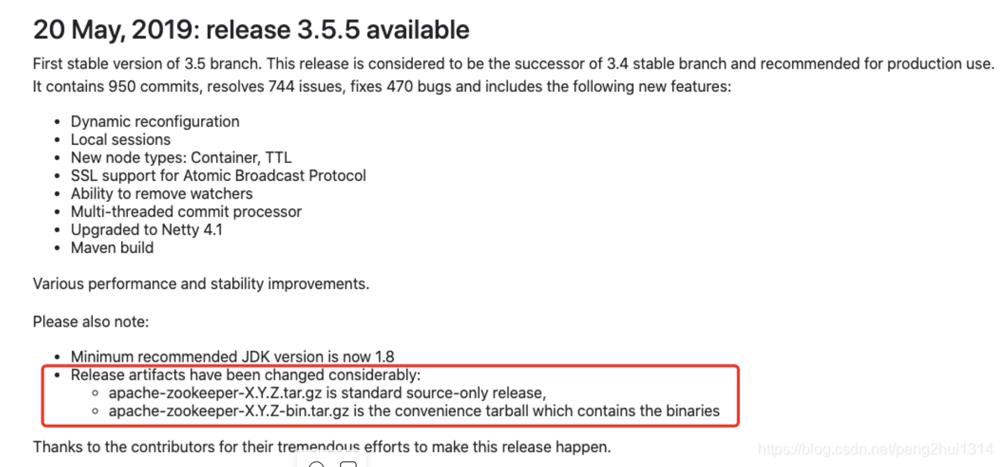

---

title: 记一次安装Zookeeper启动失败的坑
author: John Doe
tags:
  - Zookeeper
categories:
  - Zookeeper
date: 2022-04-21 21:36:00
---
今天在阿里云上安装ZooKeeper，然后启动时一直报: Starting zookeeper … FAILED TO START。折腾了一会，经查阅资料发现，原来和版本有莫大关系...

### 1. 下载的版本问题（>= 3.5.5）

实际上只要 >= 3.5.5 版本都会出现这种问题。

问题原因：下载了错误的版本文件，Zookeeper 从3.5.5后开始拆分为两个版本，而且他们的结构还很类似。

- 标准版本（Apache ZooKeeper x.y.z ），下载的文件名为：apache-zookeeper-x.y.z-bin.tar.gz
- 另一个是源码版本（Apache ZooKeeper x.y.z Source Release），下载的文件名为：apache-zookeeper-x.y.z.tar.gz

 
 
 
 所以下载 Zookeeper 的时候要注意，应该下载第一个(本人头铁，下载了第二个)。
 
 ### 2. 端口冲突问题（>=3.5.0）
 在3.5.5版本及以上，Zookeeper 提供了一个内嵌的Jetty容器来运行 AdminServer，默认占用的是 8080端口，AdminServer 主要是来查看 Zookeeper 的一些状态，如果机器上有其他程序（比如：Tomcat）占用了 8080 端口，也会导致 Starting zookeeper … FAILED TO START 的问题。

可以通过以下几种方式去解决：

-  禁用 AdminServer 服务
		admin.enableServer=false
- 修改器端口号：

		admin.serverPort=9000

转载自：https://blog.csdn.net/peng2hui1314/article/details/107255142

