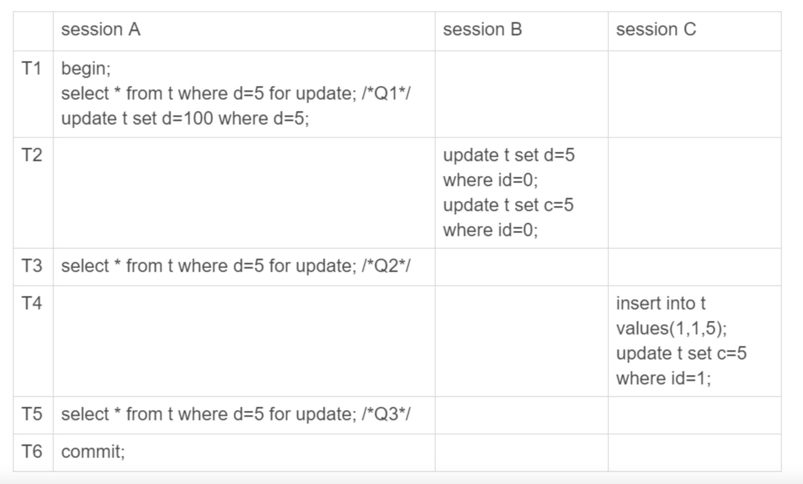

---

title: 读已提交下，为什么建议binlog使用row格式
author: John Doe
tags:
  - MySQL
  - 读已提交
  - binlog
categories:
  - MySQL
date: 2022-04-05 13:16:00
---

next-key lock 实际上是由间隙锁加行锁实现的。而间隙锁是在可重复读隔离级别下才会生效的。因此在读已提交这个隔离级别下，为了解决数据和日志的不一致问题，需要将binlog的格式改为row，而不是statement。（statement记录的是逻辑上的SQL，而row记录的是对应行的变化情况）

解释：

CREATE TABLE `t` (
  `id` int(11) NOT NULL,
  `c` int(11) DEFAULT NULL,
  `d` int(11) DEFAULT NULL,
  PRIMARY KEY (`id`),
  KEY `c` (`c`)
) ENGINE=InnoDB;
 
insert into t values(0,0,0),(5,5,5),
(10,10,10),(15,15,15),(20,20,20),(25,25,25);

 
建表执行过程如上所述，首先针对于T3和T5时session A查询会出现幻读问题（语义上，我们是要把d=5的所有数据锁住，而后续SessionB和C都能够操作d=5的数据），其次会出现数据和日志不一致的问题（binlog写入是根据commit提交决定的，因此SessionB会先写入，随后Session C，最后才是Session A，这样导致的结果就是，我们数据库的数据是：
1. 经过 T1 时刻，id=5 这一行变成 (5,5,100)，当然这个结果最终是在 T6 时刻正式提交的 ;
2. 经过 T2 时刻，id=0 这一行变成 (0,5,5);
3. 经过 T4 时刻，表里面多了一行 (1,5,5);
4. 其他行跟这个执行序列无关，保持不变。

而binlog日志里面记录的数据却是这样的：
update t set d=5 where id=0; /*(0,0,5)*/

update t set c=5 where id=0; /*(0,5,5)*/
 
insert into t values(1,1,5); /*(1,1,5)*/

update t set c=5 where id=1; /*(1,5,5)*/
 
update t set d=100 where d=5;/* 所有 d=5 的行，d 改成 100*/

这个语句序列，不论是拿到备库去执行，还是以后用 binlog 来克隆一个库，这三行的结果，都变成了 (0,5,100)、(1,5,100) 和 (5,5,100)。
也就是说，id=0 和 id=1 这两行，发生了数据不一致。
）

因此在读已提交下，使用Statement格式的binlog日志是不可取的。而如果你改用row格式，那么对于上面这种情况，记录的是对应行的修改，而不是逻辑上的SQL语句，能够避免这种问题。