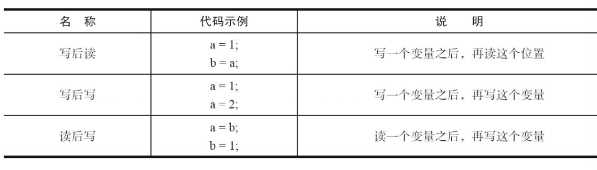

---

title: 重排序
author: John Doe
tags:
  - 重排序
  - JMM
  - 并发编程
categories:
  - 并发编程
date: 2022-04-17 10:01:00
---

重排序是指编译器和处理器为了优化程序性能而对指令序列进行重新排序的一种手段。

### 数据依赖性

如果两个操作访问同一个变量，且这两个操作中有一个为写操作，此时这两个操作之间 就存在数据依赖性。数据依赖分为下列3种类型

 
 
 上面3种情况，只要重排序两个操作的执行顺序，程序的执行结果就会被改变。 而编译器和处理器可能会对操作做重排序。编译器和处理器在重排序时，会遵守数据依赖性，编译器和处理器不会改变存在数据依赖关系的两个操作的执行顺序。 这里所说的数据依赖性仅针对单个处理器中执行的指令序列和单个线程中执行的操作， 不同处理器之间和不同线程之间的数据依赖性不被编译器和处理器考虑。
 
 ### as-if-serial语义
 
 as-if-serial语义的意思是：不管怎么重排序（编译器和处理器为了提高并行度），（单线程） 程序的执行结果不能被改变。编译器、runtime和处理器都必须遵守as-if-serial语义。
 
 为了遵守as-if-serial语义，编译器和处理器不会对存在数据依赖关系的操作做重排序，因 为这种重排序会改变执行结果。但是，如果操作之间不存在数据依赖关系，这些操作就可能被 编译器和处理器重排序。
 
 as-if-serial语义把单线程程序保护了起来，遵守as-if-serial语义的编译器、runtime和处理器 共同为编写单线程程序的程序员创建了一个幻觉：单线程程序是按程序的顺序来执行的。as- if-serial语义使单线程程序员无需担心重排序会干扰他们，也无需担心内存可见性问题。
 
 ### 程序顺序规则
 1）A happens-before B。 
 
 2）B happens-before C。 
 
 3）A happens-before C。
 
 这里的第3个happens-before关系，是根据happens-before的传递性推导出来的。 这里A happens-before B，但实际执行时B却可以排在A之前执行（看上面的重排序后的执 行顺序）。如果A happens-before B，JMM并不要求A一定要在B之前执行。JMM仅仅要求前一个 操作（执行的结果）对后一个操作可见，且前一个操作按顺序排在第二个操作之前。这里操作A 的执行结果不需要对操作B可见；而且重排序操作A和操作B后的执行结果，与操作A和操作B 按happens-before顺序执行的结果一致。在这种情况下，JMM会认为这种重排序并不非法（not illegal），JMM允许这种重排序。
 
 在计算机中，软件技术和硬件技术有一个共同的目标：在不改变程序执行结果的前提下， 尽可能提高并行度。编译器和处理器遵从这一目标，从happens-before的定义我们可以看出， JMM同样遵从这一目标。
 
 
 
 