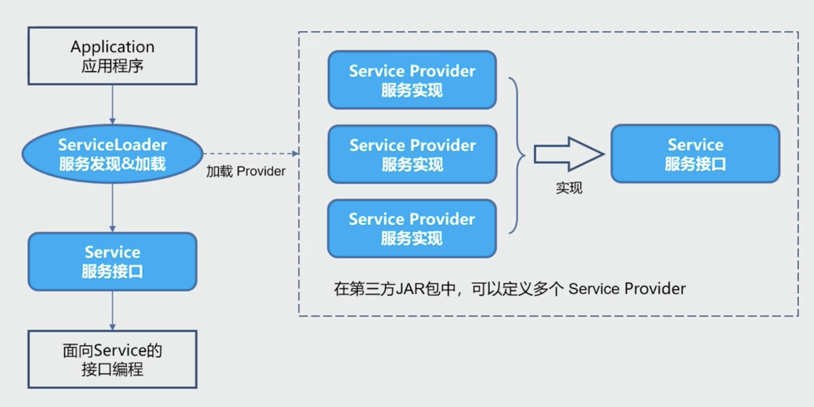
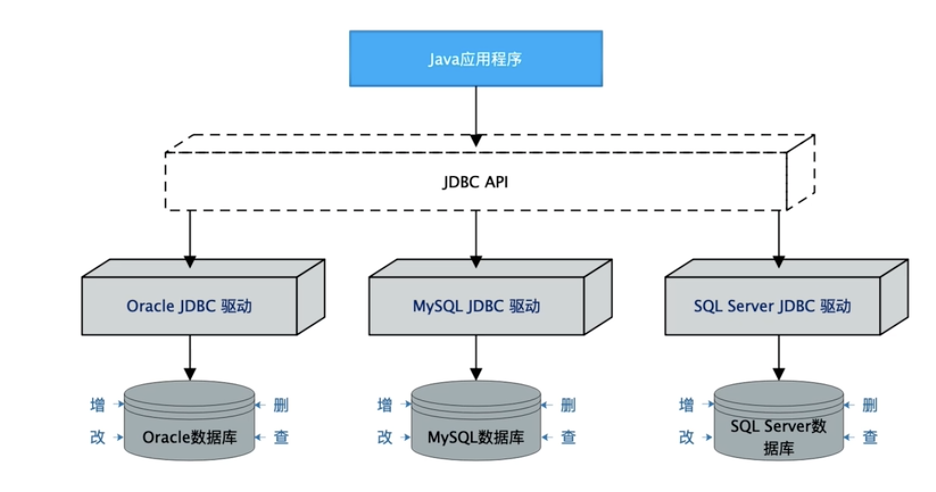
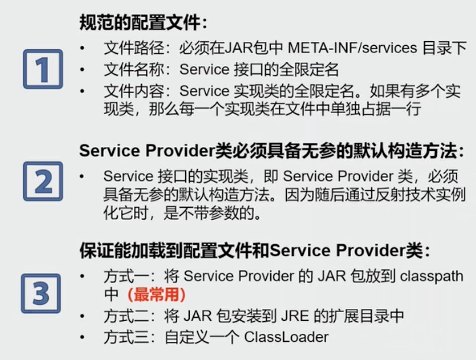
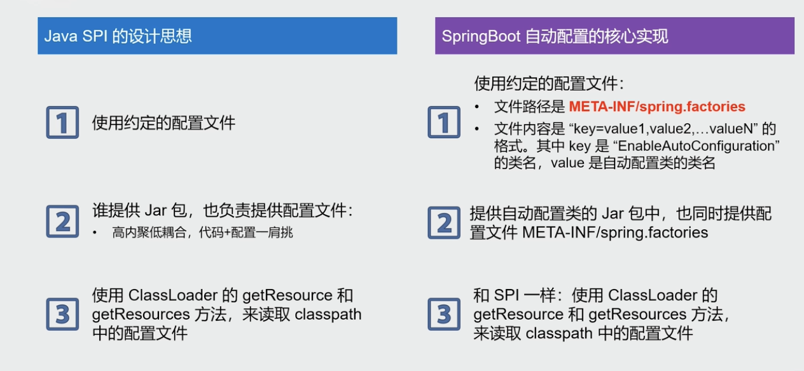

---

title: Java SPI机制
author: John Doe
tags:
  - Java
  - SPI
categories:
  - Java
date: 2022-04-29 09:06:00
---
## 基本概念
SPI（Serivce Provider Interface）：它是从java6开始引入的，一种基于classloader来发现并加载服务的机制。

一个标准的SPI有三个组件构成：
    - Service：是一个公开的接口或抽象类，定义了一个抽象的功能模块
    - Service Provider：service的一个实现类
    - ServiceLoader：核心组件，负责在运行时发现并加载service provider

## SPI运行流程

 
 
 Application无需关注service的具体实现，只需面向接口编程
 
 
## Java SPI在JDBC中的应用

 
 
 - 在Java SPI前，我们需要编码去注册驱动Class.forName("com.mysql.jdbc.Driver")
 - 在引入Java SPI后，我们只需要日引入对应的依赖jar包即可

### Java SPI的三大规范要素
 
 
### 小结
- 作用：提供了一种组件发现和注册的方式，可以用于实现各种插件，或者灵活替换所使用的组件
- 优点：面向接口编程，优雅的实现模块之间的解耦
- 设计思想：面向接口+配置文件+反射技术
- 应用场景：JDBC、SLF4J等

### 补充：Java SPI和SPringBoot自动装配

 