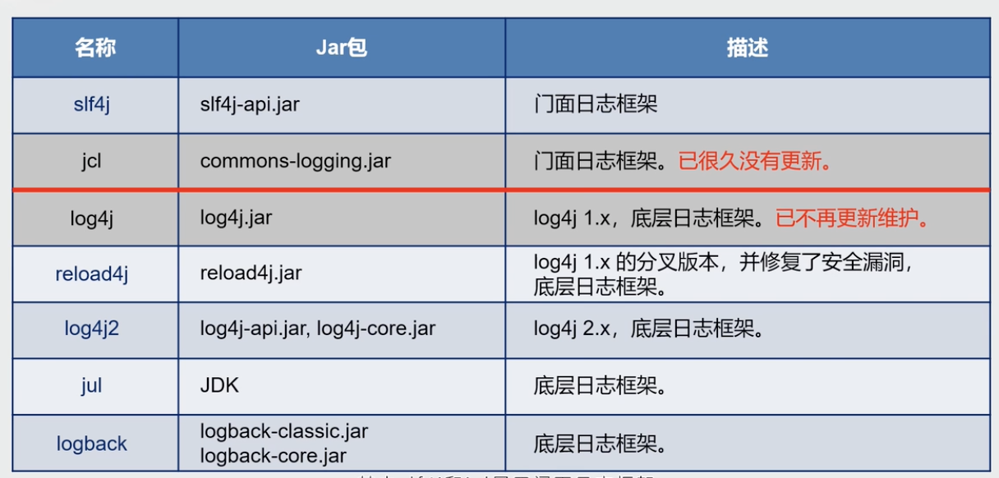
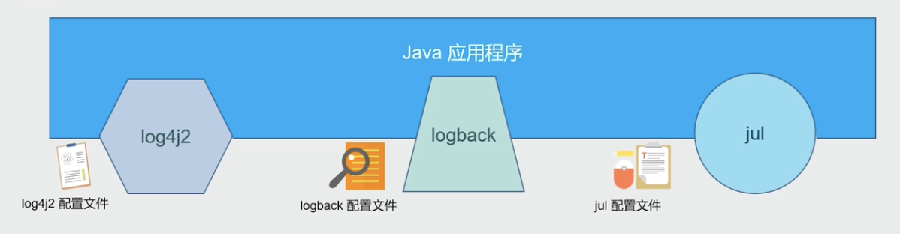
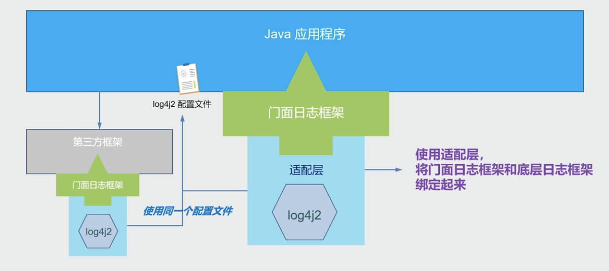
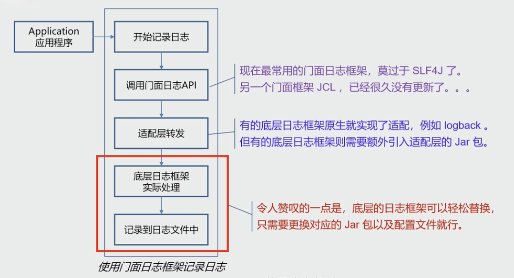
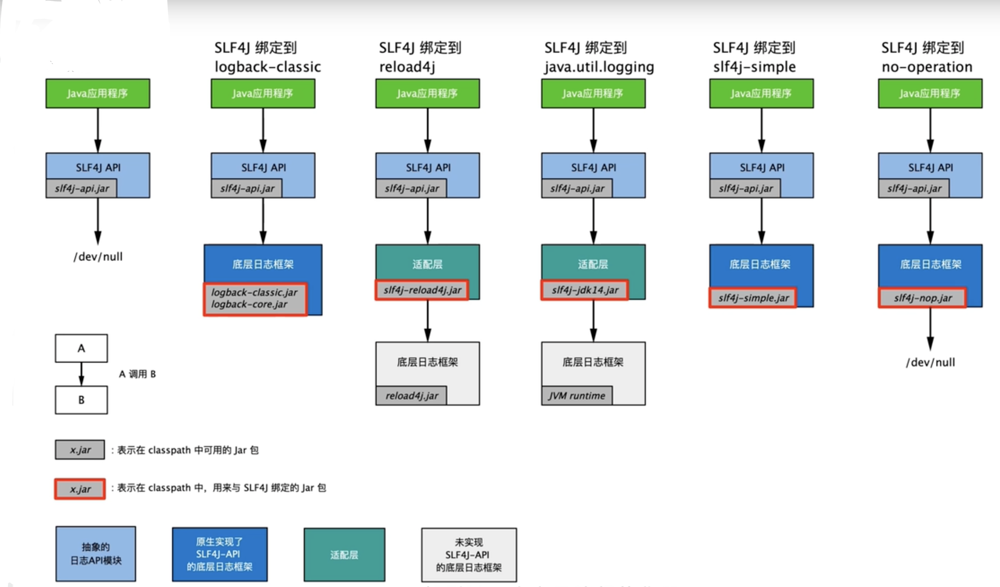
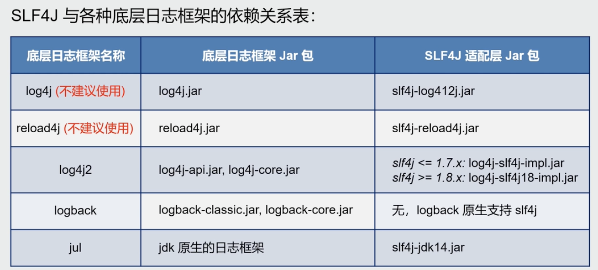
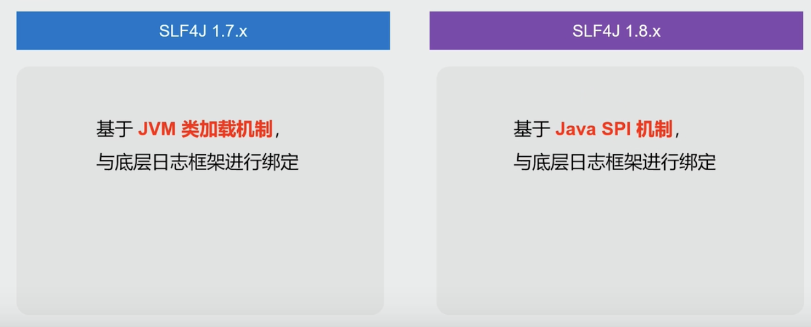

---

title: SLF4J那些事
author: John Doe
tags:
  - 日志
  - SL4J
  - Java
categories:
  - Java
date: 2022-04-29 15:21:00
---

### Java中的日志框架

 

### 门面日志框架
 
不同的日志框架，有着不同的api和配置文件，为了统一应用中不同的日志框架所带来的统一管理问题，引入了门面日志框架，向上提供了统一的接口管理，向下对接不同的日志框架实现。
 
 ### 具体流程
 
 ### 关于SL4J的适配
 
 
 ### 总结
 1. 引入jar包slf4-api.jar
 2. 引入适配层jar包（如果需要的话）
 3. 引入底层日志框架的jar包
 4. 确认是否版本安全
 ### 补充
 
 
 