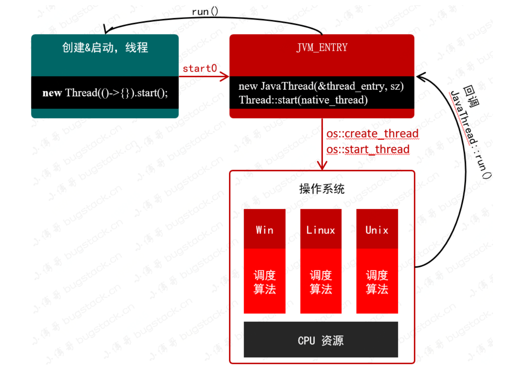
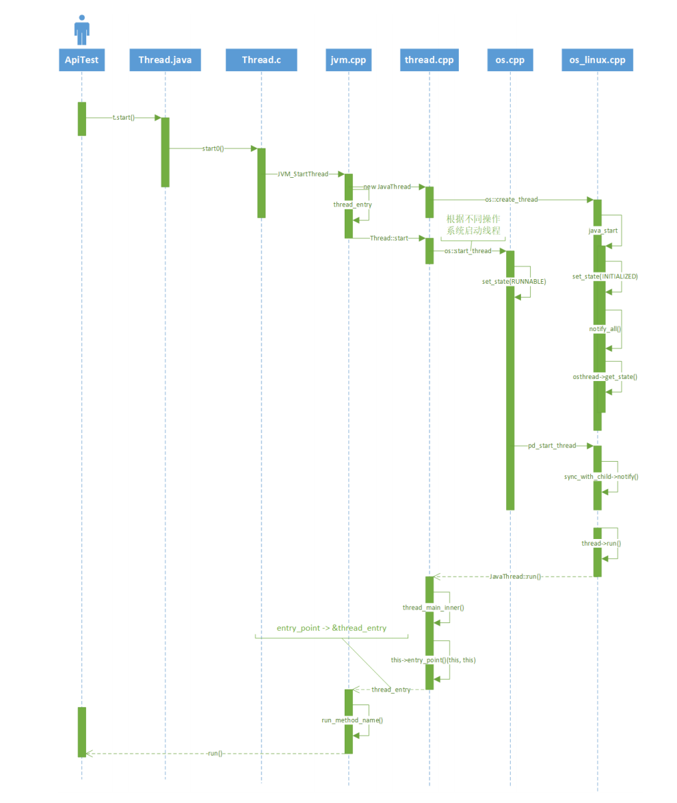
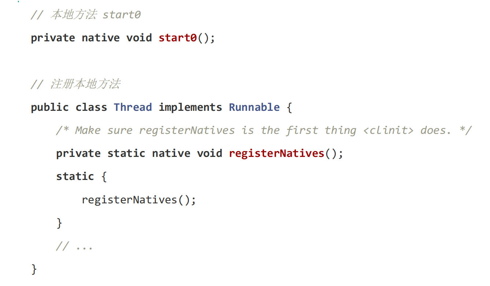

---

title: Thread.start（）启动原理
author: John Doe
tags:
  - Java
  - 线程
categories:
  - Java
date: 2022-07-09 17:00:00
---
java中启动一个线程很简单

new Thread(()->{

// TODD

}).start();

但是这个线程是如何启动起来的呢？主要会经过下面这个流程

 
 
 1. 线程的启动涉及到本地方法JNI的调用
 2. 具体的线程是映射到操作系统层面由操作系统处理
 3. 线程的启动涉及到线程的生命周期状态以及唤醒操作，所有有回调操作run()

具体的UML图如下
 
 
 ### Java 层面 Thread 启动
new Thread(() -> {

// todo

}).start();

// JDK 源码

public synchronized void start() {

if (threadStatus != 0)

throw new IllegalThreadStateException();

group.add(this);

boolean started = false;

try {

start0();

started = true;

} finally {

try {

if (!started) {

group.threadStartFailed(this);

} } catch (Throwable ignore) {}

} }

 线程启动方法 start()，在它的方法英文注释中已经把核心内容描述出来。
Causes this thread to begin execution; the Java Virtual 
Machine calls the run method of this thread. 这段话的意思
是：由 JVM 调用此线程的 run 方法，使线程开始执行。其实这就是一个 JVM 的
回调过程，下文源码分析中会讲到

 另外 start() 是一个 synchronized 方法，但为了避免多次调用，在方法中
会由线程状态判断。threadStatus != 0。 

 group.add(this)，是把当前线程加入到线程组，ThreadGroup。 

 start0()，是一个本地方法，通过 JNI 方式调用执行。这一步的操作才是启动
线程的核心步骤。

 
 
 start0()，是一个本地方法，用于启动线程。

 registerNatives()，这个方法是用于注册线程执行过程中需要的一些本地方
法，比如：start0、isAlive、yield、sleep、interrupt0 等。

后面线程的启动过程涉及到了 JVM 的参与，整个源码分析可以结合着代码调用 UML 时序图进行观看，基本核心过程包括：
Java 创建线程和启动、调用本地方法 start0()、JVM 中
JVM_StartThread 的创建和启动、设置线程状态等待被唤醒、根据不同
的 OS 启动线程并唤醒、最后回调 run() 方法启动 Java 线程

待续...