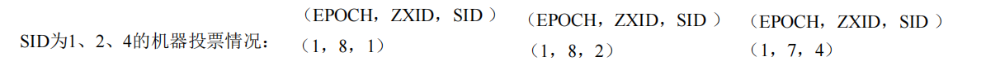

---

title: Zookeeper选举机制
author: John Doe
tags:
  - Zookeeper
  - 选举机制
categories:
  - Zookeeper
date: 2022-05-25 20:24:00
---

在了解Zookeeper的选举机制之前，首先需要了解
- SID(服务器ID，用于唯一标识一台Zookeeper集群中的机器，每台机器不能重复，和myid一致)
- ZXID（事务ID。用来标识一次服务器状态的变更。在某一时刻，集群中的每台机器的ZXID值不一定完全一致，这和Zookeeper服务器对于客户端“更新请求”的处理逻辑有关）
- Epoch(每个Leader任期的代号。没有Leader时同一轮投票过程中的逻辑时钟是相同的。每投完一次票，这个数据会增加)

了解上述三个参数之后，后续Zookeeper的选举机制便和其有关。关于其选举机制可以分为两种情况。

第一种情况是第一次启动集群时，Leader的选举是根据其myid的大小进行选举的。
		
        例如：目前有一个五台Zookeeper的集群。当启动id为1的Zookeeper时，它投自己一票。此时不满足Leader成立的条件。票数半数以上。因此进入looking状态。然后id为2的服务器启动，id1和id2的服务器都投自己一票，然后交换选票信息。此时服务器1发现服务器2的id比自己大，因此服务器1转投服务器2一票。服务器1只有0票，而服务器2有2票。但此时还是不满足半数以上，因此两者都进入looking状态。然后服务器3启动，发起一次选举。此时服务器1和2都会更改选票为服务器3。此次投票结果：服务器1为0票，服务器2为0票，服务器3为3票。此时服务器3的票数已经超过半数，服务器3当选Leader。服务器1，2更改状态为FOLLOWING，服务器3更改状态为LEADING；服务器4启动，发起一次选举。此时服务器1，2，3已经不是LOOKING状态，不会更改选票信息。交换选票信息结果：服务器3为3票，服务器4为 1票。此时服务器4服从多数，更改选票信息为服务器3，并更改状态为FOLLOWING；服务器5启动，同4一样当小弟。
        
而第二种情况是非第一次启动，而是在集群运行中，Leader宕机了，需要重新选举Leader。

		例如：假设ZooKeeper由5台服务器组成，SID分别为1、2、3、4、5，ZXID分别为8、8、8、7、7，并且此时SID为3的服务器是Leader。某一时刻，3和5服务器出现故障，因此开始进行Leader选举。

 
 
 选举Leader规则： ①EPOCH大的直接胜出 ②EPOCH相同，事务id大的胜出 ③事务id相同，服务器id大的胜出
