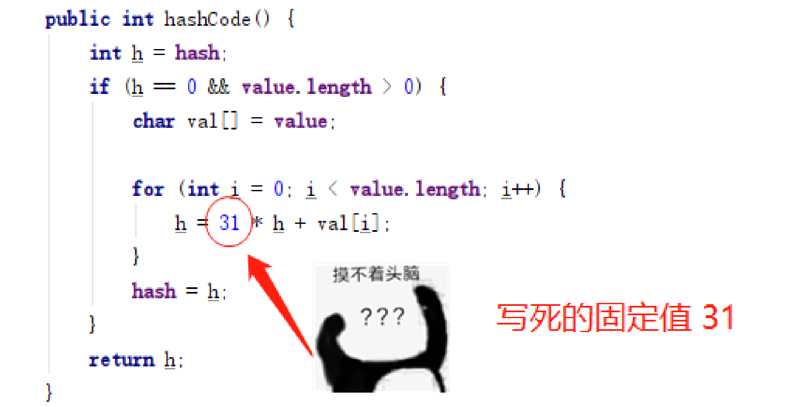
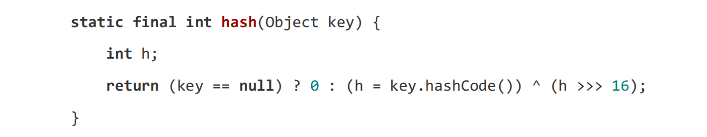

---

title: hashCode 的计算逻辑中，为什么是 31 作为乘数？
author: John Doe
tags:
  - Java
  - HashMap
categories:
  - Java
date: 2022-07-09 20:01:00
---

 
 在获取 hashCode 的源码中可以看到，有一个固定值 31，在 for 循环每次执行时
进行乘积计算，循环后的公式如下； s[0]*31^(n-1) + s[1]*31^(n-2) + ... + 
s[n-1]
那么这里为什么选择 31 作为乘积值呢？

1. 31 是一个奇质数，如果选择偶数会导致乘积运算时数据溢出。
2. 另外在二进制中，2 个 5 次方是 32，那么也就是 31 * i == (i << 5) - i。这主要是说乘积运算可以使用位移提升性能，同时目前的 JVM 虚拟机也会自动支持此类的优化。
3. 经过大量测试，相对于其他数，31得到的hash碰撞结果最小

当然一个好的哈希函数除了要尽量减少碰撞外，关于散列表也就是 hash，
还有一个非常重要的点，那就是要尽可能的让数据散列分布。只有这样才能减少
hash 碰撞次数。

### 扰动函数
在 HashMap 存放元素时候有这样一段代码来处理哈希值，这是 java 8 的散列值
扰动函数，用于优化散列效果；

 
 
 理论上来说字符串的 hashCode是一个 int 类型值，那可以直接作为数组下标了，
且不会出现碰撞。但是这个 hashCode 的取值范围是[-2147483648, 2147483647]，
有将近 40 亿的长度，谁也不能把数组初始化的这么大，内存也是放不下的。

我们默认初始化的 Map 大小是 16 个长度 DEFAULT_INITIAL_CAPACITY = 1 << 4，
所以获取的 Hash 值并不能直接作为下标使用，需要与数组长度进行取模运算得
到一个下标值，也就是我们上面做的散列列子。

那么，hashMap 源码这里不只是直接获取哈希值，还进行了一次扰动计算，(h = 
key.hashCode()) ^ (h >>> 16)。把哈希值右移 16 位，也就正好是自己长度的一
半，之后与原哈希值做异或运算，这样就混合了原哈希值中的高位和低位，增大
了随机性。