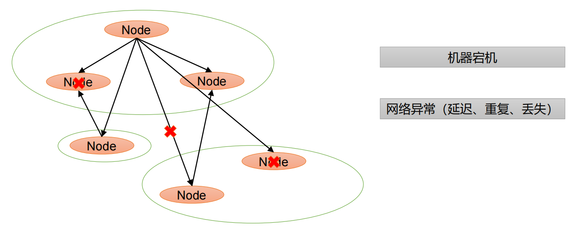
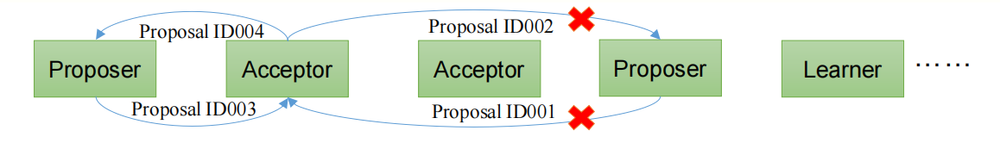
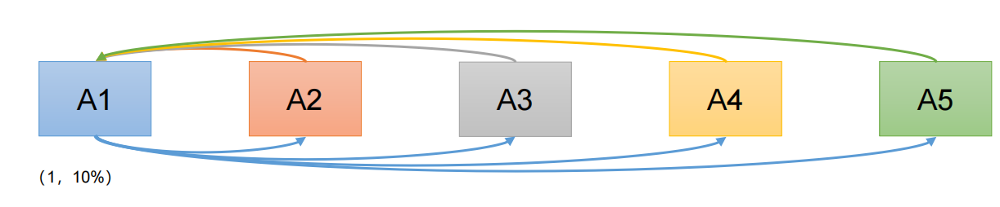
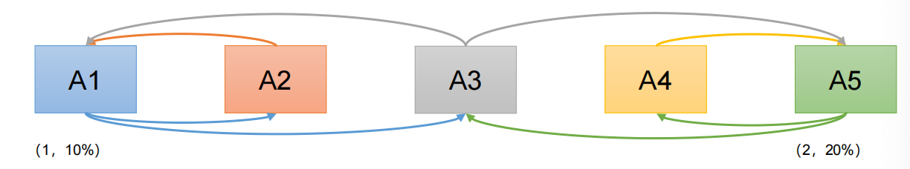
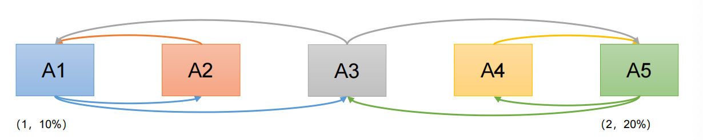

---

title: 关于Paxos算法
author: John Doe
tags:
  - Paxos
  - 一致性算法
categories:
  - 分布式
date: 2022-05-25 21:38:00
---

Paxos算法是一种基于消息传递且具有高度容错特性的一致性算法。其通常用于快速正确的在一个分布式系统中对某个数据值达成一致，并且保证无论发送任何异常都不会破坏整个系统的一致性。

 
 
 在一个Paxos系统中，首先将所有节点划分为Proposer（提议者）、Acceptor（接受者）和Learner（学习者）
 
 		注意：每个节点可以身兼数职
        
一个完整的Paxos算法流程分为三个阶段
1. Prepare准备阶段

   1. Proposer向多个Acceptor发出Propose请求Promise（承诺）
   2. Acceptor针对收到的Propose请求进行Promise（承诺）

2. Accept接受阶段

    1. Proposer收到多数Acceptor承诺的Promise后，向Acceptor发出Propose请求
    2. Acceptor针对收到的Propose请求进行Accept处理

3. Learn学习阶段

    1. Proposer将形成的决议发送给所有Learners

 
 
 1、 Prepare: Proposer生成全局唯一且递增的Proposal ID，向所有Acceptor发送Propose请求，这里无需携带提案内容，只携带Proposal ID即可。
 
 2、 Promise: Acceptor收到Propose请求后，做出“两个承诺，一个应答”。
    - 不再接受Proposal ID小于等于（注意：这里是<= ）当前请求的Propose请求。
    - 不再接受Proposal ID小于（注意：这里是< ）当前请求的Accept请求。
    - 不违背以前做出的承诺下，回复已经Accept过的提案中Proposal ID最大的那个提案的Value和Proposal ID，没有则返回空值。

3、 Propose: Proposer收到多数Acceptor的Promise应答后，从应答中选择Proposal ID最大的提案的Value，作为本次要发起的提案。如果所有应答的提案Value均为空值，则可以自己随意决定提案Value。然后携带当前Proposal ID，向所有Acceptor发送Propose请求。

4、 Accept: Acceptor收到Propose请求后，在不违背自己之前做出的承诺下，接受并持久化当前Proposal ID和提案Value。

5、 Learn: Proposer收到多数Acceptor的Accept后，决议形成，将形成的决议发送给所有Learner。

下面举例以说明：

1. 情况1：

 
   - 有A1, A2, A3, A4, A5 5位议员，就税率问题进行决议。
   - A1发起1号Proposal的Propose，等待Promise承诺； 
   - A2-A5回应Promise； 
   - A1在收到两份回复时就会发起税率10%的Proposal； 
   - A2-A5回应Accept； 
   - 通过Proposal，税率10%。
2. 情况2：

 
     - 现在我们假设在A1提出提案的同时, A5决定将税率定为20% 
     - A2承诺A1，A4承诺A5，A3行为成为关键
     - 情况1：A3先收到A1消息，承诺A1。
     - A1发起Proposal（1，10%），A2，A3接受。
     - 之后A3又收到A5消息，回复A1：（1，10%），并承诺A5
     - A5发起Proposal（2，20%），A3，A4接受。之后A1，A5同时广播决议。

		由此可见Paxos 算法缺陷：在网络复杂的情况下，一个应用 Paxos 算法的分布式系统，可能很久无法收敛，甚至陷入活锁的情况。

3. 情况3：

 
 
     - 现在我们假设在A1提出提案的同时, A5决定将税率定为20%
     - A1，A5同时发起Propose（序号分别为1，2）
     - A2承诺A1，A4承诺A5，A3行为成为关键
     - 情况2：A3先收到A1消息，承诺A1。之后立刻收到A5消息，承诺A5。
     - A1发起Proposal（1，10%），无足够响应，A1重新Propose （序号3），A3再次承诺A1。
     - A5发起Proposal（2，20%），无足够相应。A5重新Propose （序号4），A3再次承诺A5。
 
 造成这种情况的原因是系统中有一个以上的 Proposer，多个 Proposers 相互争夺 Acceptor，造成迟迟无法达成一致的情况。针对这种情况，一种改进的 Paxos 算法被提出：从系统中选出一个节点作为 Leader，只有 Leader 能够发起提案。这样，一次 Paxos 流程中只有一个Proposer，不会出现活锁的情况，此时只会出现例子中第一种情况。