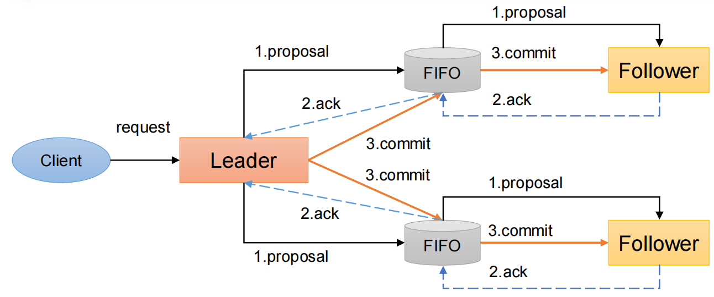
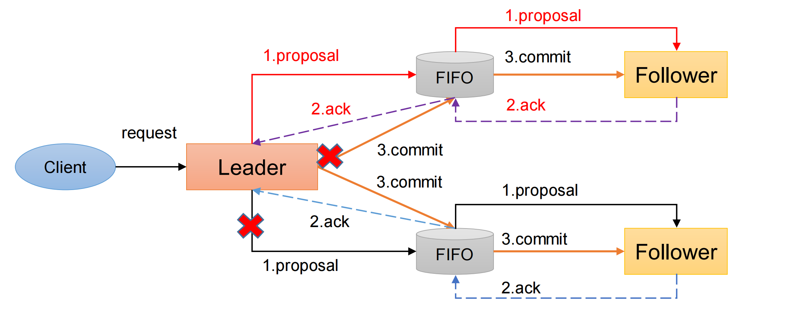
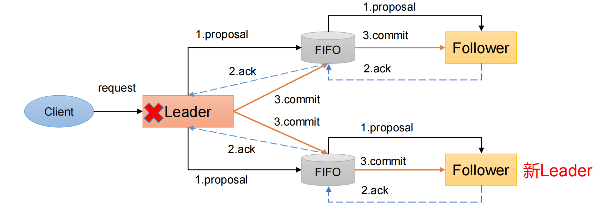

---

title: 关于ZAB协议
author: John Doe
tags:
  - ZAB协议
  - 数据一致性
categories:
  - 分布式
date: 2022-05-25 22:02:00
---

Zab 借鉴了 Paxos 算法，是特别为 Zookeeper 设计的支持崩溃恢复的原子广播协议。基于该协议，Zookeeper 设计为只有一台客户端（Leader）负责处理外部的写事务请求，然后Leader 客户端将数据同步到其他 Follower 节点。Zookeeper 只有一个 Leader 可以发起提案

Zab协议包括两种基本的模式：消息广播、崩溃恢复。

### 消息广播

ZAB协议针对事务请求的处理过程类似于一个两阶段提交过程

（1）广播事务阶段

（2）广播提交操作
这两阶段提交模型如下，有可能因为Leader宕机带来数据不一致，比如

（1） Leader 发 起 一 个 事 务Proposal1 后 就 宕 机 ， Follower 都 没有Proposal1 

（2）Leader收到半数ACK宕 机，没来得及向Follower发送Commit
怎么解决呢？ZAB引入了崩溃恢复模式。

 
 
（1）客户端发起一个写操作请求。 

（2）Leader服务器将客户端的请求转化为事务Proposal 提案，同时为每个Proposal 分配一个全局的ID，即zxid。 

（3）Leader服务器为每个Follower服务器分配一个单独的队列，然后将需要广播的 Proposal依次放到队列中去，并且根据FIFO策略进行消息发送。 

（4）Follower接收到Proposal后，会首先将其以事务日志的方式写入本地磁盘中，写入成功后向Leader反馈一个Ack响应消息。 

（5）Leader接收到超过半数以上Follower的Ack响应消息后，即认为消息发送成功，可以发送commit消息。 

（6）Leader向所有Follower广播commit消息，同时自身也会完成事务提交。Follower 接收到commit消息后，会将上一条事务提交。 

（7）Zookeeper采用Zab协议的核心，就是只要有一台服务器提交了Proposal，就要确保所有的服务器最终都能正确提交Proposal。
 
 
 ### 崩溃恢复——异常假设
 一旦Leader服务器出现崩溃或者由于网络原因导致Leader服务器失去了与过半 Follower的联系，那么就会进入崩溃恢复模式。
 
 
 
 
 假设两种服务器异常情况
 1. 假设一个事务在Leader提出之后，Leader挂了
 2. 一个事务在Leader上提交了，并且过半的Follower都响应ACK了，但是Leader在Commit消息发出之前挂了。
 
 Zab协议崩溃恢复要满足以下两个要求
 
 1、 确保已经被Leader提交的提案Proposal，必须最终被所有的Follower服务器提交。 （已经产生的提案，Follower必须执行） 
 
 2、 确保丢弃已经被Leader提出的，但是没有被提交的Proposal。（丢弃胎死腹中的提案）
 
 崩溃恢复主要包括两部分：Leader选举和数据恢复。
 
 ### 崩溃恢复---Leader选举
 
 
 

Leader选举：根据上述要求，Zab协议需要保证选举出来的Leader需要满足以下条件：

（1）新选举出来的Leader不能包含未提交的Proposal。即新Leader必须都是已经提交了Proposal的Follower服务器节点。

（2）新选举的Leader节点中含有最大的zxid。这样做的好处是可以避免Leader服务器检查Proposal的提交和丢弃工作。

### 崩溃恢复——数据恢复

Zab如何数据同步： 

（1）完成Leader选举后，在正式开始工作之前（接收事务请求，然后提出新的Proposal），Leader服务器会首先确认事务日志中的所有的Proposal 是否已经被集群中过半的服务器Commit。

（2）Leader服务器需要确保所有的Follower服务器能够接收到每一条事务的Proposal，并且能将所有已经提交的事务Proposal应用到内存数据中。等到Follower将所有尚未同步的事务Proposal都从Leader服务器上同步过，并且应用到内存数据中以后，
Leader才会把该Follower加入到真正可用的Follower列表中。