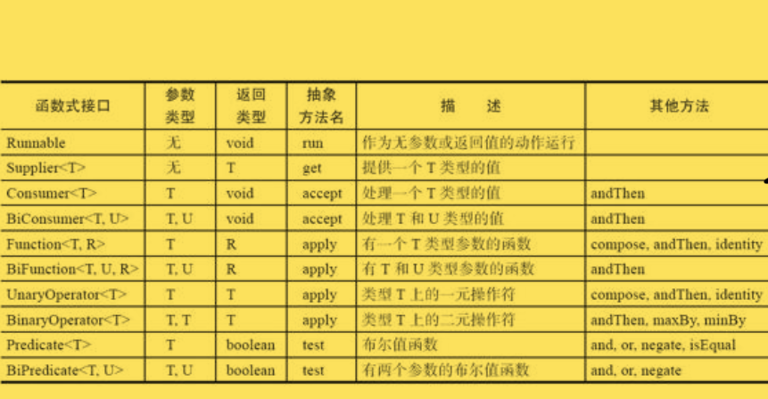
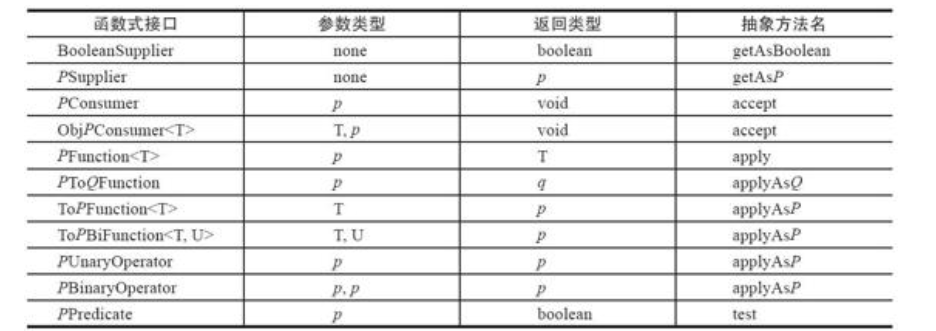

---

title: 关于lambda表达式
author: John Doe
tags:
  - lambda表达式
  - ''
  - Java
categories:
  - Java
date: 2022-05-02 22:46:00
---
### 简单介绍
lambda表达式是一个可传递的代码块，可以在以后执行一次或多次。

表达形式：(参数)->{表达式}

- 如果可以推导出lambda表达式的参数类型，则可以忽略
- 如果只有一个参数，且参数类型可以推断，则（）可以省略
- 无需指定其返回类型，lambda表达式的返回类型可以根据上下文推断得出

		注意：如果一个lambda表达式在某些分支返回值，而在另一些分支不返还，这是错误的
 
### 函数式接口
对于只有一个抽象方法的接口，需要这种接口的对象时，就可以通过提供一个lambda表达式。这种接口称为函数式接口。

java.util.function包中定义了不少非常通用的函数式接口。例如其中一个接口BiFunction<T,U,R>描述了参数类型为T和U且返回类型为R的函数。（比如可以把比较的lambda表达式保存在这个类型的变量中。当然，没多少人喜欢在sort的时候接收一个BiFunction。）

### 方法引用
对象或类型::方法名
- object::instanceMethod
- Class::staticMethod
- Class::instanceMethod

前两种方法引用等价于提供方法参数的lambda表达式，而对于第三种，第一个参数会成为方法的目标

例子：Arrays.sort(strings,String::compareToIgnoreCase)不考虑字母的大小写进行排序

### 构造器引用
构造器引用同方法引用类似，不过方法名为new。如：String:new

### 变量的作用域
lambda表达式的三个部分：
1. 代码块
2. 参数
3. 自由变量的值（非参数，且不在代码块中定义的变量）
		注意：即对于自由变量，lambda表达式需要数据结构对其进行存储，而为了明确其捕获到的自由变量的值，lambda表达式中只能引用值不会改变的变量（常量）
 
		补充：关于代码块和自由变量值有一个术语：闭包
在lambda表达式中使用this关键字，值创建这个lambda表达式的方法的this参数
### 处理lambda表达式
使用lambda表达式的重点是延迟执行。而希望一个代码延迟执行的原因有很多：
1. 在一个单独的线程中运行的代码
2. 多次运行代码
3. 在算法的适当位置运行代码（如排序比较）
4. 发生某种事件时执行代码（如点击一个按钮之类）
...

### 常用函数式接口
 
 ### 基本类型函数式接口

可以使用这些来减少装箱拆箱

		补充：如果自己设计接口，其中只有一个抽象方法，可以使用@Functionallnterface注解来标记这个接口（好处：一方面无意增加了另一个抽象方法编译器会提示报错，另一方面javadoc页会指出这是一个函数式接口）