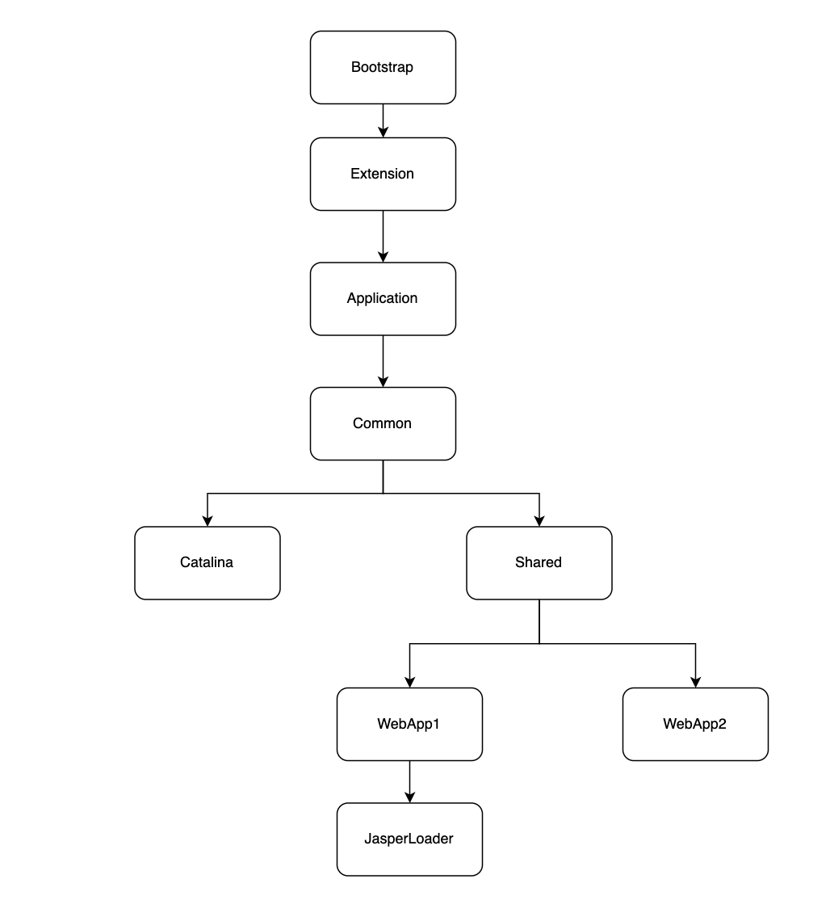

---

title: 打破双亲委派机制的一些场景
author: John Doe
tags:
  - 类加载机制
  - 双亲委派机制
categories:
  - JVM
date: 2022-07-05 19:42:00
---
前言：在说打破双亲委派机制的一些场景前，先聊一聊为什么需要双亲委派机制。

在双亲委派机制中，父子类通过组合的方式聚合在一起。由应用类加载器开始到系统类加器。主要是这几步：
1. 在自身的loadclass方法中先检查类是否已经被加载过
2. 若没有加载则调用父类加载器的loadclass方法加载，若父类为空则默认用启动类加载器作为父加载器加载。
3. 如果父类加载器失败，抛出异常classnotfoundexception后，调用自身的findclass方法进行加载类

这样做的好处是一方面可以避免类的重复加载，当父类加载器已经加载过这个类时，子类不会再去加载。另一方面，通过这样的方式可以保证安全性。因为引导类加载在加载的时候只会加载JAVA_HOME的jar包，这个类及时被同名的类破坏也不会有影响，除非你本地jdk的jar被改写。即可以有效的防止核心java api被篡改。

而既然知道了双亲委派机制的实现，那么想要破坏双亲委派机制就简单了。只需要自定义一个类加载器，重写其中的loadclass方法，使其不进行双亲委派机制。而如果我们要自定义一个类加载器而又不想破坏双亲委派机制，只需集成classloader然后重写findclass方法。

而在某些场景下，我们却需要去打破双亲委派机制，比如我下面将要提到的几种

### JNDI、JDBC等
在我们通过API调用一些java的基类时，存在一种SPI机制。比如JDBC。在类加载时，会先加载驱动DriverManger类，该类由类加载器加载。因为java.sql.DriverManger类位于rt.jar下面，会被根类加载器加载。而在其加载时，会执行静态方法，静态方法会尝试加载classpath下的所有实现driver接口的类。但这些实现类基本由各大数据库厂商实现，如果根据双亲委派机制来执行时行不通的。因为第三方的类不能被根加载器加载。因此，在jdbc中引入了线程上下文加载器的方式破坏双亲委派机制。
### Tomcat
在tomcat中为了应用程序访问不同存储库中的类和资源，达到应用类之间隔离的目的，打破了双亲委派机制。即为给个容器单独提供一个WebAppClassLoader加载器（优先加载web应用自身的类，即优先由WebAppClassLoader加载，加载不到在由CommonClassLoader加载，这和双亲委派刚好相反）。

Tomcat整体类加载器结构如下：
 
