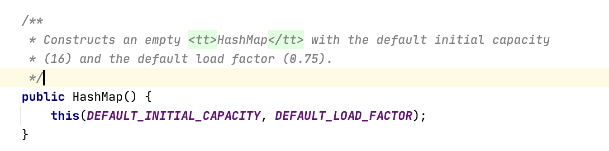
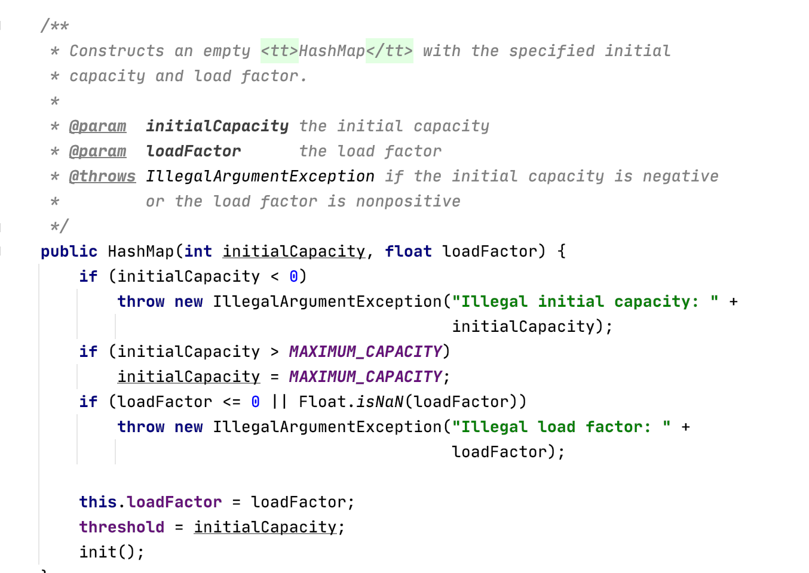
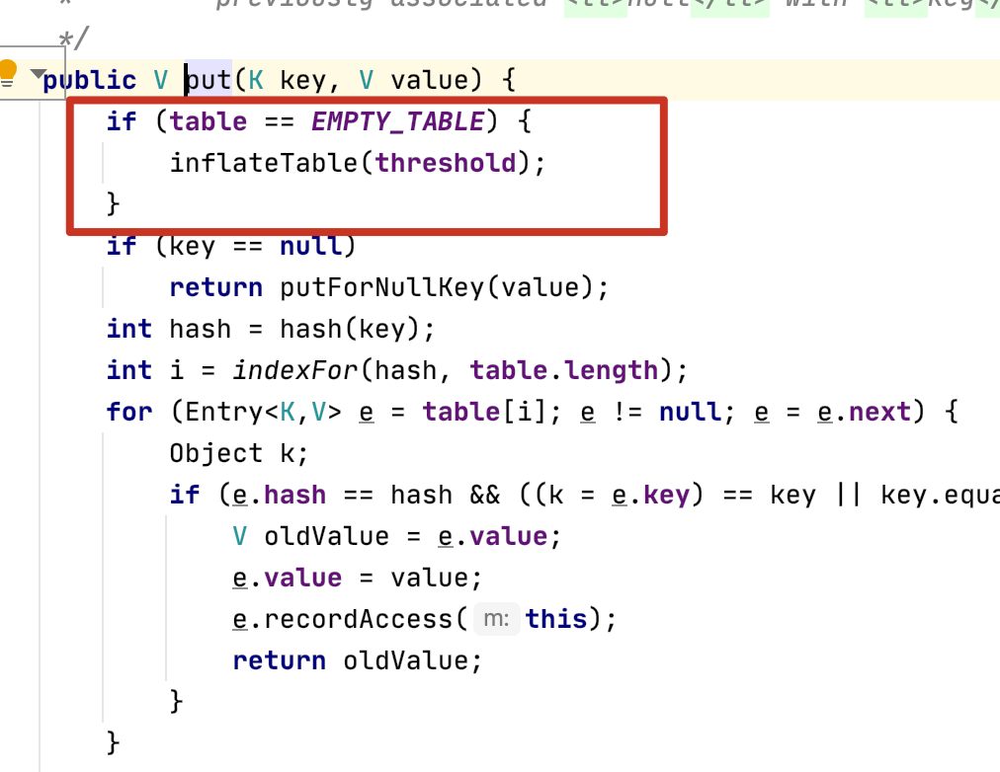
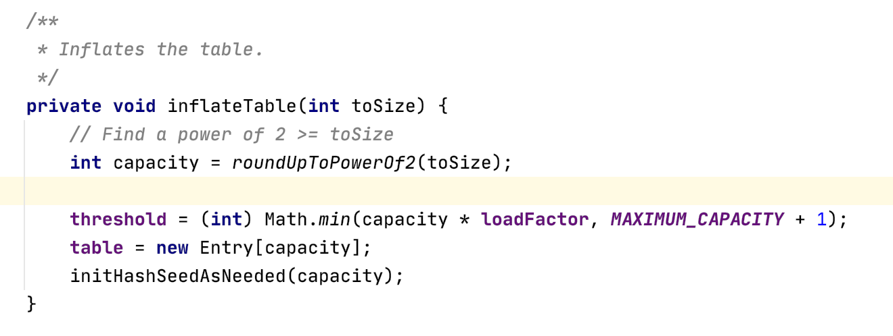
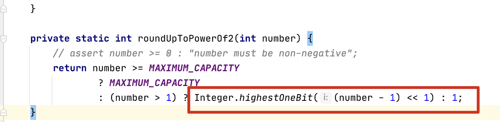
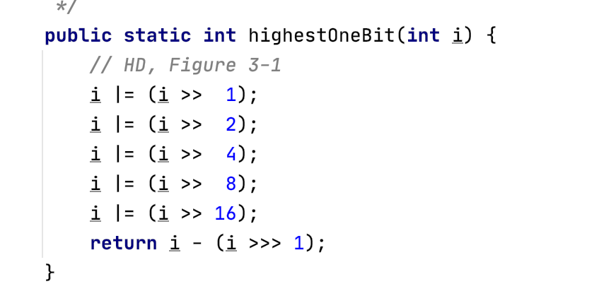

---

title: HashMap1.7
author: John Doe
tags:
  - 集合
  - HashMap
categories:
  - java基础
date: 2022-01-18 19:27:00
---
HashMap1.7底层由数组+链表实现，提供的无参构造方法默认数组容量是16，加载因子是0.75，临界值为16 * 0.75 = 12，当到了临界值则进行扩容。

你也可以通过有参构造方法指定容量和加载因子。

注意，不管有参无参此时都还未初始化数组，只是定义了数组容量。当我们第一次put往hashmap的放数据的时候才会初始化

 

而此时初始化会根据我们最初的容量大小进行初始化，大小为大于等于当前容量的2的幂。
 
 
 
 
 
 
 
 
 然后便是计算hash值，根据hash值得到数组下标，根据下标到指定位置，如果发送hash冲突则通过拉链法，将冲突元素头插进链表