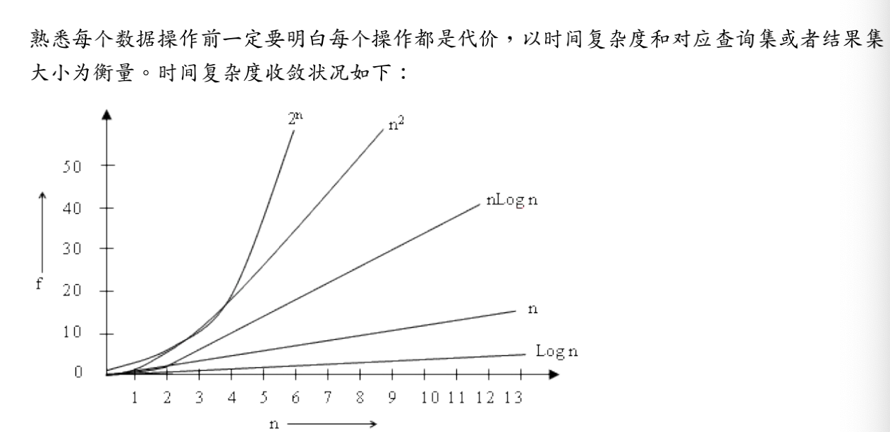
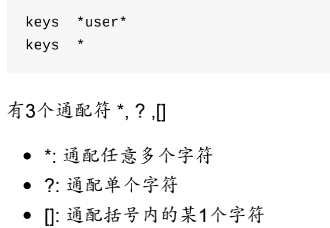
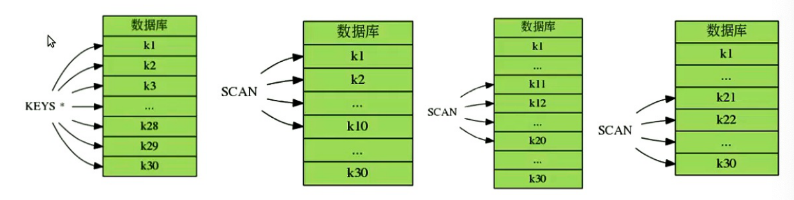
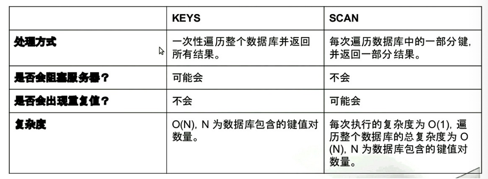
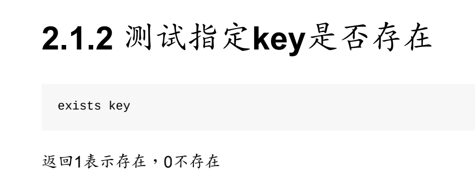
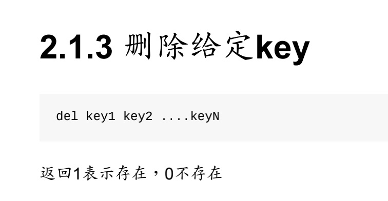

---

title: Redis开发运维实践指南笔记
author: John Doe
date: 2022-01-26 22:10:01
tags:
---

1、Redis为一个运行在内存中的数据结构服务器（data structures server）。Redis使用的是单进程（除持久化时），所以在配置时，一个实例只会用到一个CPU。

2、
 
 3、列出key：
 
 
 
 渐进的遍历整个数据库：keys命令会一次性遍历整个数据库获取与之匹配的键，当数据库包含得键值越来越多，这个命令会愈来愈慢，因此，可以用scan命令渐进的，分多次遍历整个数据库
 
 
 
 

4、
 
 
5、

 
 