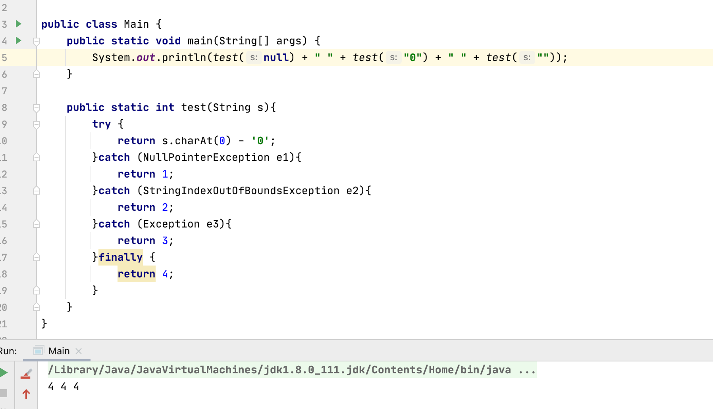

---

title: final、finalize()、finally
author: ATAo
tags:
  - java
  - final、finally、fi'nalize
  - ''
categories:
  - java
date: 2022-01-11 09:48:00
---

1、final：在java中，final主要用于修饰类、方法和变量。

1.1 修饰类：用final修饰类时，表明这个类不能被其他类所继承。
	
    注意：当用final对类进行修饰的时候，类中所有成员方法默认是final方法。

1.2 修饰方法：用fianl修饰方法时，表明这个方法不能被其子类重写。
	
    
1.3 修饰变量：用final修饰变量的话表明这个变量是一个常量，只能被赋值一次，赋值后其值不能够修改。

	   当final修饰一个基本数据类型时，表示该基本数据类型的值一旦在初始化后便不能发生变化（）；如果final修饰一个引用类型时，则在对其初始化之后便不能再让其指向其他对象了，但该引用所指向的对象的内容是可以发生变化的。本质上是一回事，因为引用的值是一个地址，final要求值，即地址的值不发生变化。　
    　　final修饰一个成员变量（属性），必须要显示初始化。这里有两种初始化方式，一种是在变量声明的时候初始化；第二种方法是在声明变量的时候不赋初值，但是要在这个变量所在的类的所有的构造函数中对这个变量赋初值。

扩展：在java中，String被设计成final类，那为什么平时使用时，String的值可以被改变呢？

    字符串常量池是java堆内存中一个特殊的存储区域，当我们建立一个String对象时，假设常量池不存在该字符串，则创建一个，若存在则直接引用已经存在的字符串。当我们对String对象值改变的时候，例如 String a="A"; a="B" 。a是String对象的一个引用（我们这里所说的String对象其实是指字符串常量），当a=“B”执行时，并不是原本String对象("A")发生改变，而是创建一个新的对象("B")，令a引用它。
    
    
2、finally：finally作为异常处理的一部分，它用在try/catch语句中，经常被用在需要释放资源的情况下。

	注意：
    1、只有与finally对应的try语句块得到执行的情况下，finally语句块才会执行。
    2、在 try 语句块中执行了 System.exit (0) 语句，终止了 Java 虚拟机的运行或者在执行 try 语句块或者 catch 语句块时被打断（interrupted）或者被终止（killed）等情况finally也可能不会执行。
    
    易错点：
    

	答案：4 4 4
    原因：finally语句在return之前执行。 
    
3、finalize：finalize()是在java.lang.Object里定义的，每一个对象都有这么个方法。这个方法在gc启动，该对象被回收的时候被调用。
	
    注意：一个对象的finalize()方法只会被调用一次，而且finalize()被调用不意味着gc会立即回收该对象，所以有可能调用finalize()后，该对象又不需要被回收了，然后到了真正要被回收的时候，因为前面调用过一次，所以不会调用finalize()，产生问题。 所以，推荐不要使用finalize()方法，它跟析构函数不一样。

