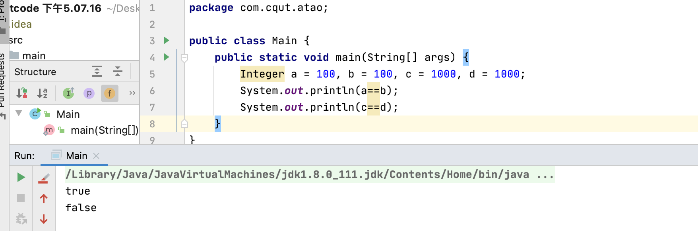
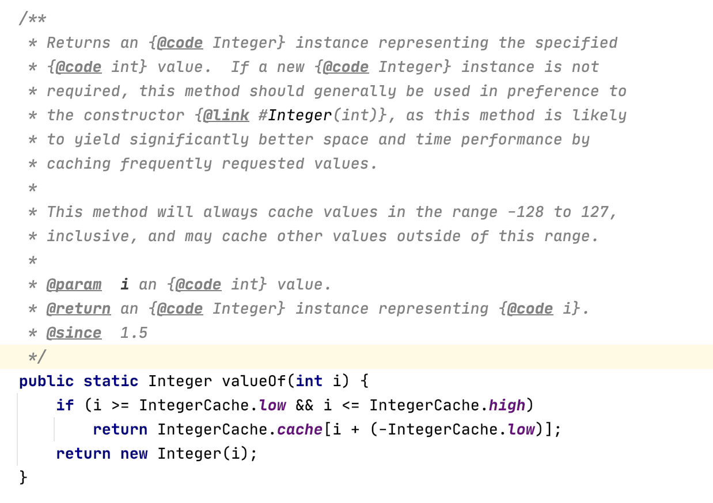
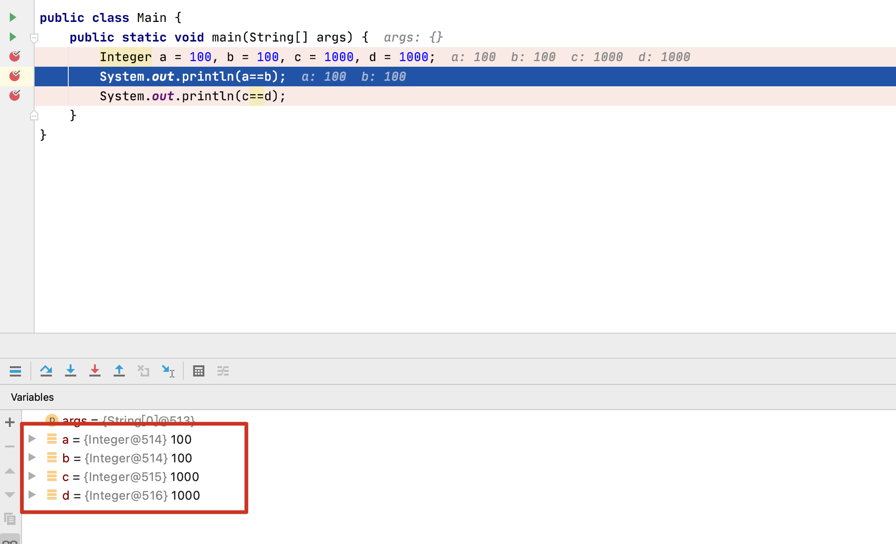

---

title: 为什么Integer 100==100 为true，而Integer 1000==1000为false？
author: ATAO
tags:
  - Integer
categories:
  - java基础
date: 2022-01-08 21:39:00
---

	在java的Integer包装类中为什么Integer a = 100, b = 100,c = 1000,d =1000，令a==b为true，而c==d为false呢？

	首先在上面的代码中，Integer a = 100会调用Integer的Integer.valueOf(int i)这个方法，而这个方法的源代码如下：
    

	
    	我们会发现在将int类型装箱时做了一个判断语句
    	if (i >= IntegerCache.low && i <= IntegerCache.high)
    	这句话是什么意思呢？通过注释可以知道，在将一个int类型装箱为Integer类型时，总会优先调用此方法。其存在一个-128到127范围的缓存，如果int类型时该范围内，则直接返回缓存中的值，不需要额外创建Integer类型，这样可以产生显著更好的空间和时间性能。而且其范围也是可以设置。
        所有我们可以知道，在执行Integer a = 100，b = 100时，走了缓存，因此b的地址同a应该一样，而c = 1000, d = 1000并为走缓存，而是走的new Interger(i)，因此创建了两个对象。
        而我们知道，==比较走的是比较对象的地址。因此才会有为什么Integer 100==100 为true，而Integer 1000==1000为false。
        debug如下：
       	

	
   	

    