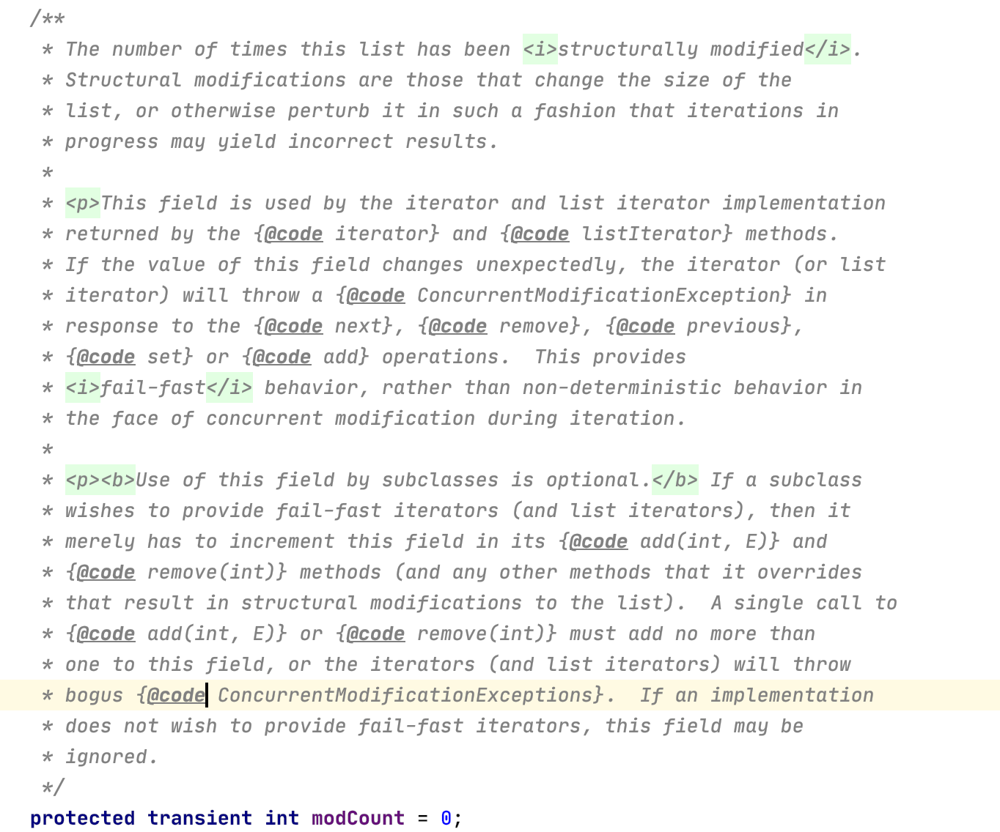
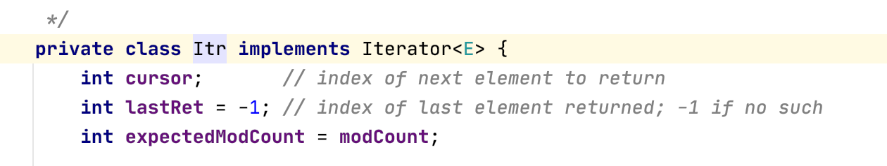
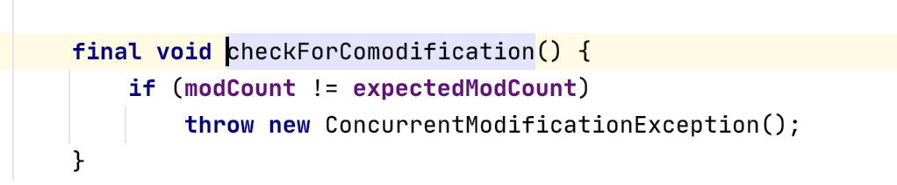

---

title: 关于集合类中的modCount++
author: John Doe
tags:
  - ArrayList
categories:
  - 集合
  - java
date: 2022-01-21 14:45:00
---
话不多说，直接看源码注释讲解
 
 由上图可知，该字段目的在于记录集合结构被修改的次数（增、删、改），该字段被迭代器所使用，当对集合进行迭代遍历时，防止数据发生改变引起错误。因此，当我们使用迭代器时，如果该值被改了，就会触发fast-fail机制，抛出异常ConcurrentModificationExceptions。
 
 
 
 