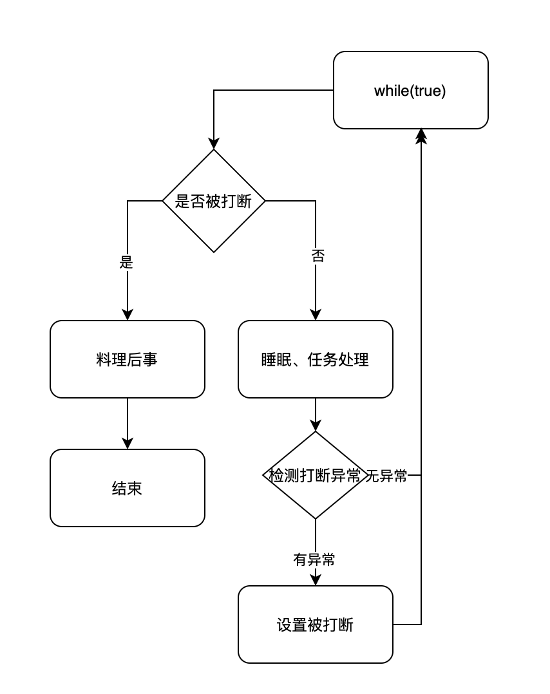

---

title: 终止模式之两阶段终止模式（Interrupt）
author: John Doe
tags:
  - 终止模式
categories:
  - juc
  - 设计模式
date: 2022-01-24 19:10:00
---
Thread类中的stop（）方法可以用于终止一个线程，但这个方法要求立即终止，被终止的线程没有机会料理后事。因此，这里采用终止模式中的两阶段终止模式来优雅的结束一个线程，给被终止的线程一个料理后事的机会。
（如果被打断线程正在 sleep，wait，join 会导致被打断的线程抛InterruptedException，并清除 打断标记如果打断的正在运行的线程，则会设置打断标记 ；park的线程被打断，也会设置 打断标记）

 
 
 
 	public class TPTInterrupt {

    public static void main(String[] args) throws InterruptedException {
        TPTInterrupt tptInterrupt = new TPTInterrupt();
        tptInterrupt.start();
        Thread.sleep(2000);
        tptInterrupt.stop();
    }

    private Thread thread;

    public void start(){

        thread = new Thread(()->{
            while (true){
                Thread thread = Thread.currentThread();
                if (thread.isInterrupted()){
                    System.out.println("料理后事...");
                    break;
                }
                try {
                    Thread.sleep(1000);
                    System.out.println("运行中...");
                } catch (InterruptedException e) {
                    // 标记打断
                    e.printStackTrace();
                    thread.interrupt();
                }
            }
        });
        thread.start();
    }

    public void stop(){
        thread.interrupt();
    }

	}
