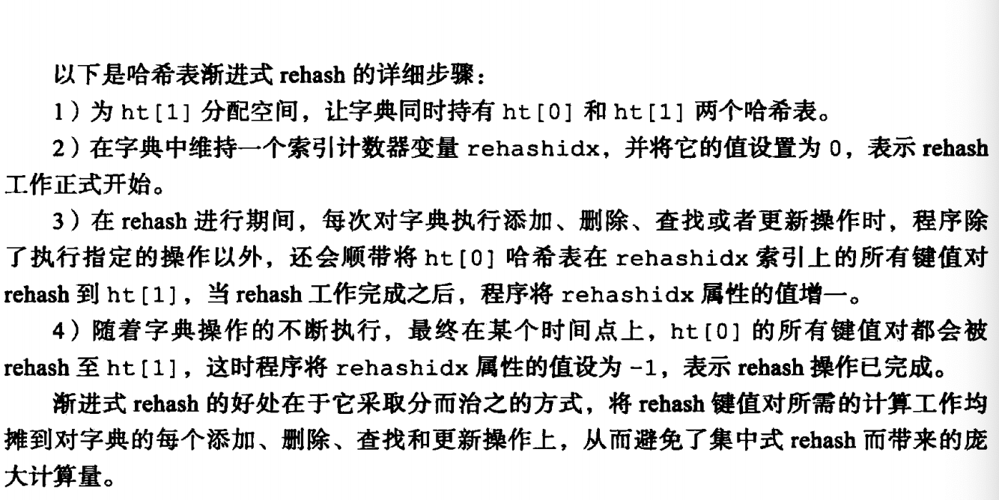
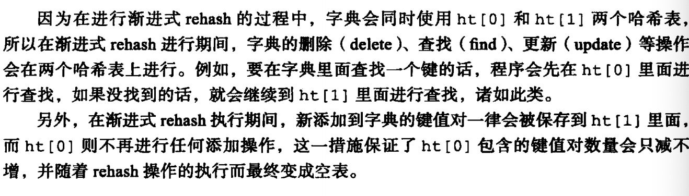
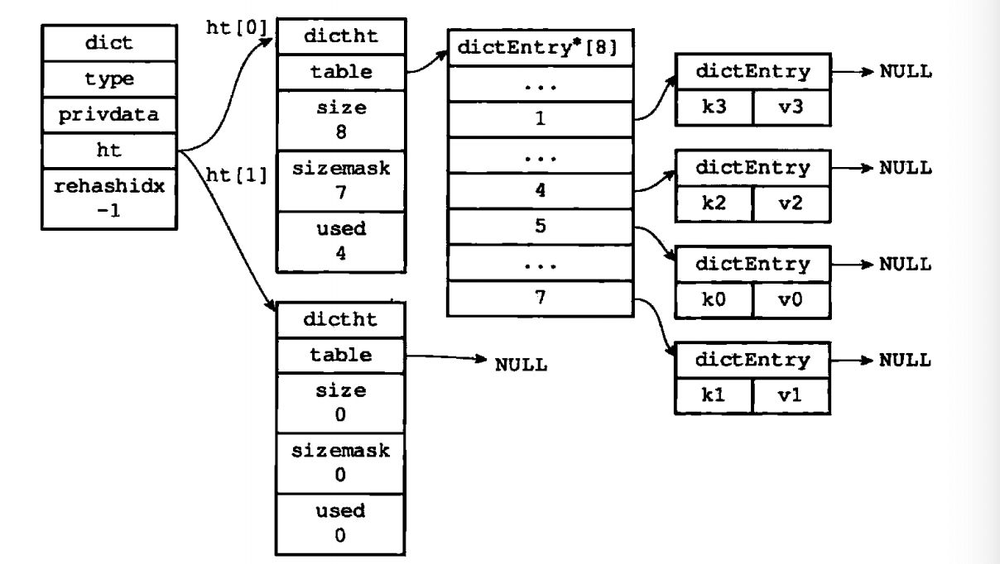

---

title: Redis底层数据结构之字典
author: John Doe
tags:
  - 哈希表
categories:
  - Redis
date: 2022-02-06 20:37:00
---

字典即符号表，Redis的数据库就是通过字典作为底层实现的。而字典的底层实现主要是使用hash表。

1、hash表底层实现是通过数组加链表实现的，对于一个key值，通过计算其hashcode，然后与上hash表的掩码（数组-1），得到在数组中的下标，然后同该下标上的链表进行比较（没有链表则直接加上去），看是否是同一个值，如果是，则覆盖，不是则加到链表尾。

2、字典则是一个包含两个hash表的结构体，一般情况只使用下标为0的hash表，当对0下标的hash表进行扩容时，会使用到1下标处的hash表。即当0下标处的hash表

a）满足服务器没有执bgsave或者bgrewriteaof命令，并且hash表负载因子大于等于1

b）或者满足服务器执bgsave或者bgrewriteaof命令，并且hash表负载因子大于等于5

（因为在执bgsave或者bgrewriteaof命令时，服务器在执行备份操作，为了尽可能提高其效率，避免在此期间进行hash表扩容操作）

c）负载因子小于0.1会收缩

就会发生扩容，此时会渐进的将0下标的hash表的数据转移到扩容后的1下标处。（这里之所以采取渐进式的转移，主要是考虑到当hash表里面存的数据量很大时，一次性转移会很消耗时间）

 

 

 