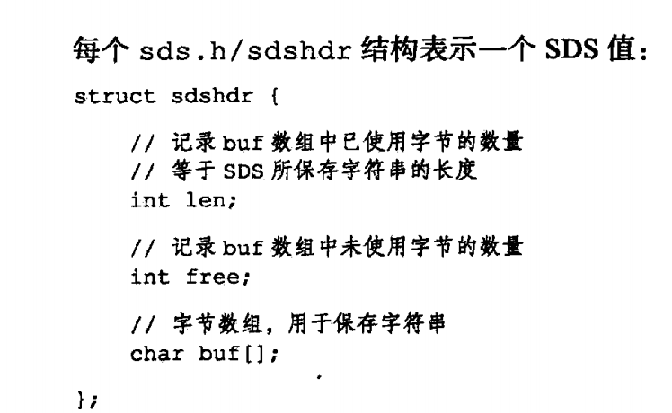

---

title: Redis底层数据结构之SDS
author: John Doe
tags:
  - 字符串
  - ''
categories:
  - Redis
date: 2022-02-06 20:13:00
---
Redis是用C语言写的，底层实现了众多数据结构，其中字符串是最常用的一种，其底层实现并不是用的C语言的char[]数组，而是进行了简单的封装sds结构体，定义了一个int的len、free和char[]来实现字符串。其相较于原生的C语言字符串有如下优点：

1、可以通过len-free以常数阶获取字符串长度

2、可以通过free字段避免缓冲区出现溢出的情况

3、同时也减少字符串修改时，内存重新分配的次数，其具体实现是通过预先分配内存（即当追加字符串之后，字符串小于1MB，会多分配一倍的空间）和懒惰回收（即当字符串变短之后，不会立即回收那一部分空间，而是作为临时空间供后续字符串扩增做优化）

4、可以保存二进制安全的数据

 