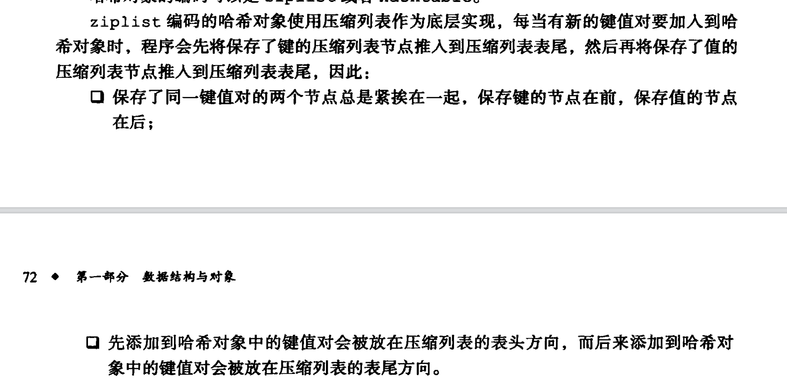
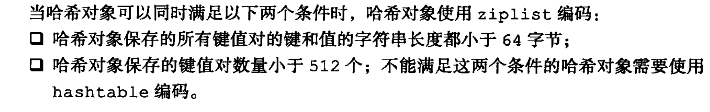
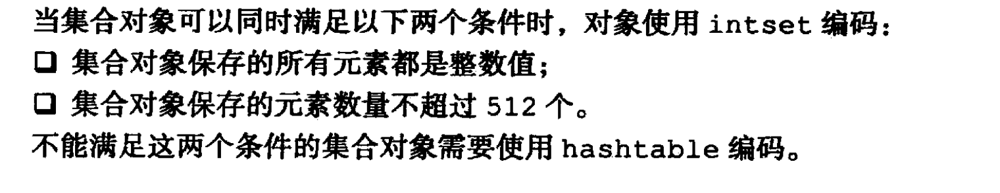
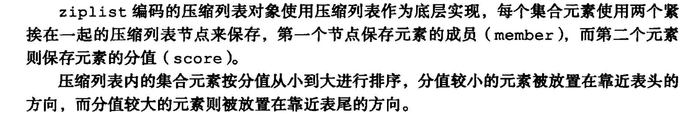
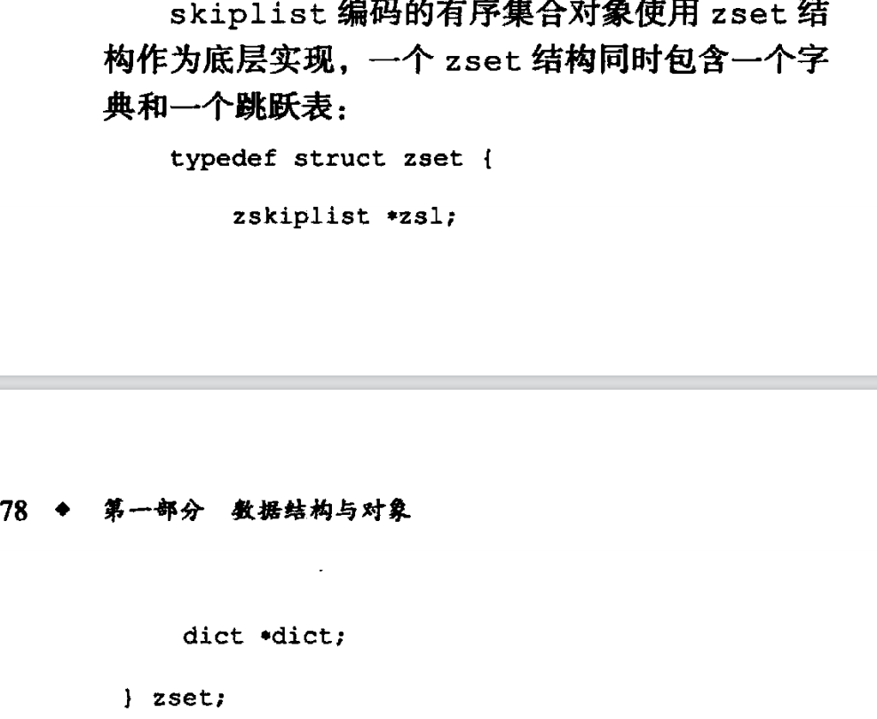
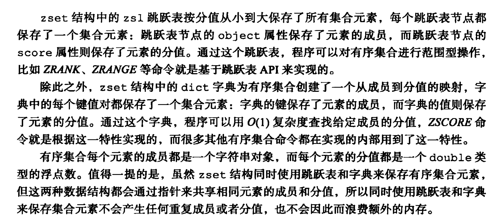
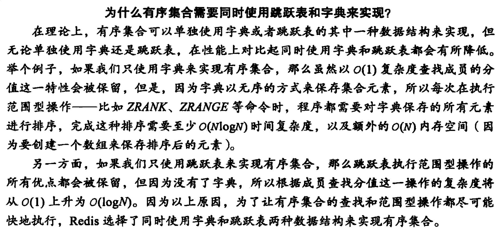
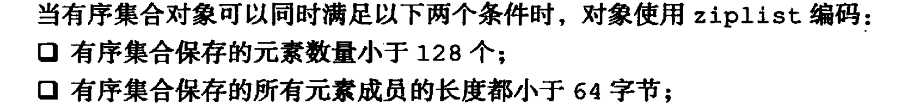

---

title: Redis底层数据结构之对象
author: John Doe
tags:
  - 对象
categories:
  - Redis
date: 2022-02-07 08:49:00
---

Redis对外提供了五种数据类型，分别是String、List、HashMap、HashSet以及ZSeT，其中String作为key-value键值映射的key，以及五种value之一，而其他四种则只能作为value。并且这五种数据类型在底层实现上都至少有两种数据结构实现。

在底层上，由一个type类型表明当前数据对象属于哪个类型，由encodeing表明底层具体的数据结构实现，然后由一个指针指向底层的数据结构实现。这样的好处的话主要就是在不同的应用场景选择不同的底层数据结构实现，会大大提高redis的存储性能。

1、具体的话，String类型底层实现有：int、raw、embstr三种数据结构的实现。其中int类型的底层数据结构实现主要是用于存放整数值，当我们的value是一个整数值，就可以选择用int类型的底层实现。而raw类型的底层实现则是一个动态字符串数据结构，一般当字符串大于32字节就会使用到。embstr则是当字符串小于32字节会使用到。两者的不同在于，embstr只会进行一次内存分配和释放，而raw则会进行两次内存分配和释放；而且embstr的内存时连续的，而raw不是。

需要注意的是：double这种浮点型的数据作为value存储的时候，底层使用的是str类型的数据结构实现。另外上述三种底层数据结构实现是可以相互转换的。

2、list类型底层编码可以使ziplist和linkedlist两种类型，当list满足每个节点小于64字节并且节点数小于512个就可以采用ziplist作为底层实现，否则采用linkedlist

3、hash对象底层编码可以使ziplist和hashtable两种类型
 
 
 
 
 4、set集合的编码实现可以使整数集合和hashtable
 
  
  
  5、有序集合zset的编码实现：ziplist和skiplist。
  
 
 
 
 
 
 
 
 
 
 
 
 
 
