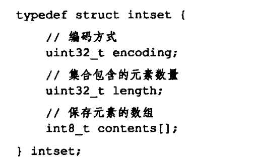

---

title: Redis底层数据结构之整数集合
author: John Doe
tags:
  - 整数集合
categories:
  - Redis
date: 2022-02-06 21:40:00
---

 
 
 整数集合是Redis用于保存整数值得集合数据结构，可以保存int16、int32、int64de整数值，并且有序不会重复，具体由encoding决定保存是int16、32还是64.
 
 当将一个新元素加入整数集合时，而且这个元素类型长于当前集合类型，就会先对集合升级，然后在加入新元素。
 
 
 升级：
 
 1、根据新元素类型，开辟新的数组
 
 2、将原数组的元素转移到新数组的正确位置上，且转化为与新数组相同的类型
 
 3、将新元素加到新数组指定的位置
 
 好处：
 
 1、提升灵活性，C语言是静态类型语言，为了避免错误，不会将两种类型放在一个数据结构里面，通过底层数组升级操作，不必担心不同类型的整数出现类型错误
 
 2、节约内存，整数集合的升级操作，确保了只在需要的时候进行，尽量节约内存。