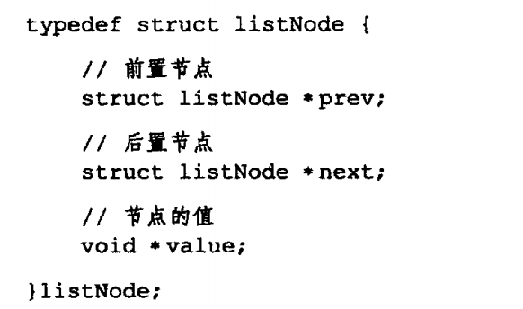
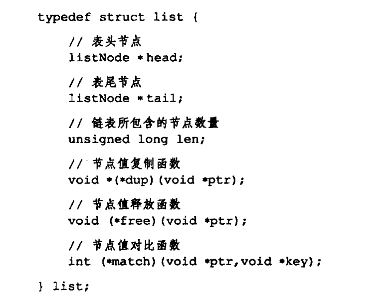
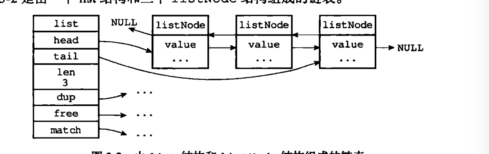

---

title: Redis底层数据结构之链表
author: John Doe
tags:
  - 链表
categories:
  - Redis
date: 2022-02-06 20:28:00
---

链表作为一种常用数据结构，Redis也对其进行了实现。链表键、发布与订阅、慢查询、监视器等方面都用到了链表。其底层由node节点和list结构构成，node节点包含前驱和后继指针以及value值，而list结构则包含了指向投节点、尾结点的指针以及链表节点数、节点复制函数、释放函数等。即最终是一个双端无环链表。

  
 
 
 
 
 