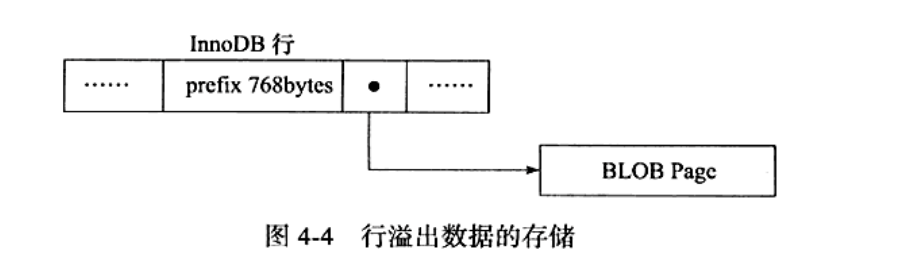

---

title: InnoDB行溢出（Redundant）
author: John Doe
tags:
  - 行结构
categories:
  - MySQL
date: 2022-03-02 18:45:00
---
3个列长度总和是66000，innoDB存储引擎的页为16kb，16384字节，会产生行溢出，因此对于这种情况，数据不会存放于b+tree的叶子节点中，而是存入页类型为uncompress blob页中。

 
 
 每页中至少存放两条行记录（否则失去了B+tree的意义，变为了链表），因此如果一页中只能放一条记录，则会将数据放到溢出页。而对于Text或BLOB的数据类型亦然。