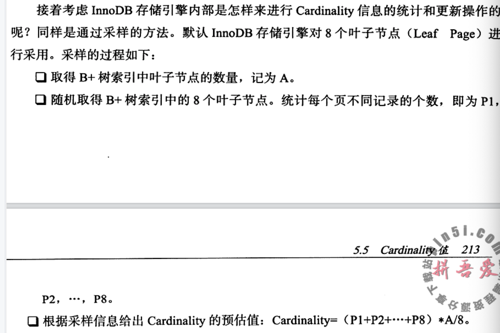

---

title: MySQL怎么查看索引是否是高选择性？
author: John Doe
tags:
  - 索引
categories:
  - MySQL
date: 2022-03-02 19:33:00
---

通过show index查看结果列中的cardinality值（表示索引中不重复记录数量的预估值），在实际应用中cardinality/table.size应该尽可能接近1。

cardinality是在存储引擎层进行统计的。具体方式是通过采样的方法来完成。具体发生在insert和update操作中，策略为①表中1/16数据发生过变化②stat_modified_counter>2 000 000 000（表中数据实际未增加，实际发生变化的还是这一行数据①就无法适用，则通过②的计数器stat_modirfied_counter表示发生变化次数）。

 