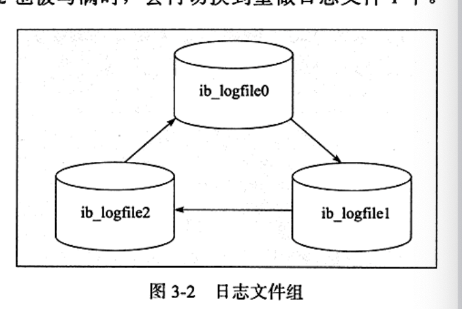
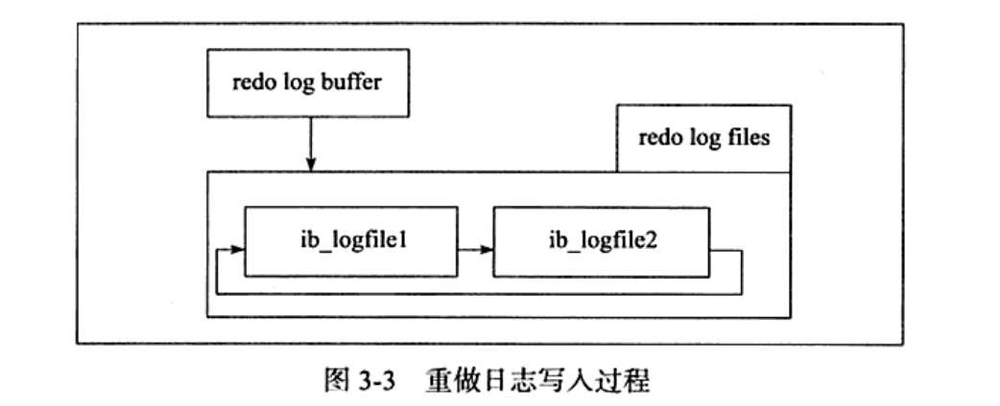

---

title: MySQL文件
author: John Doe
tags:
  - 文件
categories:
  - MySQL
date: 2022-02-09 16:05:00
---

1、参数文件：MySQL实例启动时会读取参数文件来初始化。

2、日志文件：

错误日志（记录了MySQL执行期间的错误信息）

二进制日志（记录了对MySQL执行的写操作，默认未开启。

作用：
1、恢复，可以通过binlog进行数据的恢复
2、复制：通过复制和执行binlog对远程的MySQL进行实时数据同步（主从复制）
3、审计：对binlog数据进行审计，看是否有对数据库进行注入的攻击

 
 
 
 
）

慢查询日志（可以从中得到一些SQL优化信息，默认未开启）

查询日志（记录了所有对MySQL的请求信息）

3、套接字文件

4、pid文件

5、表结构定义文件（以frm为后缀名）：记录了该表的表结构定义。除此之外还用于存放视图的定义。

6、innoDB存储引擎文件：

a）表空间文件（默认10mb，名为ibdata1）：可以设置基于innoDB存储的单独的。idb独立表空间文件（仅存储数据、索引等信息，其他信息还是存放于表空间文件）。

 
 
 b）、redolog文件（默认会有两个名为ib_logfile0和ib_logfile1的文件）：每个innoDB至少有一个redolog组（每组至少有两个redolog文件），redolog冲缓冲区写入磁盘是按512字节，即一个扇区大小，可以保障写入必定成功（所有不需要doublewrite）
 
 
 
 
 
 
 
 
