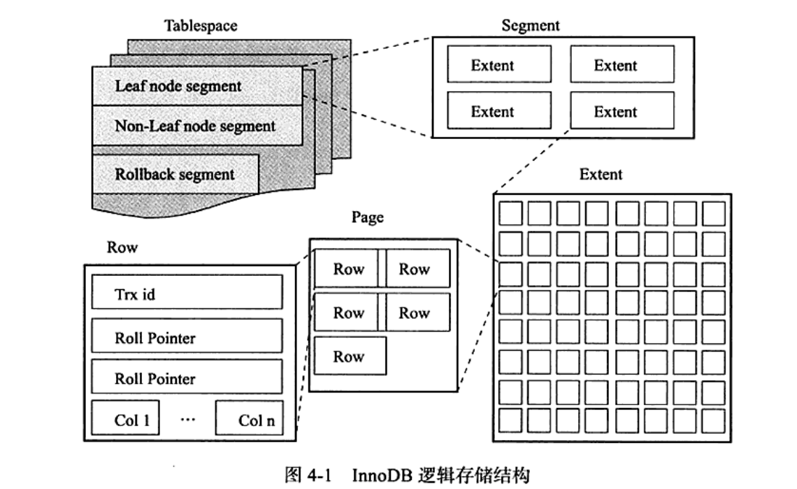
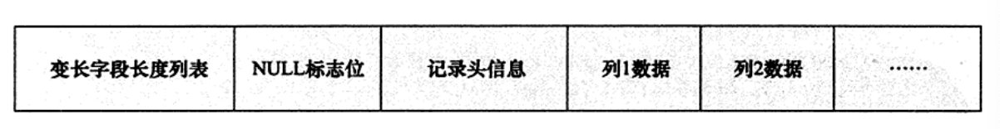
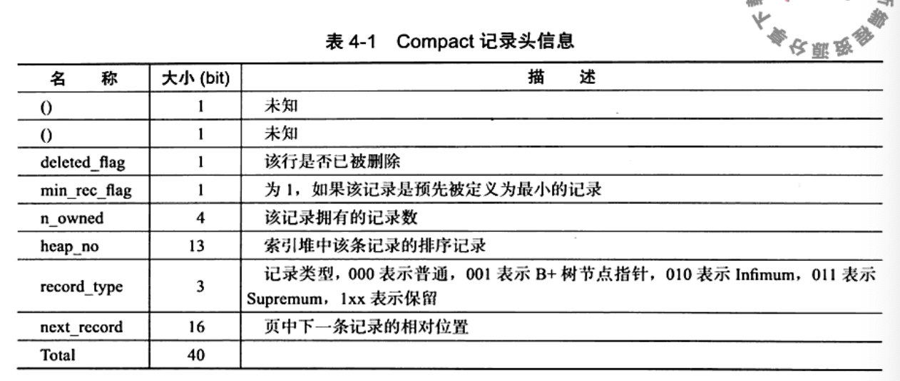
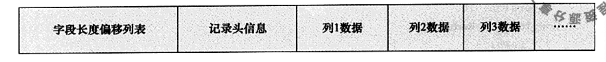
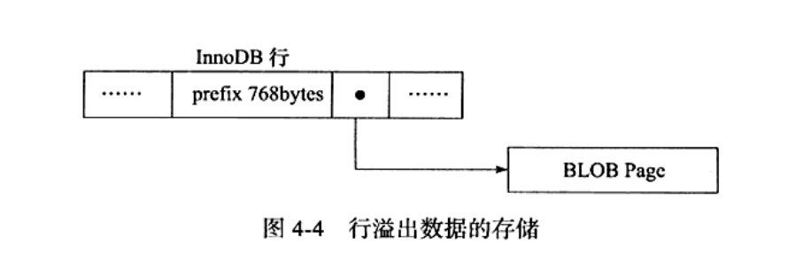
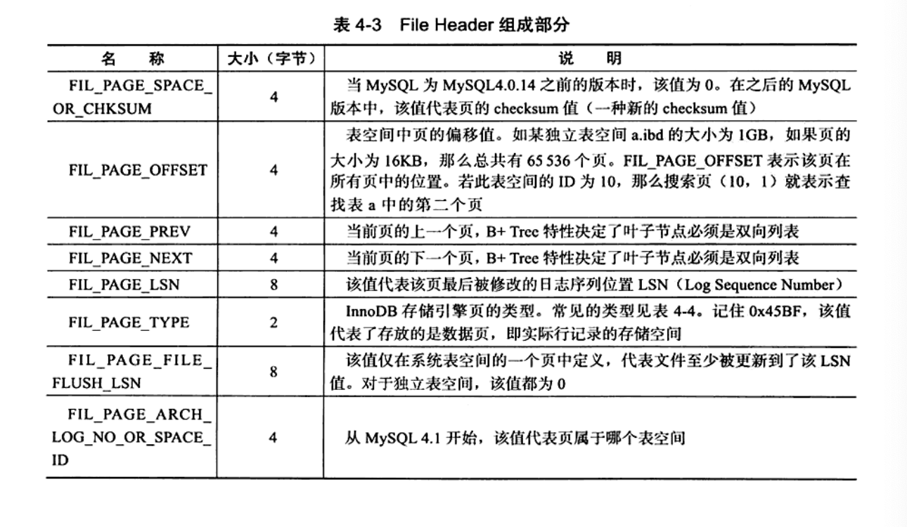
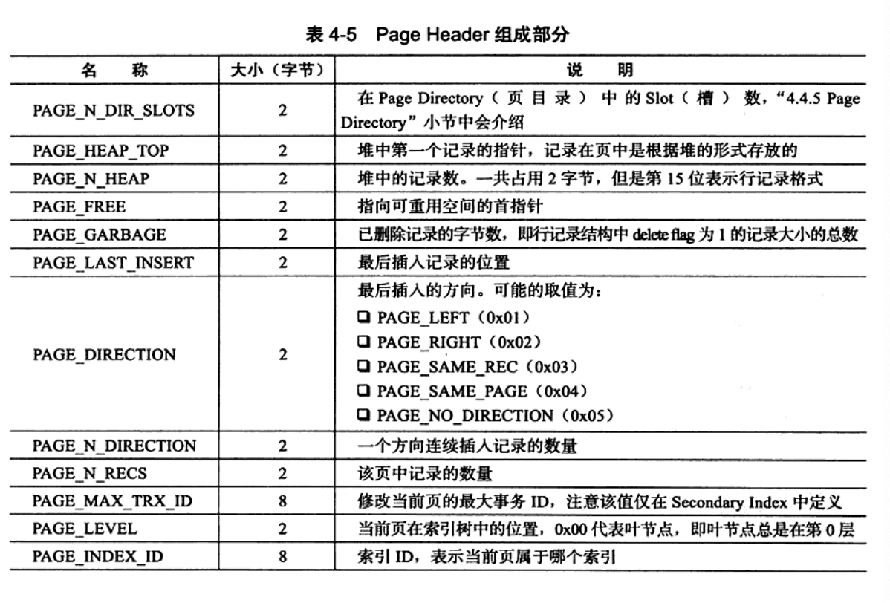
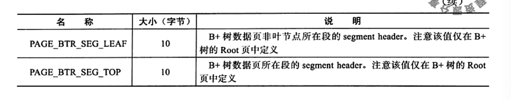

---

title: MySQL表
author: John Doe
tags:
  - 表
categories:
  - MySQL
date: 2022-02-09 18:47:00
---

innoDB中，表根据主键顺序存放。每张表都有一个主键，在建表时没有显示定义主键，则innoDB会先判断表中是否有非空的唯一索引，如果有，则该索引即为主键（对于多个非空唯一索引，根据定义的顺序选择，而不是建表列的顺序选择），如果没有，则会自动创建一个6字节的指针。

innoDB中，数据被逻辑的放在一个表空间。表空间由段组成，段又由区组成，区又有页组成，页时最基本的单位。如下：
 

innoDB默认情况下有一个共享表空间，如果用户开启参数innodb_file_per_table则每张表的数据单独放到一个表空间。（需要注意的是：单独的表空间只是存放数据、索引和插入缓冲bitmap页，对于其他数据，如回滚信息、插入缓冲索引页等仍是存放在共享表空间）

对于段由innoDB管理，数据段即为B+tree的叶子节点，索引段即为B+tree的非叶子节点，回滚段较为特殊。

区则是连续页（默认16kb/页）组成的空间（大小1mb）。一个区默认有64个连续的页。为了保证区中页的连续性，innoDB会一次从磁盘申请4-5个区。值得注意的是：

 
 
 innoDB常见页：
 
 
 
 页又由行组成最多允许7992（16kb/2-200）行记录。innoDB提供了Compact和Redundant格式的行数据格式。需要注意：除了下图的信息外，还存在事务ID列（6字节）和回滚指针列（7字节），如果innoDB没有定义主键还会有一个6字节的rowid列
 
 Compact行记录：
 
 
 
 
 
 
 
 
 Redundant行记录格式：
 
 
 
 

当然一般情况下innoDB的数据都是放在页类型为B+tree-node中，但是当发生行溢出，数据存放在Uncompress BLOB页中。
 
 
 
 innoDB数据页结构：
 
 
 

 
 
 
 
 
 
 
