---

title: innoDB存储引擎
author: John Doe
tags:
  - innoDB
categories:
  - MySQL
date: 2022-02-09 11:04:00
---

innoDB存储引擎是开源的第一个完整支持ACID事务的MySQL存储引擎（第一个支持事务的是BDB存储引擎），其特点是行锁设计、支持MVCC、支持外键、一致性非锁定读等。被广泛的应用。

 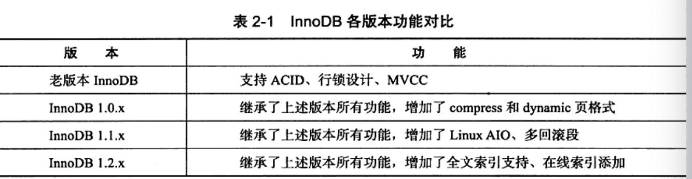
 
 innoDB存储引擎有多个内存块，组成了一个大的内存池，每个内存块有指定的后台线程来维护其运行。
 
 1、main线程主要负责将缓冲区的数据异步刷新到磁盘，保证数据的一致性（包括脏页的刷新、合并插入缓冲、undo页的回收等）
 
 2、IO线程主要是负责IO请求的回调，包括read、write、insert buffer、log等，其使用了AIO机制，保证了IO性能。
 
 3、Purge线程主要用于回收提交事务之后，undo页可能不再需要，需要对其进行回收。（1.2版本支持多个Purge线程，目的是进一步加快undo页的回收，提升性能）
 
 4、Page cleaner线程主要用于脏页的刷新操作，减轻main线程的压力。
 
 
 
 innoDB是基于磁盘存储的，为了权衡磁盘速度和CPU速度的差异，提供了一块缓冲池技术来提升性能。（因此可以将缓冲池区域设置大一点来进行优化操作）innoDB1.0允许多个缓冲池实例，磁盘读取的页根据哈希值均匀分配到不同缓冲池中（目的：减少数据库资源竞争，增加数据库并发处理能力）
 
 在数据的读取中，会先去缓冲池中查看是否存在于缓冲池，如果存在直接读取，不存在则去磁盘读取，在同步到缓冲池中。而对于写操作则是先写到缓冲池，然后根据Checkpoint机制将脏数据刷新到磁盘，保证磁盘和内存数据的一致性。
  
 缓冲池具体的数据页有：
 
 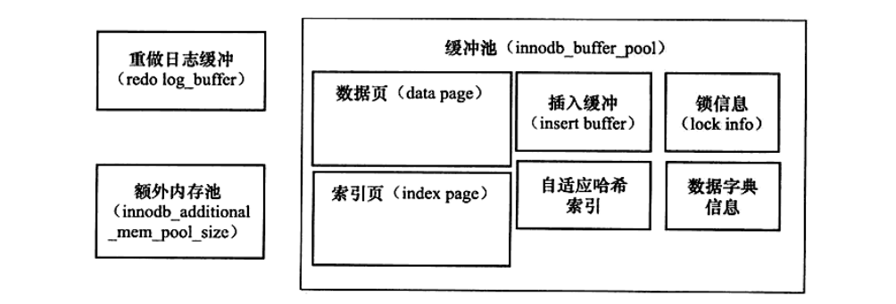
 
 为了管理这些数据页，innoDB使用了一个freeLIst链表来管理空闲的页内存，LRUList来管理已经分配的页内存，flushList来管理脏页。（脏页及存在于LRUList，又存在于flushList，是两者共享的）
 
 对于LRUList管理的页，采用了LRU（最近最少使用）算法来管理（缓冲池页大小默认16kb），在LRU列表中加入了一个midpoint位置（默认是5/8位置处），midpoint位置前面的是热点数据区域，后面的是冷数据区域（设置冷、热数据区域主要是为了保证一些经常被访问的数据存在于内存中，提示效率的一种考虑）。当一个新的页被分配到LRULIst上，会先加入到midpoint位置后面（这样做是为了防止当进行全表查询的时候，多个页会覆盖调热数据区域的页，而这些查的数据页又只使用一次，后续不再使用，当后面访问热区域的页时有会从磁盘中查找，浪费性能），同时也指定了一个从冷数据区域晋升到热数据区域的参数，当到了晋升时间后，冷数据区域的页就会晋升到热数据区域。
 
值得注意的是：空闲页的内存freeList+以分配的页内存LRUList并不等于缓冲池的内存，因为缓冲池中包含得其他部分页（自适应哈希索引、lock信息等）不需要LRU维护，不存在于LRUList中。

 
 
 
 另外，页是支持压缩的，16kb的页可以压缩成1kb、2kb、4kb、8kb。页的大小发生变化，所有对于压缩的页，会使用zipLRUList进行管理。（注意：LRUList包含zipLRUList中的页）
 
 对于zipLIRList的页的分配采用伙伴算法
 
例如压缩后的页为4kb

1、先检查4kb的zipLRUList是否有空闲页，存在即分配

2、否则，检查8kb的zipLRUList看是否存在空闲页，存在则将8kb分为两个4kb，将4kb的页放入4kbzipLRUList
，然后为其分配

3、在否则，检查16kb的freeList看是否存在空闲页，存在则将16kb分为两个4kb，一个8kb，分别放入对应zipLRUList，然后为其分配

 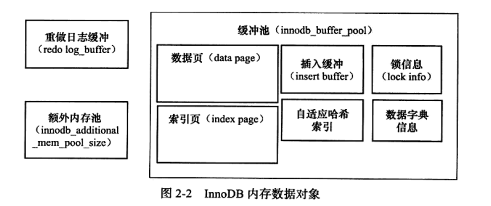
 
 由上图可知，innoDB除了缓冲池，还存在redolog日志缓冲和额外内存池。
 
 其中redolog日志缓冲（默认8mb大小）是redolog文件的缓冲区（redolog文件记录了写请求的指令，对页的写指令都会记录到这个文件中，后续数据库恢复会使用到这个文件）当满足以下条件就会将缓冲区的数据刷新到文件中。
 
 1、每个事物提交会进行刷新
 
 2、当缓冲区小于一半，会进行刷新
 
 3、main线程每秒会进行一次刷新
 
 而额外的内存池则是在对于一些数据结构本身进行进行内存分配时会从额外内存储进行申请。

前面提到进行写操作入时，一般会先写到缓冲区，然后在根据checkpoint机制将脏页刷新到内存，保持内存和磁盘数据的一致性。但考虑到如果频繁发生写操作，而对脏数据刷新到磁盘不加以控制，每来一个写操作，都会进行一次刷新，那就会产生大量的io，导致整体性能下降；除此之外，在刷新的时候如果出现了宕机，数据也会丢失。因此采用提交事物前，先写redolog日志，然后在修改内存中的页，即使将脏页刷新到磁盘时出现宕机，也能够根据redolog日志进行恢复。而chenckpoint技术就是为了解决

1、缩短数据库的恢复时间（因为chenckpoint前的脏页都已经刷新到磁盘了，只需对chenckpoint之后的进行恢复）
2、缓冲池不够时将脏页刷新到磁盘。（当缓冲池不够用时，会根据LRU算法将最近最少用的页淘汰，而淘汰时会检测是否为脏页，如果是则执行checkpoint，将脏页刷新到磁盘）
3、redolog日志不够用时，刷新脏页（即redolog的大小是有限制的，chenckpont前的是可重用的，而chenckpoint之后的是需要的，如果redolog文件里面全部都是需要使用的，则必须进行checkpoint）

在innoDB中，使用LSN（八字节）标记版本，每个页都有自己的LSN，redolog日志中和checkpoint中也有。

在innoDB中存在两种checkpoint，即sharp checkpoint（默认）和fuzzy checkpoint。

sharp checkpoint发生在数据库关闭时，此时会将所有脏页刷新到磁盘（会发生迟钝）

fuzzy checkpoint则是每次只刷新部分脏页到磁盘。以下是几种发生fuzzy checkpoint的情况：

 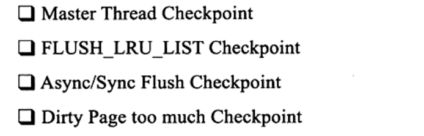
 
 1、main线程会每秒或10秒的速度从fulshList中刷新页到磁盘。
 
 2、当缓冲池没有多余空闲空间，会根据LRU算法冲LRUList淘汰页，对于淘汰的页会检测是否是脏页，是则会刷新到磁盘。
 
 3、当redolog不可用时会强制flushList中的脏页进行刷新
 
 4、当脏页太多，也会强制进行checkpoint刷新脏页到磁盘。
 
 
 innoDB主要工作都是在main线程中完成的，其内部由多个循环组成（主循环、后台循环、刷新循环、暂停循环），在多个循环中切换进行工作。
 
 innoDB1.0
 
 主循环：
 
 
 
 
 
 
 后台循环：
 
 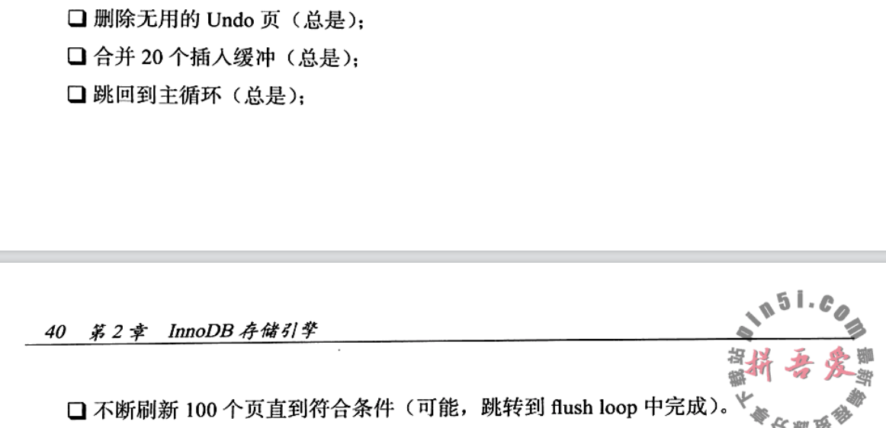
 
 innoDB1.2基于上述IO限制，加入了innoDB_io_capacitiy用于表示IO（默认200），对于刷新的页用百分比来控制
 
 另外一个参数是innoDB_max_dirty_pct（默认75），当脏页小于innoDB_max_dirty_pct也会刷新一定量的脏页（之前是不会刷新的）。
  
  
  
  接下来说一说innoDB的插入缓冲。insert buffer和数据页一样，是物理页的一部分。
  
  在innoDB中，主键是唯一标识，插入记录一般按主键递增顺序插入。因此，聚集索引一般是顺序的（比如自增id这种），对于顺序的一般插入操作速度很快，但对于主键是uuid之类则和辅助索引一样，是随机的。因此对于这种情况，按顺序插入则相对要慢得多。因此insert buffer的作用就是对于非聚集索引的插入或者更新操作先判断是否存在缓冲池，若存在则直接插入，不存在则放到insert buffer中，在以一定频率进行inser buffer和辅助索引子节点的合并，提高对于非聚集索引的插入性能。当然使用insert buffer需要满足
 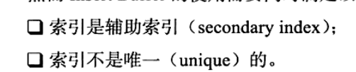
 
 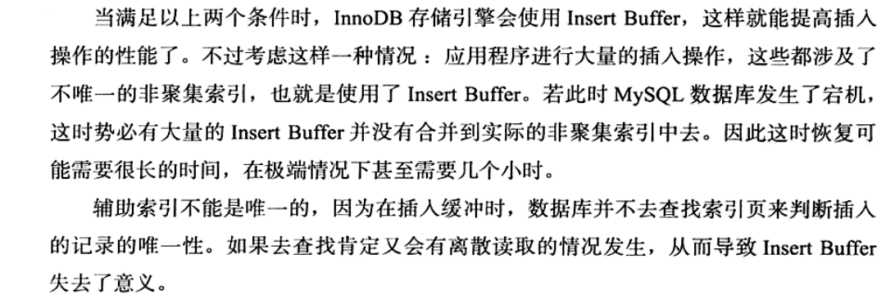
 
 insert buffer数据实现是一颗b+树，
 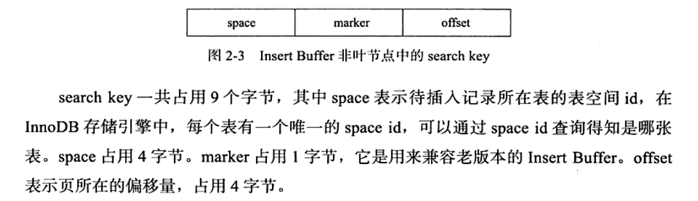
 
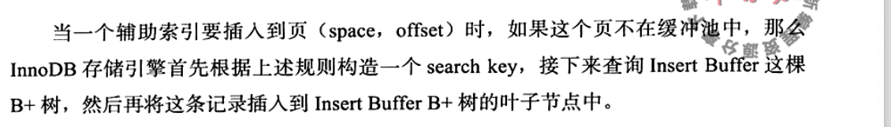

 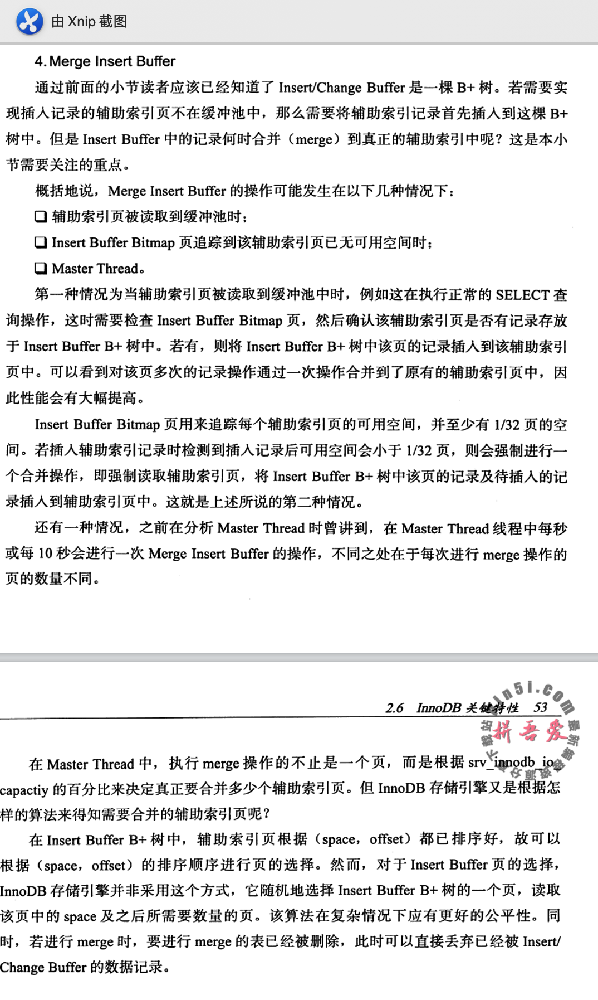
 
 change buffer：在1.0.x版本引入了channge buffer，可以对增删改都进行缓冲
 
 
 
 两次写：当innoDB刷新某个页到磁盘中，但只刷新了部分，数据库就宕机了（部分写失效）。double write就是为了解决这种情况产生的。
 
 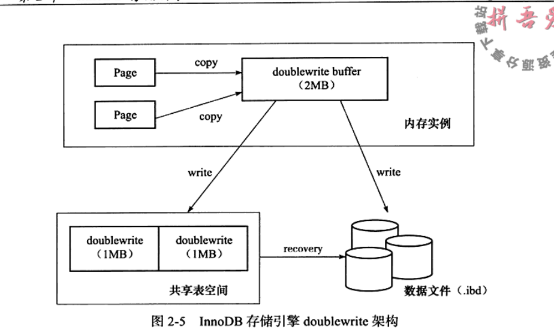
 
 double write由两部分组成。一部分时内存double write buffer（大小2mb），一部分是磁盘上的共享表空间中连续的128页（即两个区，大小为2mb）。在对脏页进行刷新时，并不直接写磁盘，而是通过memcpy函数将脏页先复杂到 doublewrite buffer，然后doubllewrite buffer再分两次顺序的写到共享表空间的物理磁盘上（每次写1mb）。完成之后，在将doublewrite buffer中的页写入各个表文件空间中。如果在写入表中磁盘时发生了宕机什么的。在恢复时，可以从共享表空间中找到一个备份页，将其复制到表空间。
 
 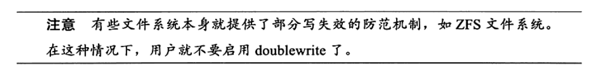
 
 自适应哈希：innoDB会对表上各索引页的查询监控。如果建立哈希索引会提升性能，则建立哈希索引。而条件就是：对这个页的连续访问模式要一样。
 
 异步IO：innoDB采用AIO的方式处理磁盘操作，可以在发起一个IO请求后，立马发起另一个IO请求，当全部发送完后，等所有请求操作完。除此之外，还可以进行IO的合并操作。
 
 
 刷新邻接页：即刷新一个脏页时，会检测该页周围的页是否是脏页，是则一并刷新。
 
 
 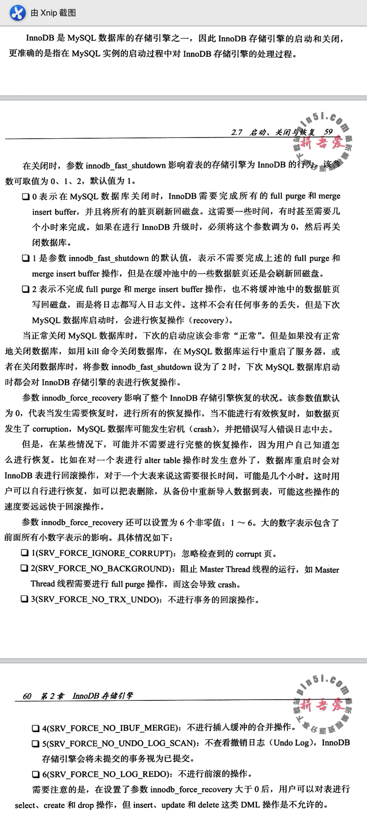