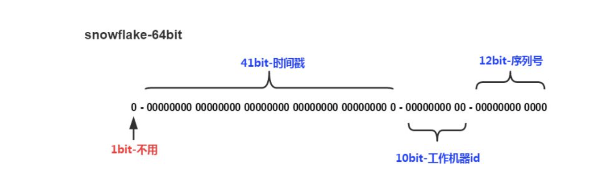

---

title: 分库分表之后的主键处理方式
author: John Doe
tags:
  - 主键
categories:
  - MySQL
date: 2022-02-24 12:56:00
---

1、UUID：不适合作为主键，其太长了而且无序，插入效率低

2、数据库自增id：两台数据库分别设置不同步⻓，⽣成不重复ID的策略来实现⾼可⽤。这种⽅式⽣成的 id 有序，但是需要独⽴部署数据库实例，成本⾼，还会有性能瓶颈。

3、利⽤ redis ⽣成 id : 性能⽐᫾好，灵活⽅便，不依赖于数据库。但是，引⼊了新的组件造成
系统更加复杂，可⽤性降低，编码更加复杂，增加了系统成本。

4、Twitter的snowflake算法：

 
 
 1.第一位

占用1bit，其值始终是0，没有实际作用。

2.时间戳

占用41bit，精确到毫秒，总共可以容纳约140年的时间。

3.工作机器id

占用10bit，其中高位5bit是数据中心ID（datacenterId），低位5bit是工作节点ID（workerId），做多可以容纳1024个节点。

4.序列号

占用12bit，这个值在同一毫秒同一节点上从0开始不断累加，最多可以累加到4095。

SnowFlake算法在同一毫秒内最多可以生成多少个全局唯一ID呢？只需要做一个简单的乘法：

1024x4096

SnowFlake算法的优点：

1.生成ID时不依赖于DB，完全在内存生成，高性能高可用。

2.ID呈趋势递增，后续插入索引树的时候性能较好。

SnowFlake算法的缺点：

依赖于系统时钟的一致性。如果某台机器的系统时钟回拨，有可能造成ID冲突，或者ID乱序。
