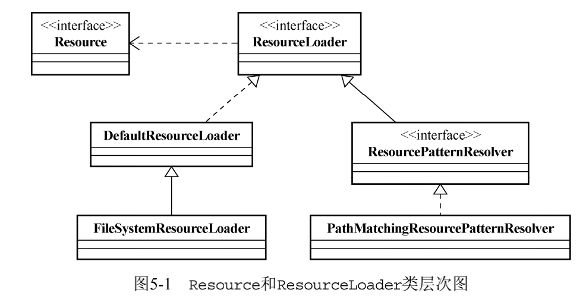

---

title: ApplicationContext统一资源加载策略
author: John Doe
tags:
  - 资源加载
  - 容器
categories:
  - Spring
date: 2022-03-04 15:24:00
---

Spring框架内部使用org.springframework.core.io.Resource接口作为所有资源的抽象和访 
问接口

其中ClassPathResource就是Resource的一个特定类型的实现，代表的是位于Classpath中的资源。

Resource接口可以根据资源的不同类型，或者资源所处的不同场合，给出相应的具体实现。Spring
框架在这个理念的基础上，提供了一些实现类（可以在org.springframework.core.io包下找到这
些实现类）。

 ByteArrayResource。将字节（byte）数组提供的数据作为一种资源进行封装，如果通过
InputStream形式访问该类型的资源，该实现会根据字节数组的数据，构造相应的ByteArrayInputStream并返回。

 ClassPathResource。该实现从Java应用程序的ClassPath中加载具体资源并进行封装，可以使
用指定的类加载器（ClassLoader）或者给定的类进行资源加载。 

 FileSystemResource。对java.io.File类型的封装，所以，我们可以以文件或者URL的形
式对该类型资源进行访问，只要能跟File打的交道，基本上跟FileSystemResource也可以。  

 UrlResource。通过java.net.URL进行的具体资源查找定位的实现类，内部委派URL进行具
体的资源操作。  

 InputStreamResource。将给定的InputStream视为一种资源的Resource实现类，较为少用。
可能的情况下，以ByteArrayResource以及其他形式资源实现代之。

如果给定的实现类不满足需求，还可以通过实现Resource接口自定义。

org.springframework.core.io.ResourceLoader接口是资源查找定位策略的统一抽象，具体的资源查找定
位策略则由相应的ResourceLoader实现类给出。

其中最主要的就是Resource getResource(String location);方法，通过它，我们就可以根
据指定的资源位置，定位到具体的资源实例。

1、可用的ResourceLoader：

ResourceLoader有一个默认的实现类，即org.springframework.core.io.DefaultResourceLoader，该类默认的资源查找处理逻辑如下。

(1) 首先检查资源路径是否以classpath:前缀打头，如果是，则尝试构造ClassPathResource类
型资源并返回。

(2) 否则，(a) 尝试通过URL，根据资源路径来定位资源，如果没有抛出MalformedURLException，
有则会构造UrlResource类型的资源并返回；(b)如果还是无法根据资源路径定位指定的资源，则委派
getResourceByPath(String) 方法来定位， DefaultResourceLoader 的
getResourceByPath(String)方法默认实现逻辑是，构造ClassPathResource类型的资源并返回。

为了避免DefaultResourceLoader在最后getResourceByPath(String)方法上的不恰当处理，
我们可以使用org.springframework.core.io.FileSystemResourceLoader，它继承自DefaultResourceLoader，但覆写了getResourceByPath(String)方法，使之从文件系统加载资源并以
FileSystemResource类型返回。这样，我们就可以取得预想的资源类型。

FileSystemResourceLoader在ResourceLoader家族中的兄弟FileSystemXmlApplicationContext，也是覆写了getResourceByPath(String)方法的逻辑，以改变DefaultResourceLoader的
默认资源加载行为，最终从文件系统中加载并返回FileSystemResource类型的资源。

2、 ResourcePatternResolver ——批量查找的ResourceLoader：

ResourcePatternResolver是ResourceLoader的扩展，ResourceLoader每次只能根据资源路径
返回确定的单个Resource实例，而ResourcePatternResolver则可以根据指定的资源路径匹配模式，
每次返回多个Resource实例。

ResourcePatternResolver在继承ResourceLoader原有定义的基础上，又引入了Resource[] 
getResources(String)方法定义，以支持根据路径匹配模式返回多个Resources的功能。它同时还
引入了一种新的协议前缀classpath*:，针对这一点的支持，将由相应的子类实现给出。

ResourcePatternResolver最常用的一个实现是org.springframework.core.io.support. 
PathMatchingResourcePatternResolver，该实现类支持ResourceLoader级别的资源加载，支持基
于Ant风格的路径匹配模式（类似于**/*.suffix之类的路径形式），支持ResourcePatternResolver新
增加的classpath*:前缀等，基本上集所有技能于一身。

在构造PathMatchingResourcePatternResolver实例的时候，可以指定一个ResourceLoader，
如果不指定的话，则PathMatchingResourcePatternResolver内部会默认构造一个DefaultResourceLoader实例。PathMatchingResourcePatternResolver内部会将匹配后确定的资源路径，
委派给它的ResourceLoader来查找和定位资源。这样，如果不指定任何ResourceLoader的话，PathMatchingResourcePatternResolver在加载资源的行为上会与DefaultResourceLoader基本相同，
只存在返回的Resource数量上的差异。

不过，可以通过传入其他类型的ResourceLoader来替换PathMatchingResourcePatternResolver
内部默认使用的DefaultResourceLoader，从而改变其默认行为。

 
 
 ApplicationContext继承了ResourcePatternResolver，当
然就间接实现了ResourceLoader接口。所以，任何的ApplicationContext实现都可以看作是一个
ResourceLoader甚至ResourcePatternResolver。而这就是ApplicationContext支持Spring内统一
资源加载策略的真相。

通常，所有的ApplicationContext实现类会直接或者间接地继承org.springframework. 
context.support.AbstractApplicationContext，从这个类上，我们就可以看到ApplicationContext与ResourceLoader之间的所有关系。AbstractApplicationContext继承了DefaultResourceLoader，那么，它的getResource(String)当然就直接用DefaultResourceLoader的了。剩
下需要它“效劳”的，就是ResourcePatternResolver的Resource[]getResources (String)，当
然，AbstractApplicationContext也不负众望，当即拿下。AbstractApplicationContext类的内
部声明有一个resourcePatternResolver，类型是ResourcePatternResolver，对应的实例类型为
PathMatchingResourcePatternResolver 。之前我们说过 PathMatchingResourcePatternResolver构造的时候会接受一个ResourceLoader，而AbstractApplicationContext本身又继承自
DefaultResourceLoader，当然就直接把自身给“贡献”了。这样，整个ApplicationContext的实
现类就完全可以支持ResourceLoader或者ResourcePatternResolver接口，你能说ApplicationContext不支持Spring的统一资源加载吗？说白了，ApplicationContext的实现类在作为ResourceLoader或者ResourcePatternResolver时候的行为，完全就是委派给了PathMatchingResourcePatternResolver和DefaultResourceLoader来做。

 
 
 
 1、既然ApplicationContext可以作为ResourceLoader或者ResourcePatternResolver来使用，
那么，很显然，我们可以通过ApplicationContext来加载任何Spring支持的Resource类型。与直接
使用ResourceLoader来做这些事情相比，很明显，ApplicationContext的表现过于“谦虚”了。

2、ApplicationContext容器本身就是一个ResourceLoader，我们为了该类还需要单独提供
一个resourceLoader实例就有些多于了，直接将当前的ApplicationContext容器作为ResourceLoader注入不就行了？而ResourceLoaderAware和ApplicationContextAware接口正好可以帮助我
们做到这一点，只不过现在的FooBar需要依赖于Spring的API了。不过，在我看来，这没有什么大不
了，因为我们从来也没有真正逃脱过依赖（这种依赖也好，那种依赖也罢）。

3、容器可以将bean定义文件中的字符串形式表达的信息，正确地转换成具体对象定
义的依赖类型。对于那些Spring容器提供的默认的PropertyEditors无法识别的对象类型，我们可以
提供自定义的PropertyEditor实现并注册到容器中，以供容器做类型转换的时候使用。默认情况下，
BeanFactory容器不会为org.springframework.core.io.Resource类型提供相应的PropertyEditor，所以，如果我们想注入Resource类型的bean定义，就需要注册自定义的PropertyEditor到
BeanFactory容器。不过，对于ApplicationContext来说，我们无需这么做，因为ApplicationContext容器可以正确识别Resource类型并转换后注入相关对象。

4、特定的 10 ApplicationContext容器实现，在作为ResourceLoader加载资源时，会有其特定的行为。
我们下面主要讨论两种类型的ApplicationContext容器，即ClassPathXmlApplicationContext和
FileSystemXmlApplicationContext。其他类型的ApplicationContext容器，会在稍后章节中提到。 11 
我们知道，对于URL所接受的资源路径来说，通常开始都会有一个协议前缀，比如file:、http:、ftp:
等。既然Spring使用UrlResource对URL定位查找的资源进行了抽象，那么，同样也支持这样类型的
资源路径，而且，在这个基础上，Spring还扩展了协议前缀的集合。ResourceLoader中增加了一种新
的资源路径协议——classpath:，ResourcePatternResolver又增加了一种——classpath*:。这
样，我们就可以通过这些资源路径协议前缀，明确地告知Spring容器要从classpath中加载资源

当ClassPathXmlApplicationContext在实例化的时候，即使没有指明
classpath:或者classpath*:等前缀，它会默认从classpath中加载bean定义配置文件

而FileSystemXmlApplicationContext则有些不同，如果我们像如下代码那样指定conf/ 
appContext.xml，它会尝试从文件系统中加载bean定义文件

不过，我们可以像如下代码所示，通过在资源路径之前增加classpath:前缀，明确指定
FileSystemXmlApplicationContext从classpath中加载bean定义的配置文件

 

