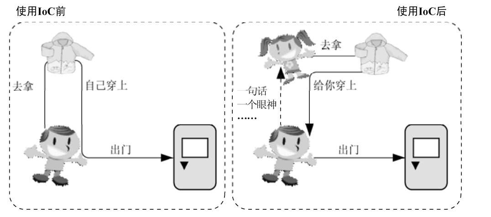

---

title: IOC的基本理念：让别人为你服务
author: John Doe
tags:
  - IOC的理解
categories:
  - Spring
date: 2022-03-03 17:01:00
---
IOC即控制反转，它还有一个别名叫做依赖注入（Dependency 
Injection）。

在我日常开发中，经常需要一个对象依赖于另一个对象的服务。最简单而有效的方式就是直接在类的构造函数中新建相应的依赖类。这就好比要装修新房，需要用家具，这个时候，根据通常解决
对象依赖关系的做法，我们就会直接打造出需要的家具来。不过，通常都是分工明确的，所以，大多数情况下，我们可以去家具广场将家具买回来，然后根据需要装修布置即可。不管是直接打造家具（通过new构造对象），还是去家具广场买家具（通过工厂设计模式），有一个共同点需要我们关注，那就是我们都是自己主动地去获取依赖的对象！可是回头想想，我们自己每次用到什么依赖对象都要主动地去获取，这是否真的必要？我们最终所要做的，其实就是直接调用依赖对象所提供的某项服务而已。只要用到这个依赖对象的时候，它能够准备就绪，我们完全可以不管这个对象是自己找来的还是别人送过来的。

实际上IOC就是为了帮助我们解决这种问题的，而提供了更加轻松简洁的方式。它的反转，就反转在让你从原来的事必躬亲，转变为现在的享受服务。

通常情况下，被注入对象会直接依赖于被依赖对象。但是，在IoC的场景中，二者之间通过IoC Service Provider来打交道，所有的被注入对象和依赖对象现在由IoC Service Provider统一管理。被注入对象需要什么，直接跟IoC Service Provider招呼一声，后者就会把相应的被依赖对象注入到被注入对象中，从而达到IoC Service Provider为被注入对象服务的目的。IoC Service Provider在这里就是通常的IoC容器所充当的角色。从被注入对象的角度看，与之前直接寻求依赖对象相比，依赖对象的取得方式发生了反转，控制也从被注入对象转到了IoC Service Provider那里。

 
 
 
 （IoC Service Provider在这里是一个抽象出来的概念，它可以指代任何将IoC场景中的业务对象绑定
到一起的实现方式。它可以是一段代码，也可以是一组相关的类，甚至可以是比较通用的IoC框架或
者IoC容器实现。）