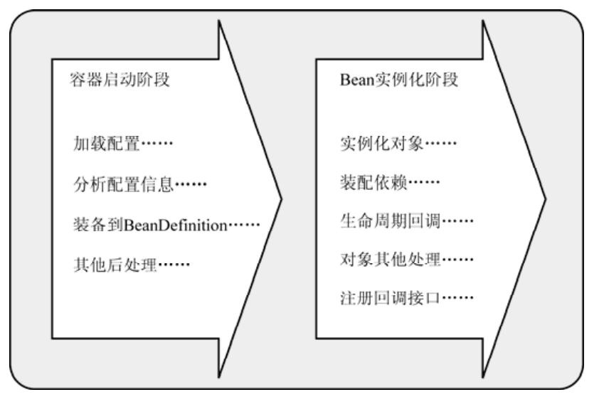

---

title: Spring容器背后的秘密
author: John Doe
tags:
  - IOC
categories:
  - Spring
date: 2022-03-04 10:22:00
---
Spring的IOC容器它会以某种方式加载Configuration Metadata（通常也就是XML格式的配置信息），然后根据这些信息绑定整个系统的对象，最终组装成一个可用的基于轻量级容器的应用系统。

Spring的IOC容器在实现上述过程中可以分为两个阶段：容器启动阶段和Bean实例化阶段。

Spring的IoC容器在实现的时候，充分运用了这两个实现阶段的不同特点，在每个阶段都加入了相应的容器扩展点，以便我们可以根据具体场景的需要加入自定义的扩展逻辑。

 
 
 
1、容器启动阶段：
容器启动伊始，首先会通过某种途径加载Configuration MetaData。除了代码方式比较直接，在大部分情况下，容器需要依赖某些工具类（BeanDefinitionReader）对加载的Configuration MetaData进行解析和分析，并将分析后的信息编组为相应的BeanDefinition，最后把这些保存了bean定义必要信息的BeanDefinition，注册到相应的BeanDefinitionRegistry，这样容器启动工作就完成了。

总地来说，该阶段所做的工作可以认为是准备性的，重点更加侧重于对象管理信息的收集。当然，
一些验证性或者辅助性的工作也可以在这个阶段完成。

2、 Bean实例化阶段：经过第一阶段，现在所有的bean定义信息都通过BeanDefinition的方式注册到了BeanDefinitionRegistry中。当某个请求方通过容器的getBean方法明确地请求某个对象，或者因依赖关系容器需要隐式地调用getBean方法时，就会触发第二阶段的活动。
该阶段，容器会首先检查所请求的对象之前是否已经初始化。如果没有，则会根据注册的BeanDefinition所提供的信息实例化被请求对象，并为其注入依赖。如果该对象实现了某些回调接口，也会根据回调接口的要求来装配它。当该对象装配完毕之后，容器会立即将其返回请求方使用。

如果说第一阶段只是根据图纸装配生产线的话，那么第二阶段就是使用装配好的生产线来生产具体的产品了。