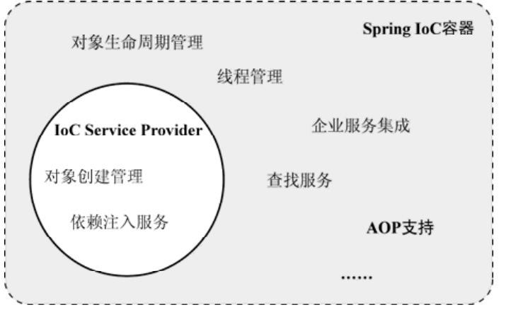

---

title: Spring的IOC容器
author: John Doe
tags:
  - IOC
categories:
  - Spring
date: 2022-03-03 21:11:00
---

Spring的IoC容器是一个IoC Service Provider，但是，这只是它被冠以IoC之名的部分原因，我们不能忽略的是“容器”。Spring的IoC容器是一个提供IoC支持的轻量级容器，除了基本的IoC支持，它作为轻量级容器还提供了IoC之外的支持。如在Spring的IoC容器之上，Spring还提供了相应的AOP框架支持、企业级服务集成等服务。Spring的IoC容器和IoCService Provider所提供的服务之间存在一定的交集。

 
 
 Spring提供了两种容器类型：BeanFactoryApplicationContext
 
  BeanFactory。基础类型IoC容器，提供完整的IoC服务支持。如果没有特殊指定，默认采用延迟初始化策略（lazy-load）。只有当客户端对象需要访问容器中的某个受管对象的时候，才对该受管对象进行初始化以及依赖注入操作。所以，相对来说，容器启动初期速度较快，所需要的资源有限。对于资源有限，并且功能要求不是很严格的场景，BeanFactory是比较合适的
IoC容器选择。

  ApplicationContext在BeanFactory的基础上构建，是相对比较高级的容器实现，除了拥有BeanFactory的所有支持，ApplicationContext还提供了其他高级特性，比如事件发布、国际化信息支持等。ApplicationContext所管理的对象，在该类型容器启动之后，默认全部初始化并绑定完成。所以，相对于BeanFactory来说，ApplicationContext要求更多的系统资源，同时，因为在启动时就完成所有初始化，容器启动时间较之BeanFactory也会长一些。在那些系统资源充足，并且要求更多功能的场景中，ApplicationContext类型的容器是比较合适的选择。
 