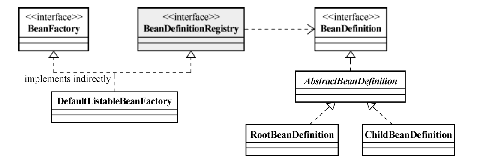

---

title: Spring的IOC容器之BeanFactory
author: John Doe
tags:
  - BeanFactory
categories:
  - Spring
date: 2022-03-03 21:21:00
---

BeanFactory，顾名思义，就是生产Bean的工厂。当然，严格来说，这个“生产过程”可能不像
说起来那么简单。既然Spring框架提倡使用POJO，那么把每个业务对象看作一个JavaBean对象，或许
更容易理解为什么Spring的IoC基本容器会起这么一个名字。作为Spring提供的基本的IoC容器，
BeanFactory可以完成作为IoC Service Provider的所有职责，包括业务对象的注册和对象间依赖关系的
绑定。

BeanFactory就像一个汽车生产厂。你从其他汽车零件厂商或者自己的零件生产部门取得汽车零
件送入这个汽车生产厂，最后，只需要从生产线的终点取得成品汽车就可以了。相似地，将应用所需
的所有业务对象交给BeanFactory之后，剩下要做的，就是直接从BeanFactory取得最终组装完成并
且可用的对象。至于这个最终业务对象如何组装，你不需要关心，BeanFactory会帮你搞定。

所以，对于客户端来说，与BeanFactory打交道其实很简单。最基本地，BeanFactory肯定会公
开一个取得组装完成的对象的方法接口，就像代码清单4-1中真正的BeanFactory的定义所展示的那
样。

BeanFactory就像一个汽车生产厂。你从其他汽车零件厂商或者自己的零件生产部门取得汽车零件送入这个汽车生产厂，最后，只需要从生产线的终点取得成品汽车就可以了。相似地，将应用所需的所有业务对象交给BeanFactory之后，剩下要做的，就是直接从BeanFactory取得最终组装完成并
且可用的对象。至于这个最终业务对象如何组装，你不需要关心，BeanFactory会帮你搞定。

当BeanFactory说这些事情让它来做的时候，可能没有告诉你它会怎么来做
这个事情。不过没关系，我们通常只需将“生产线图纸”交给BeanFactory就行了。通常情况下，它会通过常用的图纸（XML文件）来注册并管理各个业务对象之间的依赖关系。

当然BeanFactory只是一个接口，我们最终需要一个该接口的实现来进行实际的Bean的管理，DefaultListableBeanFactory就是这么一个比较通用的BeanFactory实现类。

DefaultListableBeanFactory除了间接地实现了BeanFactory接口，还实现了BeanDefinitionRegistry接口，该接口才是在BeanFactory的实现中担当Bean注册管理的角色。基本上，BeanFactory接口只定义如何访问容器内管理的Bean的方法，各个BeanFactory的具体实现类负责具体Bean的注册以及管理工作。BeanDefinitionRegistry接口定义抽象了Bean的注册逻辑。通常情况下，具体的BeanFactory实现类会实现这个接口来管理Bean的注册。

 
 
 每一个受管的对象，在容器中都会有一个BeanDefinition的实例（instance）与之相对应，该
BeanDefinition的实例负责保存对象的所有必要信息，包括其对应的对象的class类型、是否是抽象
类、构造方法参数以及其他属性等。当客户端向BeanFactory请求相应对象的时候，BeanFactory会
通过这些信息为客户端返回一个完备可用的对象实例。RootBeanDefinition和ChildBeanDefinition是BeanDefinition的两个主要实现类。

采用外部配置文件时，Spring的IoC容器有一个统一的处理方式。通常情况下，需要根据不同的外
部配置文件格式，给出相应的BeanDefinitionReader实现类，由BeanDefinitionReader的相应实
现类负责将相应的配置文件内容读取并映射到BeanDefinition，然后将映射后的BeanDefinition注
册到一个BeanDefinitionRegistry，之后，BeanDefinitionRegistry即完成Bean的注册和加载。
当然，大部分工作，包括解析文件格式、装配BeanDefinition之类的工作，都是由BeanDefinitionReader的相应实现类来做的，BeanDefinitionRegistry只不过负责保管而已。

与为  Properties配置文件格式提供PropertiesBeanDefinitionReader相对应，Spring同样为XML
格式的配置文件提供了现成的BeanDefinitionReader实现，即XmlBeanDefinitionReader。
XmlBeanDefinitionReader负责读取Spring指定格式的XML配置文件并解析，之后将解析后的文件内
容映射到相应的BeanDefinition，并加载到相应的
BeanDefinitionRegistry中（在这里是DefaultListableBeanFactory）。这时，整个BeanFactory就可以放给客户端使用了。除了提供XmlBeanDefinitionReader用于XML格式配置文件的加载，Spring还在DefaultListableBeanFactory的基础上构建了简化XML格式配置加载的XmlBeanFactory实现。

如果要通过注解标注的方式为类注入所需要的依赖，现在可以使用@Autowired以 及@Component等对相关类进行标记。
