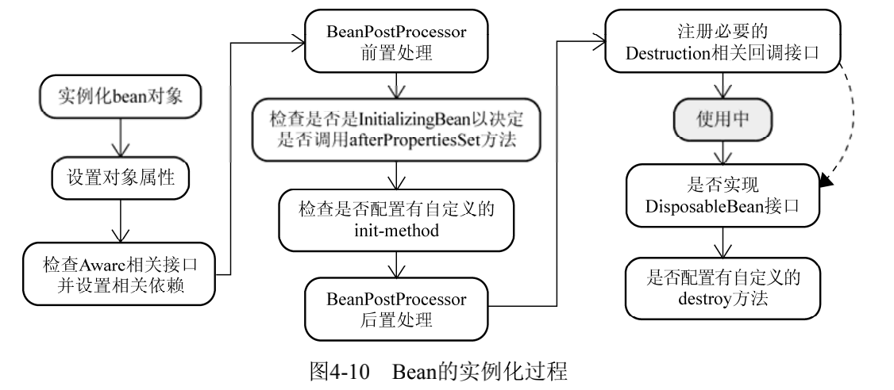
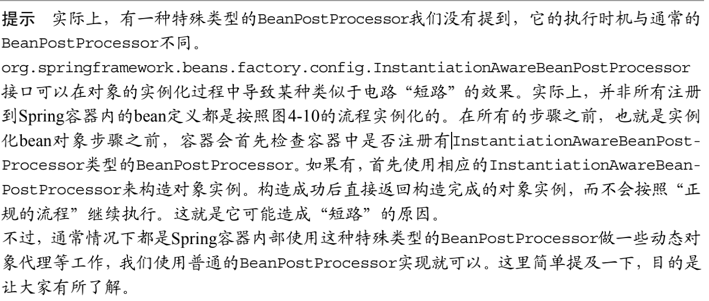

---

title: 了解Spring中bean的一生
author: John Doe
tags:
  - bean
  - ''
categories:
  - Spring
date: 2022-03-04 14:10:00
---

容器启动之后，并不会马上就实例化相应的bean定义。我们知道，容器现在仅仅拥有所有对象的BeanDefinition来保存实例化阶段将要用的必要信息。只有当请求方通过BeanFactory的getBean()方法来请求某个对象实例的时候，才有可能触发Bean实例化阶段的活动。BeanFactory的getBean（）
法可以被客户端对象显式调用，也可以在容器内部隐式地被调用。隐式调用有如下两种情况。

 对于BeanFactory来说，对象实例化默认采用延迟初始化。通常情况下，当对象A被请求而需
要第一次实例化的时候，如果它所依赖的对象B之前同样没有被实例化，那么容器会先实例化对象A所依赖的对象。这时容器内部就会首先实例化对象B，以及对象 A依赖的其他还没有实例化的对象。这种情况是容器内部调用getBean()，对于本次请求的请求方是隐式的。

 ApplicationContext启动之后会实例化所有的bean定义，但ApplicationContext在实现的过程中依然遵循Spring容器实现流程的两个阶段，只不过它
会在启动阶段的活动完成之后，紧接着调用注册到该容器的所有bean定义的实例化方法
getBean()。这就是为什么当你得到ApplicationContext类型的容器引用时，容器内所有对
象已经被全部实例化完成。不信你查一下类org.
AbstractApplicationContext的refresh()方法。

 
 
 1、 Bean的实例化与
 
 BeanWrapper：容器在内部实现的时候，采用“策略模式（Strategy Pattern）”来决定采用何种方式初始化bean实例。
通常，可以通过反射或者CGLIB动态字节码生成来初始化相应的bean实例或者动态生成其子类。

org.springframework.beans.factory.support.InstantiationStrategy定义是实例化策略
的抽象接口，其直接子类SimpleInstantiationStrategy实现了简单的对象实例化功能，可以通过
反射来实例化对象实例，但不支持方法注入方式的对象实例化。CglibSubclassingInstantiationStrategy继承了SimpleInstantiationStrategy的以反射方式实例化对象的功能，并且通过CGLIB
的动态字节码生成功能，该策略实现类可以动态生成某个类的子类，进而满足了方法注入所需的对象
实例化需求。默认情况下，容器内部采用的是CglibSubclassingInstantiationStrategy。

容器只要根据相应bean定义的BeanDefintion取得实例化信息，结合CglibSubclassingInstantiationStrategy以及不同的bean定义类型，就可以返回实例化完成的对象实例。但是，返回方
式上有些“点缀”。不是直接返回构造完成的对象实例，而是以BeanWrapper对构造完成的对象实例
进行包裹，返回相应的BeanWrapper实例。

BeanWrapper接口通常在Spring框架内部使用，它有一个实现类org.springframework.beans. 
BeanWrapperImpl。其作用是对某个bean进行“包裹”，然后对这个“包裹”的bean进行操作，比如设置或者获取bean的相应属性值。而在第一步结束后返回BeanWrapper实例而不是原先的对象实例，
就是为了第二步“设置对象属性”。

BeanWrapper定义继承了org.springframework.beans.PropertyAccessor接口，可以以统一的
方式对对象属性进行访问；BeanWrapper定义同时又直接或者间接继承了PropertyEditorRegistry
和TypeConverter接口。不知你是否还记得CustomEditorConfigurer？当把各种PropertyEditor注
册给容器时，知道后面谁用到这些PropertyEditor吗？对，就是BeanWrapper！在第一步构造完成
对象之后，Spring会根据对象实例构造一个BeanWrapperImpl实例，然后将之前CustomEditorConfigurer注册的PropertyEditor复制一份给BeanWrapperImpl实例（这就是BeanWrapper同时又
是PropertyEditorRegistry的原因）。这样，当BeanWrapper转换类型、设置对象属性值时，就不
会无从下手了。

2、 各色的Aware接口：

当对象实例化完成并且相关属性以及依赖设置完成之后，Spring容器会检查当前对象实例是否实
现了一系列的以Aware命名结尾的接口定义。如果是，则将这些Aware接口定义中规定的依赖注入给当前对象实例。

3、 BeanPostProcessor

BeanPostProcessor的概念容易与BeanFactoryPostProcessor的概念混淆。但只要记住BeanPostProcessor是存在于对象实例化阶段，而BeanFactoryPostProcessor则是存在于容器启动阶段，
这两个概念就比较容易区分了。

与BeanFactoryPostProcessor通常会处理容器内所有符合条件的BeanDefinition类似，BeanPostProcessor会处理容器内所有符合条件的实例化后的对象实例。该接口声明了两个方法，分别在
两个不同的时机执行。postProcessBeforeInitialization()方法是BeanPostProcessor前置处理这一步将
会执行的方法，postProcessAfterInitialization()则是对应BeanPostProcessor后置处
理那一步将会执行的方法。BeanPostProcessor的两个方法中都传入了原来的对象实例的引用，这为
我们扩展容器的对象实例化过程中的行为提供了极大的便利，我们几乎可以对传入的对象实例执行任
何的操作。

通常比较常见的使用BeanPostProcessor的场景，是处理标记接口实现类，或者为当前对象提供
代理实现。除了检查标记接口以便应用自定义逻辑，还可以通过BeanPostProcessor对当前对象实例做更多
的处理。比如替换当前对象实例或者字节码增强当前对象实例等。Spring的AOP则更多地使用
BeanPostProcessor来为对象生成相应的代理对象，如org.springframework.aop.framework. 
autoproxy.BeanNameAutoProxyCreator。

 
 
 4、 InitializingBean和init-method：
 
 org.springframework.beans.factory.InitializingBean是容器内部广泛使用的一个对象生
命周期标识接口

该接口定义很简单，其作用在于，在对象实例化过程调用过“BeanPostProcessor的前置处理”
之后，会接着检测当前对象是否实现了InitializingBean接口，如果是，则会调用其afterPropertiesSet()方法进一步调整对象实例的状态。比如，在有些情况下，某个业务对象实例化完成后，还
不能处于可以使用状态。这个时候就可以让该业务对象实现该接口，并在方法afterPropertiesSet()
中完成对该业务对象的后续处理。

虽然该接口在Spring容器内部广泛使用，但如果真的让我们的业务对象实现这个接口，则显得
Spring容器比较具有侵入性。所以，Spring还提供了另一种方式来指定自定义的对象初始化操作，那就
是在XML配置的时候，使用< bean>的init-method属性。
  
  通过init-method，系统中业务对象的自定义初始化操作可以以任何方式命名，而不再受制于
InitializingBean的afterPropertiesSet()。如果系统开发过程中规定：所有业务对象的自定义初
始化操作都必须以init()命名，为了省去挨个< bean>的设置init-method这样的烦琐，我们还可以通
过最顶层的< beans>的default-init-method统一指定这一init()方法名。
  
 5、 DisposableBean与destroy-method：
 
 当所有的一切，该设置的设置，该注入的注入，该调用的调用完成之后，容器将检查singleton类
型的bean实例，看其是否实现了org.springframework.beans.factory.DisposableBean接口。或
者其对应的bean定义是否通过< bean>的destroy-method属性指定了自定义的对象销毁方法。如果是，
就会为该实例注册一个用于对象销毁的回调（Callback），以便在这些singleton类型的对象实例销毁之
前，执行销毁逻辑。
  
  与InitializingBean和init-method用于对象的自定义初始化相对应，DisposableBean和
destroy-method为对象提供了执行自定义销毁逻辑的机会。

最常见到的该功能的使用场景就是在Spring容器中注册数据库连接池，在系统退出后，连接池应
该关闭，以释放相应资源。
