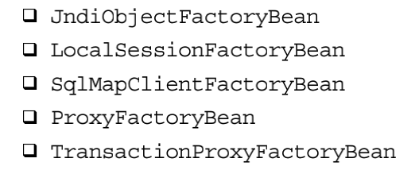

---

title: 工厂方法与 FactoryBean
author: John Doe
tags:
  - FactoryBean
categories:
  - Spring
date: 2022-03-03 23:05:00
---

在强调“面向接口编程”的同时，有一点需要注意：虽然对象可以通过声明接口来避免对特定接
口实现类的过度耦合，但总归需要一种方式将声明依赖接口的对象与接口实现类关联起来。否则，只
依赖一个不做任何事情的接口是没有任何用处的。

如果该类是由我们设计并开发的，那么还好说，我们可以通过依赖注入，让容器帮助我们解除接 
口与实现类之间的耦合性。但是，有时，我们需要依赖第三方库，需要实例化并使用第三方库中的相
关类，这时，接口与实现类的耦合性需要其他方式来避免。 

通常的做法是通过使用工厂方法（Factory Method）模式，提供一个工厂类来实例化具体的接口
实现类，这样，主体对象只需要依赖工厂类，具体使用的实现类有变更的话，只是变更工厂类，而主
体对象不需要做任何变动。

针对使用工厂方法模式实例化对象的方式，Spring的IoC容器同样提供了对应的集成支持。我们所
要做的，只是将工厂类所返回的具体的接口实现类注入给主体对象

1、 静态工厂方法（Static Factory Method）

2、非静态工厂方法（Instance Factory Method）

3、FactoryBean：FactoryBean是Spring容器提供的一种可以扩展容器对象实例化逻辑的接口，请不要将其与容器名称BeanFactory相混淆。FactoryBean，其主语是Bean，定语为Factory，也就是说，它本身与其他注册到容器的对象一样，只是一个Bean而已，只不过，这种类型的Bean本身就是生产对象的工厂
（Factory）。

当某些对象的实例化过程过于烦琐，通过XML配置过于复杂，使我们宁愿使用Java代码来完成这
个实例化过程的时候，或者，某些第三方库不能直接注册到Spring容器的时候，就可以实现org.spring.framework.beans.factory.FactoryBean接口，给出自己的对象实例化逻辑代码。当然，不使用Fac.toryBean，而像通常那样实现自定义的工厂方法类也是可以的。不过，FactoryBean可是Spring提供
的对付这种情况的“制式装备”哦！

Spring容器内部许多地方了使用FactoryBean。下面是一些比较常见的FactoryBean实现，你可以参照FactoryBean的Javadoc以了解更多内容。

 