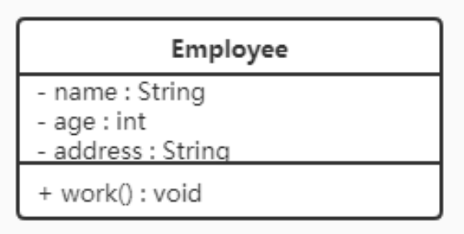
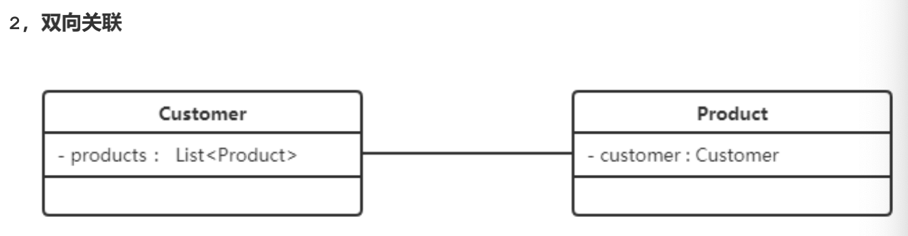
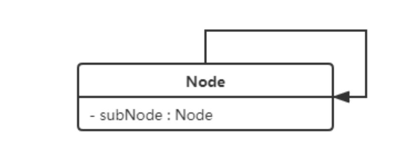
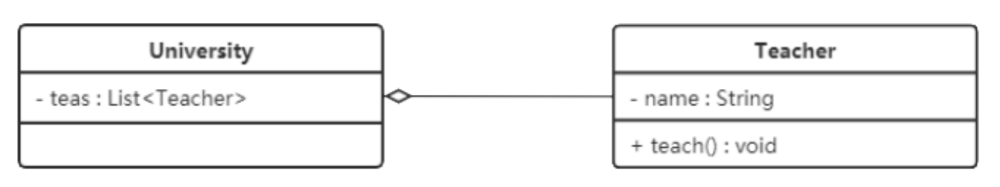
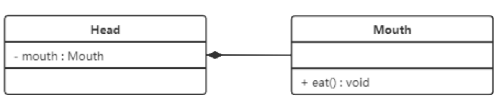
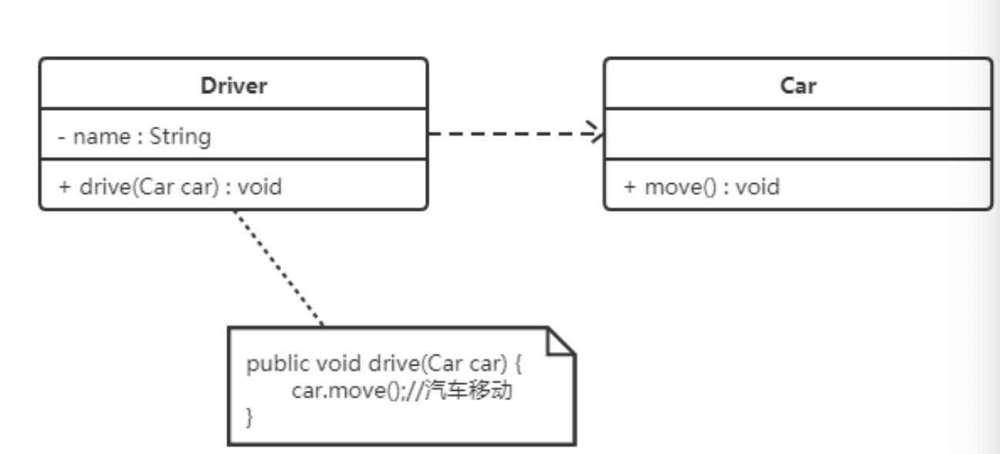
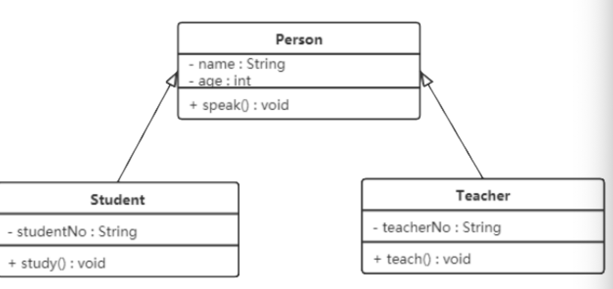
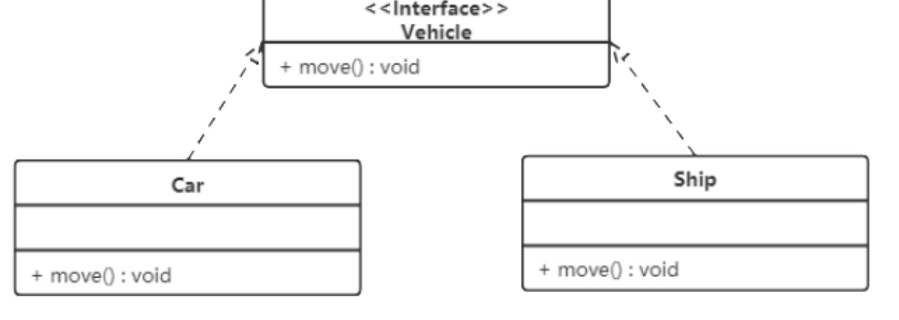

---

title: UML类图
author: John Doe
tags:
  - UML
categories:
  - 设计模式
date: 2022-03-04 21:51:00
---

 
 
 属性/方法名称前加的加号和减号表示了这个属性/方法的可见性，UML类图中表示可见性的符号有三种：

+：表示public

-：表示private

#：表示protected

属性的完整表示方式是： 可见性 名称 ：类型 [ = 缺省值]
方法的完整表示方式是： 可见性 名称(参数列表) [ ： 返回类型]

类之间关系的表示方式：

1、关联关系：关联关系是对象之间的一种引用关系，用于表示一类对象与另一类对象之间的联系，如老师和学生、师
傅和徒弟、丈夫和妻子等。关联关系是类与类之间最常用的一种关系，分为一般关联关系、聚合关系和组合关系。

 

 
 
 自关联：
 
 
 
 2、聚合关系：聚合关系是关联关系的一种，是强关联关系，是整体和部分之间的关系。
聚合关系也是通过成员对象来实现的，其中成员对象是整体对象的一部分，但是成员对象可以脱离整体
对象而独立存在。

 
 
 3、组合关系：组合表示类之间的整体与部分的关系，但它是一种更强烈的聚合关系。在组合关系中，整体对象可以控制部分对象的生命周期，一旦整体对象不存在，部分对象也将不存在，
部分对象不能脱离整体对象而存在。

 
 
 4、依赖关系：依赖关系是一种使用关系，它是对象之间耦合度最弱的一种关联方式，是临时性的关联。在代码中，某个类的方法通过局部变量、方法的参数或者对静态方法的调用来访问另一个类（被依赖类）中的某些方
法来完成一些职责。

 
 
 5、继承关系：继承关系是对象之间耦合度最大的一种关系，表示一般与特殊的关系，是父类与子类之间的关系，是一种继承关系。
 
 
 
 6、实现关系：实现关系是接口与实现类之间的关系。在这种关系中，类实现了接口，类中的操作实现了接口中所声明的所有的抽象操作。
 
 
 
 

