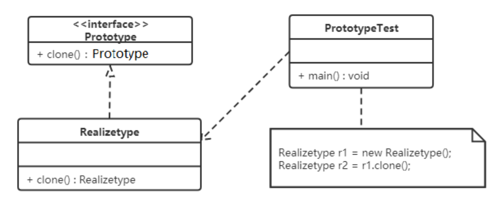

---

title: 原型模式
author: John Doe
tags:
  - 原型模式
categories:
  - 设计模式
date: 2022-03-07 15:41:00
---

概述：用一个已经创建的实例作为原型，通过复制该原型对象来创建一个和原型对象相同的新对象。

结构：
原型模式包含如下角色：
抽象原型类：规定了具体原型对象必须实现的的 clone() 方法。
具体原型类：实现抽象原型类的 clone() 方法，它是可被复制的对象。
访问类：使用具体原型类中的 clone() 方法来复制新的对象。

  
  
  原型模式的克隆分为浅克隆和深克隆。

浅克隆：创建一个新对象，新对象的属性和原来对象完全相同，对于非基本类型属性，仍指向原
有属性所指向的对象的内存地址。

深克隆：创建一个新对象，属性中引用的其他对象也会被克隆，不再指向原有对象地址。（使用对象流，先将原型对象存入file，然后从file读取，即为深克隆）

Java中的Object类中提供了clone() 方法来实现浅克隆。 Cloneable 接口是上面的类图中的抽象原型类，而实现了Cloneable接口的子实现类就是具体的原型类。

使用场景：对象的创建非常复杂，可以使用原型模式快捷的创建对象。性能和安全要求比较高。

